# 03 — The shell: window, tabs, run bar, log, settings, projects

<!-- nav -->
[← 02 Services and the tool catalogue](02-services.md) · [↑ Contents](README.md) · [04 Prepare →](04-prepare.md)

**Flows:** [F0.1](#f01-switch-tab) · [F0.2](#f02-press-) · [F0.3](#f03-press-) · [F0.4](#f04-the-chain) · [F0.5](#f05-a-runs-bookkeeping-every-step-uses-it) · [F0.6](#f06-open-at-start) · [F0.7](#f07-derive-the-editing-policy-review--new) · [F0.8](#f08-new-project) · [F0.9](#f09-open-a-project) · [F0.10](#f010-save-as) · [F0.11](#f011-rescan) · [F0.12](#f012-add-sources-from-prepare) · [F0.13](#f013-tests)
<!-- /nav -->

## 1. The window

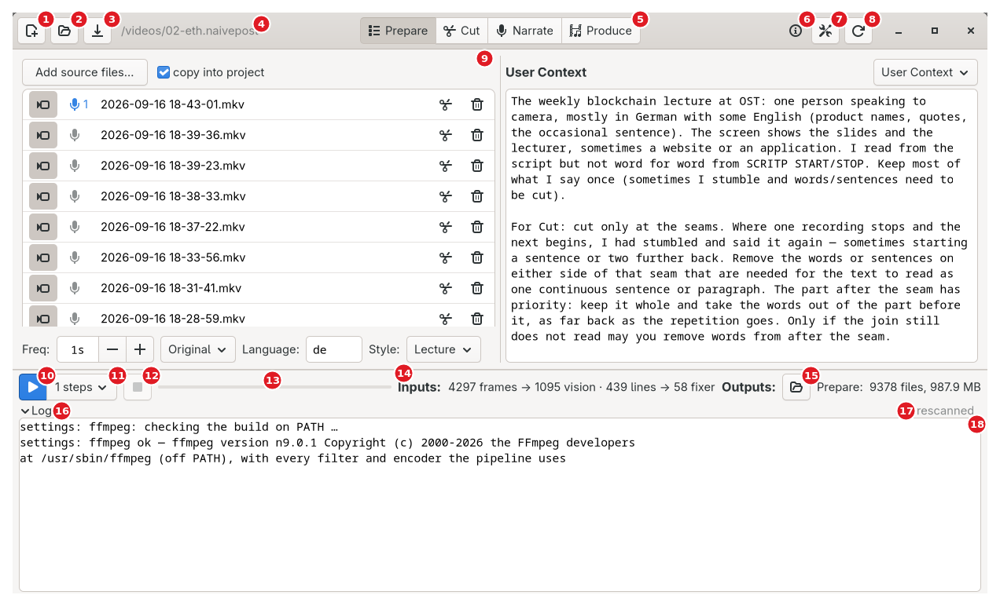

Screenshot of the prototype on the ETH lecture project.

**1** New · **2** Open · **3** Save · **4** project name/path · **5** tab row · **6** ⓘ · **7** Settings · **8** Rescan · **9** the visible tab's page · **10** ▶ run / pause · **11** chain · **12** ⏹ · **13** progress bar (draws no text) · **14** Inputs readout · **15** Outputs: folder button and count · **16** log expander · **17** status line · **18** the log

- One window, title "Naivepost", default 1240×740. Header bar: New ("New project — name it, put it where you want it, and start over"), Open ("Load a project — sources, prompts and settings"), Save ("Save this project to a file"), project name/path (as the window narrows: path + tab words → file name + tab words → file name + icons only), tab row as title widget, then, packed from the right edge inward (reads ⓘ ⚙ ⟳ on screen): Rescan ("Rescan inputs and outputs"), Settings ("Settings — the LLM and audio.cpp endpoints"), ⓘ (tooltip = current tab's label + help text).
- Tabs: Prepare (view-list), Cut (edit-cut), Narrate (microphone), Produce (multimedia). Locked tab: greyed, not disabled; tooltip = the reason; a click bounces and puts the reason on the status line. Cut locked until a source is marked footage ("Add footage on the Prepare step first — the cut is laid out from the recordings"). Narrate and Produce never locked; their ▶ refuses without a cut.
- Bottom: run bar ([§2](#2-the-run-bar)), the visible tab's "Inputs:" and "Outputs:" readouts, then the log expander, its header carrying the status line. Log: read-only monospace; lines start `>>> `, `!!! ` or four spaces. Only one log line is a link — the per-run model exchange page, opened in a browser (GTK's file launcher, `xdg-open` fallback); no other path clickable. REVIEW: the rewrite MAY tag every path it writes.
- Page and bottom bar are two halves of a draggable divider, not a fixed strip; collapsing the log expander returns its height to the page.
- A page whose prerequisites vanish while open switches silently to Prepare ([F0.1](#f01-switch-tab) S2's bounce is only for a click).
- Closing the window flushes the narration autosave, red line, project and prompts, then closes; no prompt.
- Watchdog: dumps every goroutine's stack after 3 s without a GUI heartbeat (engineering constant).

### F0.1 Switch tab

<!-- back -->← first flow · [↑ 03 The shell](#03--the-shell-window-tabs-run-bar-log-settings-projects) · [all flows](11-flow-index.md#3-all-flows) · [F0.2 →](#f02-press-)

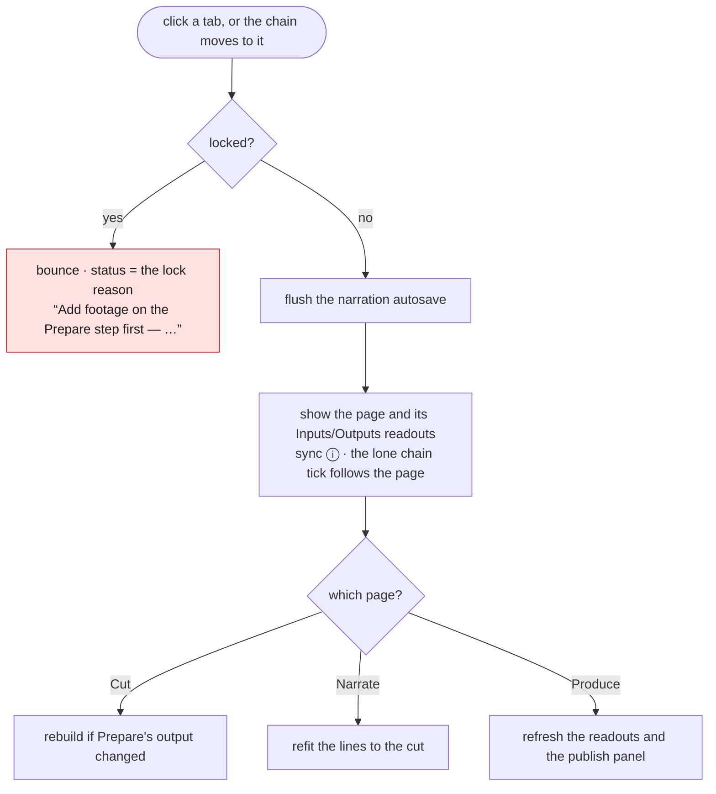

S1 Click a tab (or the chain moves to it). S2 Locked → bounce, status = lock reason; stop. S3 Flush the narration autosave. S4 Show the page and its Inputs/Outputs readouts; sync ⓘ; the lone chain tick follows the page ([F0.4](#f04-the-chain) S7). S5 Refresh: Cut rebuilds if Prepare's output changed since its build; Narrate refits its lines to the cut; Produce refreshes readouts and publish panel.

## 2. The run bar

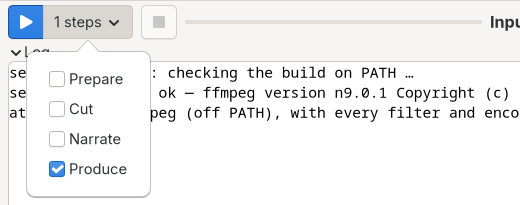

Screenshot of the prototype on the ETH lecture project. REVIEW: the prototype labels one ticked step "1 steps"; the rewrite SHOULD say "1 step".

- ▶ (suggested-action): "Run the ticked steps — or resume what is paused"; while a run or page transport is busy it shows ⏸ "Pause". (Prototype: every control refresh rewrites the idle tooltip to "Run this step — or resume what is paused"; the rewrite uses one wording.) ⏹: "Stop the run or the playback — ⏸ is what parks one to carry on later". Chain button label: none / "N steps" / all; tooltip "Which steps ▶ runs, in this order. Narrate skips itself when the video has no narration, and Cut skips itself when the cut has hand edits." Fresh project, or project file without `run_steps` → **Prepare ticked alone**; each tick is written to the project on toggle.
- Progress bar: two tracks summed (0 = speech/describe, 1 = frames/fix). It draws **no text of its own**: the tracks' lines, joined by "  ·  " (e.g. "describe 1/2: chunk 4/12", "<job> done" for a finished track), go to the **status line** in the log expander's header, so a run overwrites whatever was last there. Tooltip per track "<job>: task i of n, k waiting" / "…, none waiting" / "<job>: N task(s), all done"; nothing queued → standing tooltip "The run: the job, which of the run's jobs it is, and the task it is on" stays. A model thinking with nothing countable pulses the bar.

### F0.2 Press ▶

<!-- back -->[← F0.1](#f01-switch-tab) · [↑ 03 The shell](#03--the-shell-window-tabs-run-bar-log-settings-projects) · [all flows](11-flow-index.md#3-all-flows) · [F0.3 →](#f03-press-)

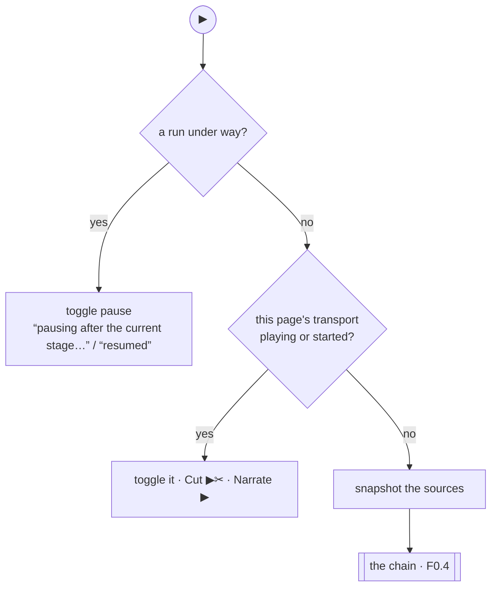

S1 Run under way → toggle pause ("pausing after the current stage…" / "resumed"); stop. S2 Visible tab's transport playing or started (Cut or Narrate: once its preview started) → toggle it; stop. S3 Snapshot the sources. S4 Run the chain ([F0.4](#f04-the-chain)).

### F0.3 Press ⏹

<!-- back -->[← F0.2](#f02-press-) · [↑ 03 The shell](#03--the-shell-window-tabs-run-bar-log-settings-projects) · [all flows](11-flow-index.md#3-all-flows) · [F0.4 →](#f04-the-chain)

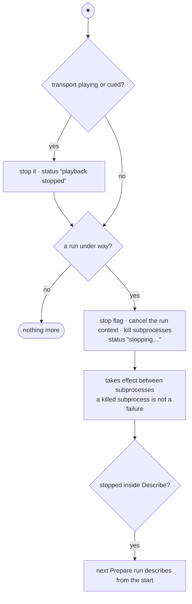

S1 Page transport playing or cued → stop it, status "playback stopped"; does not return — the run stops too, so one press ends both and status reads "stopping…". S2 No run → nothing more. S3 Set the stop flag, cancel the run context (aborts model and audio calls), kill registered subprocesses; status "stopping…". S4 Pause/stop act only between subprocesses; a stopped subprocess is not a failure. S5 A stop that reached Describe arms "describe from the start" for the next Prepare run.

### F0.4 The chain

<!-- back -->[← F0.3](#f03-press-) · [↑ 03 The shell](#03--the-shell-window-tabs-run-bar-log-settings-projects) · [all flows](11-flow-index.md#3-all-flows) · [F0.5 →](#f05-a-runs-bookkeeping-every-step-uses-it)

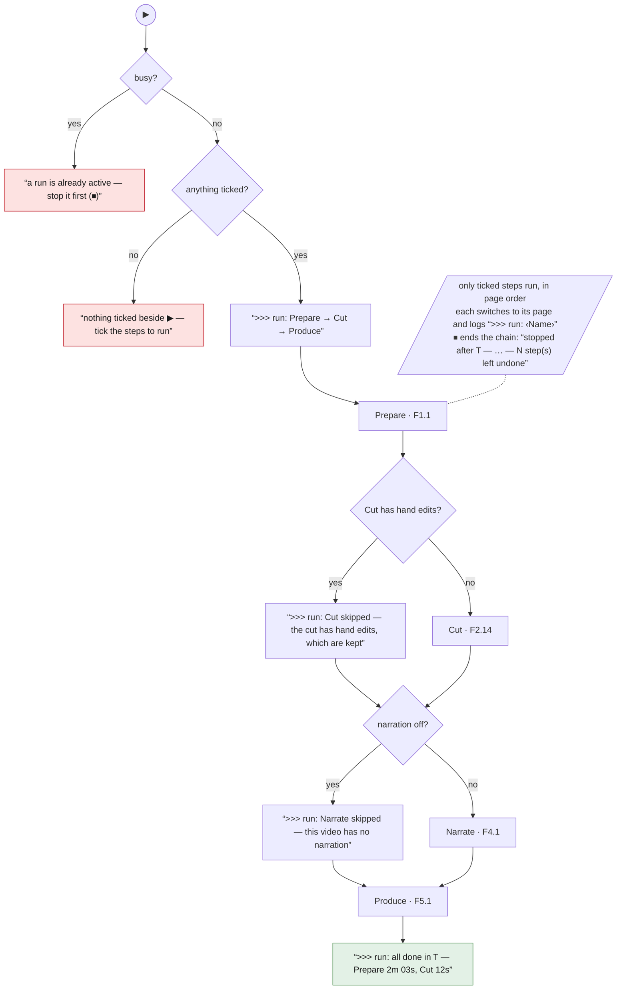

S1 Busy → refuse ("a run is already active — stop it first (⏹)"). S2 Nothing ticked → "nothing ticked beside ▶ — tick the steps to run". S3 Log ">>> run: Prepare → Cut → Produce". S4 Each ticked step in page order: skip Narrate if narration off (">>> run: Narrate skipped — this video has no narration"); skip Cut if it has hand edits (">>> run: Cut skipped — the cut has hand edits, which are kept"); else switch to the page synchronously ([F0.1](#f01-switch-tab)), log ">>> run: <Name>", run its step (Prepare [F1.1](04-prepare.md#f11--prepare), Cut [F2.14](05-cut.md#f214-suggest-a-cut), Narrate [F4.1](07-narrate.md#f41--write-and-speak), Produce [F5.1](08-produce.md#f51--produce)). A declining step is skipped, not waited for. S5 A stop ends the chain. REVIEW: in the prototype a FAILING step logs its failure and the chain walks on to the next ticked step; the rewrite SHOULD stop the chain on failure. S6 End line, mirrored on the status line: ">>> run: all done in T — Prepare 2m 03s, Cut 12s" (status "all done in T") / ">>> run: stopped after T — … — N step(s) left undone" (status "stopped after T") / ">>> run: T — … — N step(s) left undone" when steps were skipped or declined (status "ran T, N left undone"); no line for a single finished step; **no line and no status at all** when every ticked step declined or was skipped — the status keeps the last refusal's text (REVIEW: the rewrite SHOULD say so). Durations: "45s" under a minute, else "9m 12s". S7 Lone tick follows the page: exactly one step ticked and the user opens another tab → the tick moves there quietly and is saved.

### F0.5 A run's bookkeeping (every step uses it)

<!-- back -->[← F0.4](#f04-the-chain) · [↑ 03 The shell](#03--the-shell-window-tabs-run-bar-log-settings-projects) · [all flows](11-flow-index.md#3-all-flows) · [F0.6 →](#f06-open-at-start)

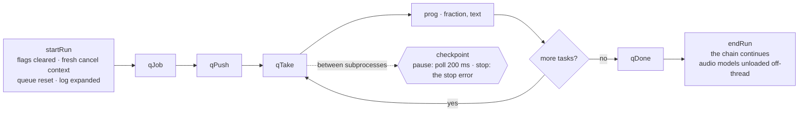

S1 startRun: running, flags cleared, fresh cancel context, queue reset (also closes the model log page), controls, log expanded. S2 Each stage: `qJob(track, name, phase, of)`, `qPush(track, n, kind)`, per task `qTake` (also for tasks skipped as their output exists), `prog(track, fraction, text)`, `qDone(track, share)`. S3 Between subprocesses: `checkpoint()` (pause polls every 200 ms; stop returns the stop error). S4 endRun: running off, controls, the chain continues, audio models unloaded off-thread.

## 3. Projects

### F0.6 Open at start

<!-- back -->[← F0.5](#f05-a-runs-bookkeeping-every-step-uses-it) · [↑ 03 The shell](#03--the-shell-window-tabs-run-bar-log-settings-projects) · [all flows](11-flow-index.md#3-all-flows) · [F0.7 →](#f07-derive-the-editing-policy-review--new)

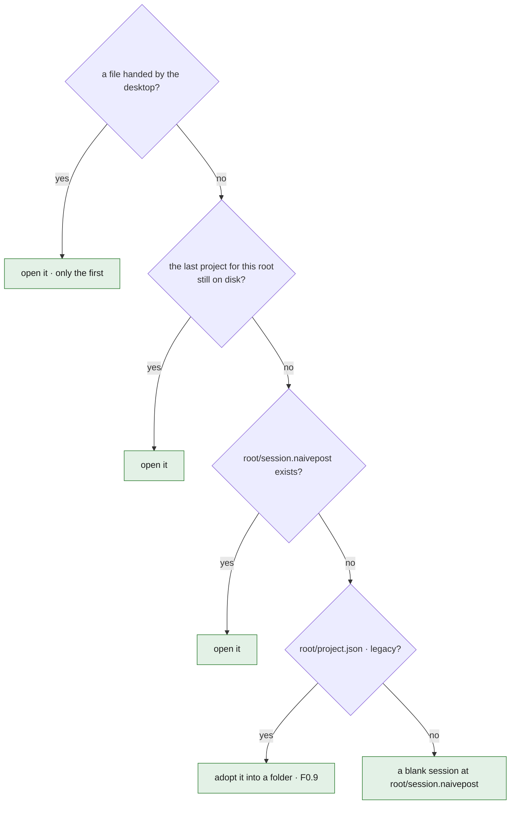

S1 A file handed by the desktop (first only); else S2 the last project remembered for this root in the settings file, if still on disk; else S3 `<root>/session.naivepost` if it exists; else S4 `<root>/project.json` (legacy, adopted into a folder); else a blank session at `<root>/session.naivepost`.

### F0.7 Derive the editing policy (REVIEW — new)

<!-- back -->[← F0.6](#f06-open-at-start) · [↑ 03 The shell](#03--the-shell-window-tabs-run-bar-log-settings-projects) · [all flows](11-flow-index.md#3-all-flows) · [F0.8 →](#f08-new-project)

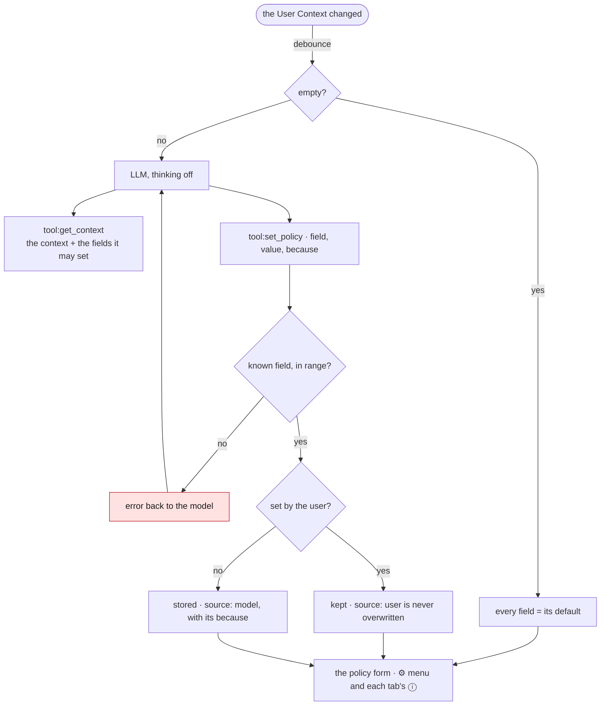

Runs after the User Context changes (debounced; on the next ▶ or on demand from the policy form). S1 Empty context → every policy field default; stop. S2 Ask the LLM (thinking off) with `tool:get_context` and `tool:set_policy`, system prompt "policy" (new, [`prompts/`](prompts) to add): read the context, set only fields it speaks to. S3 Each `set_policy` validated (known field, in range), stored with `source: model` and its `because`. S4 Hand-set fields (`source: user`) never overwritten. S5 The policy form (from the ⚙ menu and each tab's ⓘ) shows every field with value, source and reason.

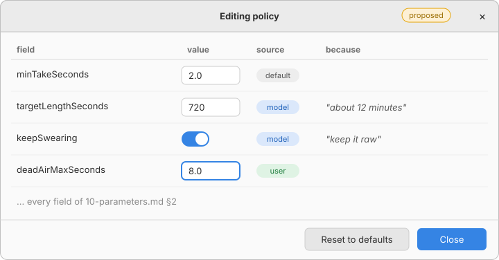

Proposed screen: not in the prototype, drawn in its visual style.

### F0.8 New project

<!-- back -->[← F0.7](#f07-derive-the-editing-policy-review--new) · [↑ 03 The shell](#03--the-shell-window-tabs-run-bar-log-settings-projects) · [all flows](11-flow-index.md#3-all-flows) · [F0.9 →](#f09-open-a-project)

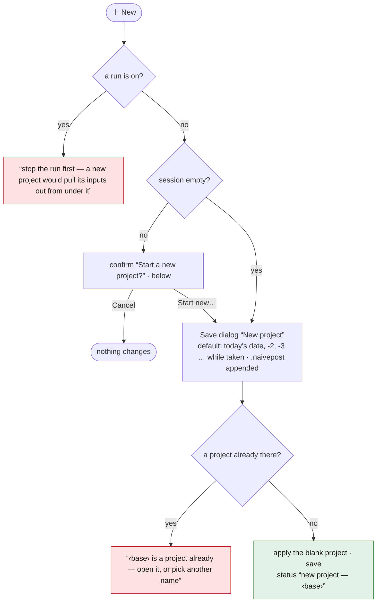

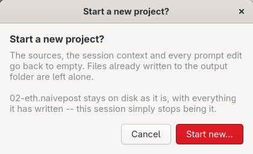

Screenshot of the prototype on the ETH lecture project.

S1 Refused during a run ("stop the run first — a new project would pull its inputs out from under it"). S2 Session empty → S4. S3 Confirm "Start a new project?", detail "The sources, the session context and every prompt edit go back to empty. Files already written to the output folder are left alone." (+ "<base> stays on disk as it is…" or "This session has never been saved under a name of its own…"); button "Start new…". S4 Save dialog "New project", default name today's date (-2, -3 … while taken), `.naivepost` appended. S5 Existing project at that name → "<base> is a project already — open it, or pick another name". S6 Apply the blank project via the load's apply list; chooser folders follow the chosen folder when outside the root; save; status "new project — <base>"; log ">>> new project <path> -- the session is empty; outputs on disk are untouched".

### F0.9 Open a project

<!-- back -->[← F0.8](#f08-new-project) · [↑ 03 The shell](#03--the-shell-window-tabs-run-bar-log-settings-projects) · [all flows](11-flow-index.md#3-all-flows) · [F0.10 →](#f010-save-as)

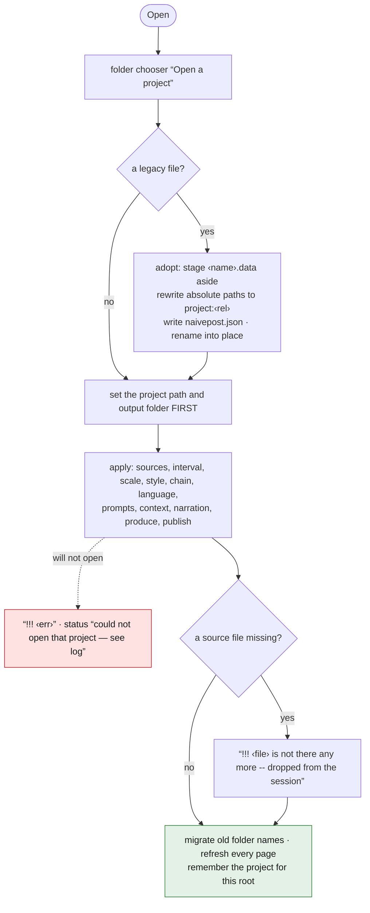

S1 Folder chooser "Open a project" (legacy files: double-click or command line only). S2 Adopt a legacy file into a folder if needed (staged; refuses if the target exists or a stale `.adopting` remains). S3 Set project path and output folder first, then apply the project (sources, missing ones logged "!!! <file> is not there any more -- dropped from the session", interval, scale, style, chain, language, prompts, context, narration flag, reference flag, hints, produce, publish). S4 Migrate old folder names; refresh every page; remember the project for this root. A failed open logs "!!! <err>", status "could not open that project — see log".

### F0.10 Save as

<!-- back -->[← F0.9](#f09-open-a-project) · [↑ 03 The shell](#03--the-shell-window-tabs-run-bar-log-settings-projects) · [all flows](11-flow-index.md#3-all-flows) · [F0.11 →](#f011-rescan)

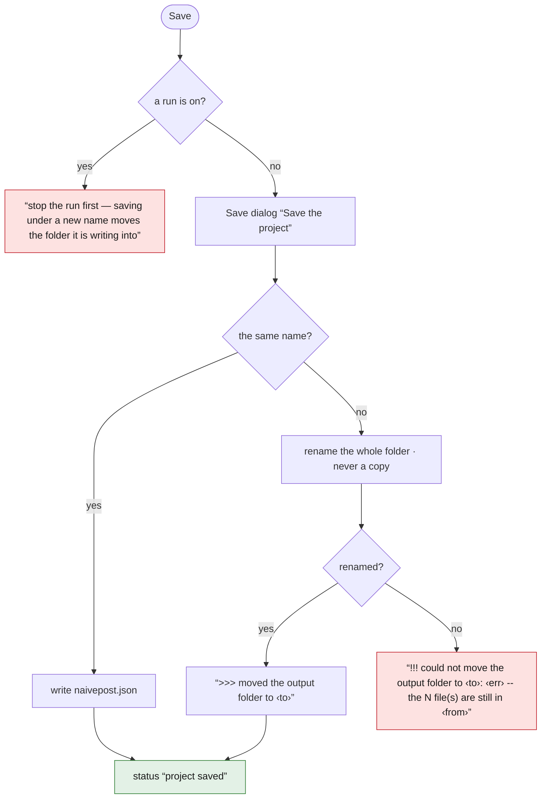

S1 Refused during a run ("stop the run first — saving under a new name moves the folder it is writing into"). S2 Save dialog "Save the project". S3 A different name renames the whole folder (never a copy; renaming onto a non-empty folder fails, files stay, log says where). A successful rename logs ">>> moved the output folder to <to>". S4 Status "project saved".

### F0.11 Rescan

<!-- back -->[← F0.10](#f010-save-as) · [↑ 03 The shell](#03--the-shell-window-tabs-run-bar-log-settings-projects) · [all flows](11-flow-index.md#3-all-flows) · [F0.12 →](#f012-add-sources-from-prepare)

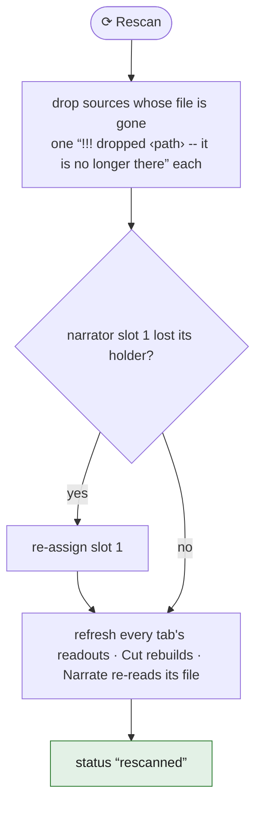

S1 Drop sources whose files are gone ("!!! dropped <path> -- it is no longer there" each); re-assign slot 1 if its holder went. S2 Refresh every tab's readouts; Cut rebuilds; Narrate re-reads its file. S3 Status "rescanned".

### F0.12 Add sources (from Prepare)

<!-- back -->[← F0.11](#f011-rescan) · [↑ 03 The shell](#03--the-shell-window-tabs-run-bar-log-settings-projects) · [all flows](11-flow-index.md#3-all-flows) · [F0.13 →](#f013-tests)

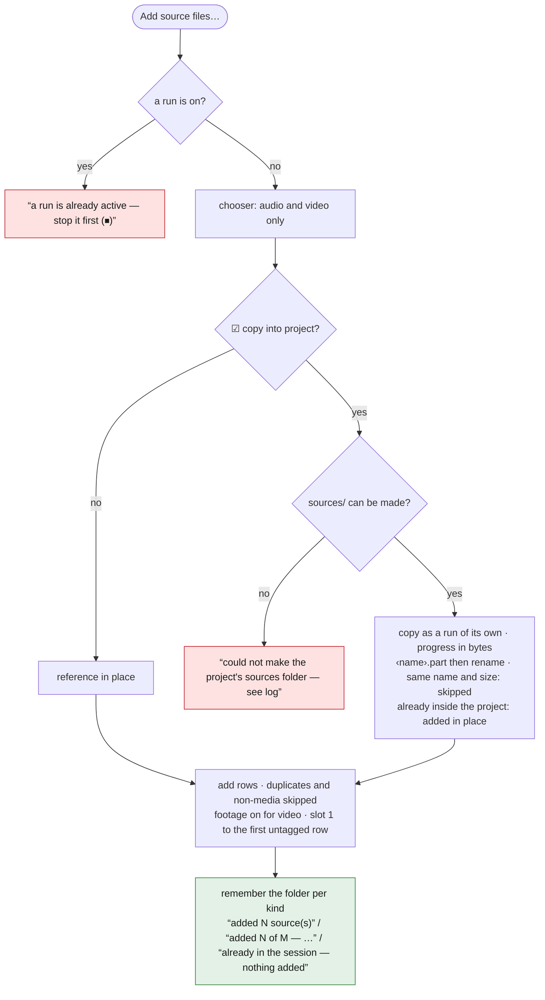

S0 A copy is a run of its own: refuses while anything else runs ("a run is already active — stop it first (⏹)"); abandons with "could not make the project's sources folder — see log" when `sources/` cannot be created. S1 File chooser "Add sources" filtered to audio and video (`.flac .wav .mp3 .m4a .aac .ogg .opus .wma .mp4 .mkv .mov .webm .avi .ts`). S2 "copy into project" on → copy each file into `sources/` as a run of its own (progress in bytes; `.part` then rename; same name + same size not copied again; files already inside the project added in place); else reference in place. S3 Add to the list (duplicates and non-media skipped; footage defaults on for video; narrator slot 1 auto-assigned to the first untagged row, recordings before footage). S4 Remember the folder per kind. S5 Status "added N source(s)" / "added N of M — the rest were already in" / "already in the session — nothing added".

## 4. Sources list (lives on Prepare, specified here because the shell snapshots it)

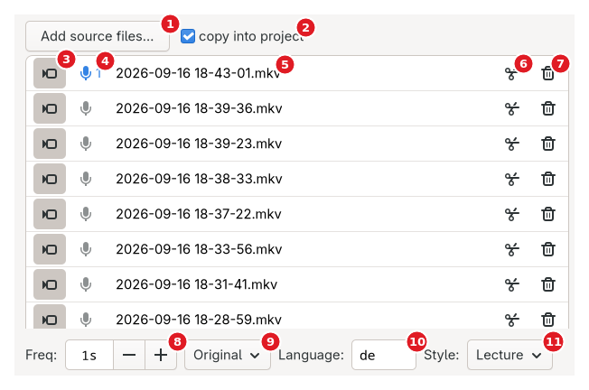

Screenshot of the prototype on the ETH lecture project. Not in this project, so not in the shot: the track menu (a file with ≥ 2 audio streams) and ⚠ (a name without a timestamp).

**1** Add source files… · **2** copy into project · **3** 🎥 footage · **4** 🎤 narrator slot · **5** file name · **6** ✂ split the voice · **7** 🗑 remove · **8** Freq · **9** frame size · **10** Language · **11** Style

Row controls, in order: 🎥 footage toggle (video only; "Footage — frames come out of this file and it can be cut. Off: it is only listened to…"); 🎤 narrator button cycling free slots 1..N then none ("1 is the voice the narration is spoken in; 2–4 are the rest of the group"; slot 1 highlighted); file name (middle-ellipsized; tooltip = path); track menu when the file holds ≥ 2 audio streams — face is an icon and "<on>/<total>", dimmed while any track is out; popover headed "Audio tracks in this file", a three-line explanation over the checks ("Track N — <title> (stereo|mono)"; last ticked track cannot be unticked; each ticked track becomes a lane, mixed like a separate recording); ⚠ when the name has no timestamp (tooltip explains renaming or dragging into place on Cut); ✂ split-the-voice toggle (greyed on a split product); 🗑 remove from session ("the file itself is left alone"). The four symbol controls (🎥 🎤 ✂ 🗑) end their tooltip with the four-line legend of the row's symbols; track button and ⚠ do not.

Rules: only a video may be footage; one row per narrator slot; two sources with one base name refuse the run ("A and B are both inputs/<base> -- rename one", status "A and B have the same name — rename one"); a missing file is dropped loudly. Slot 1 auto-filled whenever unheld — after an add, a removal, a rescan that dropped a row, or a load that stripped a bad tag — with the first untagged recording, footage last; a loaded project with two rows in one slot or footage on an audio file has the offending flag cleared on load. Strings: "Add source files…" ("Add recordings or footage — several at once"); "copy into project" ("Ticked, an added file is copied into the project's sources/ folder, so the project holds everything it needs. Unticked, the file is referenced where it is: nothing is duplicated, and the session breaks if it moves."); the list's tooltip "Every file here is transcribed, and placed on the session clock by the timestamp in its name".

## 5. Settings dialog

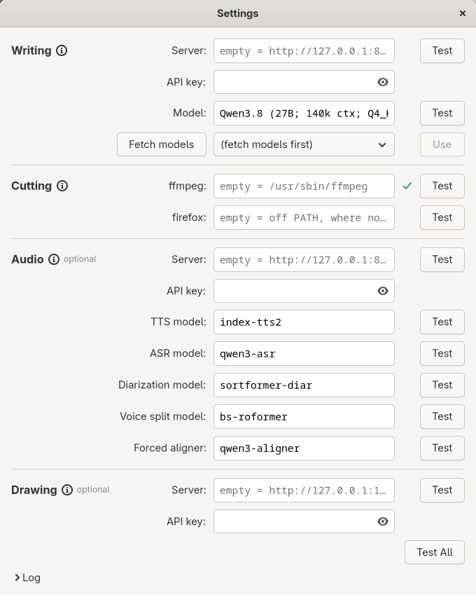

Screenshot of the prototype on the ETH lecture project. Server boxes are empty (their placeholders show the loopback defaults); the ✓ is a passed ffmpeg test.

No Save/Cancel: every box written 600 ms after the last keystroke and on close ("settings saved to <path>"). Each Test reads what is typed, shows a spinner then ✓/✗ with the verdict as tooltip, mirrors its lines into the main log as "settings: …". Test All runs every test. Each section's ⓘ explains at length what the server is expected to speak.

### F0.13 Tests

<!-- back -->[← F0.12](#f012-add-sources-from-prepare) · [↑ 03 The shell](#03--the-shell-window-tabs-run-bar-log-settings-projects) · [all flows](11-flow-index.md#3-all-flows) · [F1.1 →](04-prepare.md#f11--prepare)

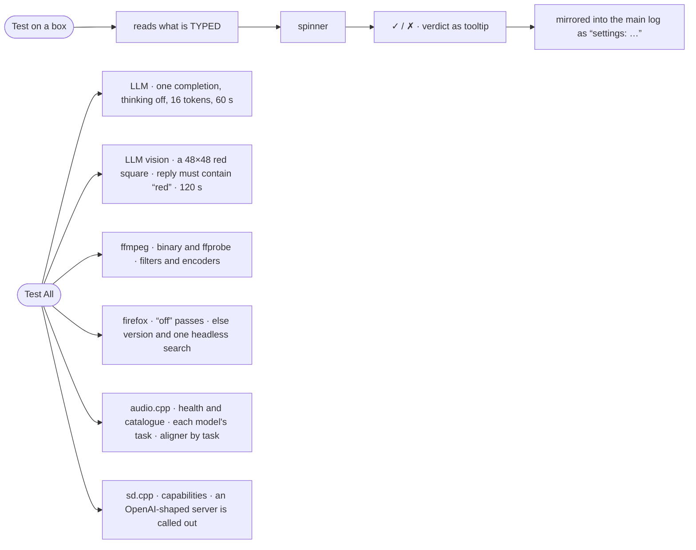

- LLM: one completion "Reply with the single word: ok" (thinking off, max 16 tokens, 60 s) → "<model> answered in X s: “ok”".
- LLM vision: a generated 48×48 red square with "In one word: what colour is this square?" (120 s); the reply must contain "red", else "…it is not seeing the image. Prepare sends video frames to this model: it needs a vision model, served with its mmproj/vision file".
- Fetch models: GET /v1/models → dropdown; Use copies the id into Model.
- ffmpeg: resolves the binary (and ffprobe beside it), reads the version, scans filters (rubberband, subtitles, loudnorm, atempo, amix, adelay, alimiter) and encoders (libx264, libx265, aac, libopus).
- firefox: "off" is a success ("the model is offered no web search…"); otherwise the version and one real headless search.
- Audio: health + catalogue → "healthy in N ms, will narrate with <id>"; per model box: id served and declared for its task (clon/asr/diar/sep), with install hints; aligner: what aligns (none is a success: cut points come off the waveform; several: preferred one named).
- sd.cpp: capabilities → "<weights> is loaded and can draw"; an OpenAI-shaped server is called out as not sd-server.

## 6. The settings file

`~/.config/naivepost/llm.conf`, `KEY="value"` lines, written whole: `LLM_SERVER, LLM_MODEL, LLM_API_KEY, AUDIOCPP_SERVER, AUDIOCPP_API_KEY, AUDIOCPP_VOICES, AUDIOCPP_ASR_MODEL, AUDIOCPP_DIAR_MODEL, AUDIOCPP_TTS_MODEL, AUDIOCPP_SEP_MODEL, AUDIOCPP_ALIGN_MODEL, FFMPEG, FIREFOX, SD_SERVER, SD_API_KEY, PROJECT_<n>_ROOT/FILE`. Precedence: dialog box → this file → (legacy `<root>/llm.conf`, migrated once) → built-in default. The audio URL also honours `NAIVEPOST_TTS_URL` and `AUDIOCPP_SERVER` below the dialog; sd `SD_SERVER`. REVIEW: the rewrite MAY add `SUBTITLE_LANGUAGES` (code:tag:name list) and a `STYLES` table per [`00-principles.md` §5](00-principles.md#5-generalisations-proposed-review).

## 7. The model exchange log (llm/)

One HTML page per run named `MMDD-HHMMSS-<first step>.html`; each call a numbered section (meta line: model, thinking/execute mode, duration; each message with inline images; the reply, reasoning folded in a details block; tool calls and results; notes when cut off or empty). The app log gets two lines per call (">>> <step>: 451.4 kB of text and 0 image(s) went to the LLM"; ">>> <step>: 28.6 kB came back in 2m39s — cut off at the model's token limit" + ">>>   the reply begins: …") and, once per run, the clickable link ">>>   this run's exchanges, images included: llm/<name>". Recording never fails the call.

## 8. Details confirmed against the code (verification pass)

- **Subprocess logging**: every subprocess is logged before it runs, as a shell would take it (quoted arguments), at the four-space indent; a failure repeats the command and the last 400 characters of its output in the error.
- **[F0.9](#f09-open-a-project) legacy adoption**: a path naming `naivepost.json` opens its folder; adopting a legacy file stages `<name>.data` aside, rewrites absolute paths into that folder to `project:<rel>`, writes `naivepost.json`, removes the old file, renames into place (">>> <name> is a folder now, with the project inside it as naivepost.json — everything this session writes is in there"). A project with a legacy `out_dir` other than the project folder loads with "!!! this project used to write into A and now writes into B -- the old folder is untouched". Folder migration: two passes (step1..step6 → named folders; inputs/ and understand/{describe,transcript} → prepare/…), one log line per move, failures logged and left in place, emptied `understand/` removed.
- **[F0.10](#f010-save-as)**: a failed rename logs "!!! could not move the output folder to <to>: <err> -- the N file(s) are still in <from>"; nothing logged when nothing to move.
- **Settings file**: rewritten whole with its explanatory comments; a cleared box is written back as the shipped default for exactly five fields — voices folder and the ASR, diarization, TTS and separation model ids; everything else (three server URLs, aligner id, LLM model, all three keys, ffmpeg, firefox) written as typed, empty included. Legacy `~/.config/naivepost/settings.json` (`{"projects": {root: file}}`) is read, never written, only when `llm.conf` has no `PROJECT_*` lines. Legacy keys `AUDIOCPP_MODELS` (its `voices/` subfolder is the voices folder when `AUDIOCPP_VOICES` is absent), `PROMPT_*`, `SD_MODEL`, `AUDIOCPP_LANGUAGE` are read and ignored.
- **Settings dialog log**: collapsed until a test fails, which opens it.
- **Icons**: icons/ tree searched beside the binary, under the app root and in the working directory; when the desktop entry or MIME package is (re)written, the path is logged once and `update-mime-database` / `update-desktop-database` run in the background.
- **Exchange page**: written when the request goes out, appended as the reply streams, then rewritten whole; verdicts "…came back in T[, after X of thinking]", "— cut off at the model's token limit", "— the model answered nothing at all", "the call failed after T: …"; run link logged once, on the first call.
- **Audio server messages**: a missing model is reported with the catalogue the server does serve and, only when the id is the shipped default, the exact `docker compose exec audio python3 tools/model_manager_v2.py install <pkg> --models-root models` command; a model served under another task is refused by name ("\"X\" on <url> is declared task \"Y\", but Prepare needs \"Z\" there"). A server refusing uploads (403) gets the fix (start with `--ui-management`, or mount the folder into the container); an upload answering 200 without a `path` is a failure.
- **Duration probing**: a file whose header has no duration (recorder killed mid-write) is measured by decoding once; cached per path+size+mtime like every probe.

<!-- nav -->
---
[← 02 Services and the tool catalogue](02-services.md) · [↑ top](#03--the-shell-window-tabs-run-bar-log-settings-projects) · [↑ Contents](README.md) · [04 Prepare →](04-prepare.md)
<!-- /nav -->
