# 04 — Prepare

<!-- nav -->
[← 03 The shell](03-shell.md) · [↑ Contents](README.md) · [05 Cut →](05-cut.md)

**Flows:** [F1.1](#f11--prepare) · [F1.2](#f12-voice-separation-rows-with-) · [F1.3](#f13-per-source-audio--text--word-times--speakers--segments) · [F1.4](#f14-asr-in-chunks) · [F1.5](#f15-forced-alignment) · [F1.6](#f16-frames-per-video) · [F1.7](#f17-describe-per-footage-source-chunks-of-ppolicydescribeframesperreq--4) · [F1.8](#f18-fix-the-transcripts-blocks-of-ppolicyfixblocklines--25-lines) · [F1.9](#f19-mark-retakes-gaming-style) · [F1.10](#f110-repair-the-joins-lecture-style) · [F1.11](#f111-place-the-edges-of-a-mark) · [F1.12](#f112-hand-edit-the-text-lecture) · [F1.13](#f113-the-sessions-word-list-shared-by-retakes-joins-finaltxt-and-subtitles)
<!-- /nav -->

Sources, transcripts, frames, and what the models make of them. One ▶ runs the whole step; each stage skips when its output exists.

## 1. Screen

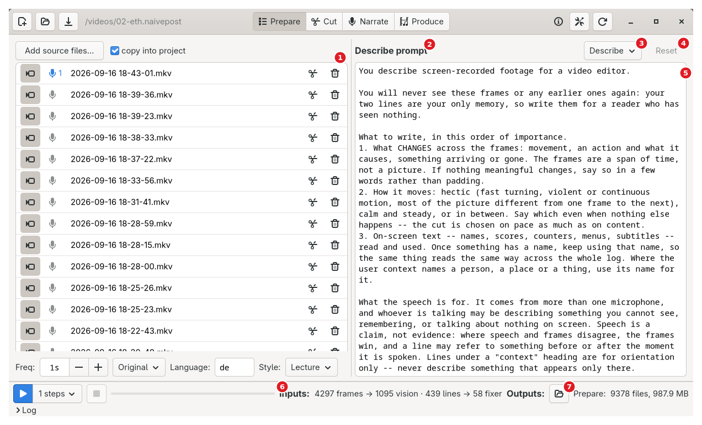

<sub>Screenshot of the prototype on the ETH lecture project.</sub>

**1** sources list and frame controls ([`03-shell.md` §4](03-shell.md#4-sources-list-lives-on-prepare-specified-here-because-the-shell-snapshots-it)) · **2** row title, "‹Name› prompt" · **3** row picker · **4** Reset (live only while this machine holds an edit) · **5** the prompt or the User Context · **6** Inputs readout · **7** Outputs: folder button and count

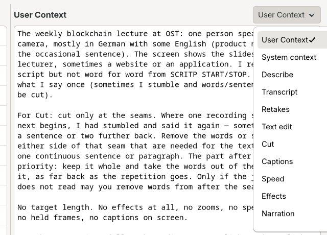

<sub>Screenshot of the prototype on the ETH lecture project.</sub> The list scrolls: Translate and Upload text sit below Narration.

Left: the sources list ([`03-shell.md` §4](03-shell.md#4-sources-list-lives-on-prepare-specified-here-because-the-shell-snapshots-it)) and, under it, Freq (frame interval stepper: each, 0.1, 0.2, 0.5, 1s, 2s, 3s, 4s, 5s; "Seconds between frames — type 0.1 to 5, or 'each' for every frame"), Frame size (Original, 896w (LLM), 480p, 720p, 1080p; "Frame size — Original keeps the video's own size"), Language (ASR code; "…the wrong one transcribes into gibberish. Empty means en"), Style (style table; shipped Lecture and Gaming; a blank project stores "" = **Gaming** — REVIEW: with no project loaded the prototype's dropdown opens on "Lecture", so picker and stored value disagree until touched; the rewrite MUST ship and show an explicit default; "Lecture: a read to camera -- the speech is the video, cut by removing the words said twice and the false starts. Gaming: a session -- the cut picks the moments worth keeping. Both describe the picture; only what the cut is chosen from differs.").

Right: the prompt bench — one heading row (title, "edited — kept in your settings" mark, row picker, Reset), one text box. The User Context row hides mark and Reset (no built-in wording to differ from). Row 0 = **User Context** (per project, sent with every request, outranks the prompts; empty sends nothing). Rows 1–12 = the twelve prompts in pipeline order, per machine; ✎ = edited on this machine; Reset restores the shipped wording. Every keystroke is stored. REVIEW: add a row "Editing policy" opening the form of [F0.7](03-shell.md#f07-derive-the-editing-policy-review--new).

Inputs readout: "N frames → M vision · L lines → K fixer", per-file tooltip. Outputs: one folder button for `prepare/`, label "Prepare:" + count; its tooltip names the three subfolders.

## 2. Flows

### F1.1 ▶ Prepare

<sub><!-- back -->[← F0.13](03-shell.md#f013-tests) · [↑ 04 Prepare](#04--prepare) · [all flows](11-flow-index.md#3-all-flows) · [F1.2 →](#f12-voice-separation-rows-with-)</sub>

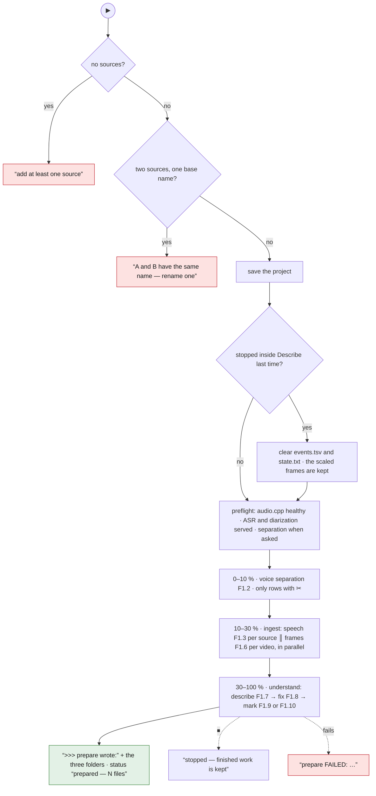

S1 Ignore when running. No sources → "add at least one source". Two sources with one base name → refuse (log "!!! A and B are both inputs/<base> -- rename one", status "A and B have the same name — rename one"). S2 Save the project. S3 Last run stopped inside Describe → remove every `events.tsv`/`state.txt` (">>> stopped last time — describing from the start again: … (scaled frames kept)"); a failed clear is logged (">>> could not clear the last run (…) -- resuming it") and the run resumes from disk. S4 startRun; log ">>> prepare: N input files", each file, the inputs summary, ">>> prepare: sending the session context from Prepare (N characters)". S5 Check the audio server; ASR and diarization models (and separation when asked) served. S6 Phases, share of the bar: voice separation ([F1.2](#f12-voice-separation-rows-with-)) 0–10 % when asked; ingest ([F1.3](#f13-per-source-audio--text--word-times--speakers--segments) + [F1.6](#f16-frames-per-video) in parallel) to 30 %; understand = describe ([F1.7](#f17-describe-per-footage-source-chunks-of-ppolicydescribeframesperreq--4)) → fix ([F1.8](#f18-fix-the-transcripts-blocks-of-ppolicyfixblocklines--25-lines)) → marking ([F1.9](#f19-mark-retakes-gaming-style)/F1.10) 30–100 %. S7 Success: fraction 1, ">>> prepare wrote:" + tree of the three folders, status "prepared — N files"; stopped → "stopped — finished work is kept"; failed → "prepare FAILED: …" / "prepare failed — see log". S8 Refresh the page, gates and Cut page; unload audio models.

### F1.2 Voice separation (rows with ✂)

<sub><!-- back -->[← F1.1](#f11--prepare) · [↑ 04 Prepare](#04--prepare) · [all flows](11-flow-index.md#3-all-flows) · [F1.3 →](#f13-per-source-audio--text--word-times--speakers--segments)</sub>

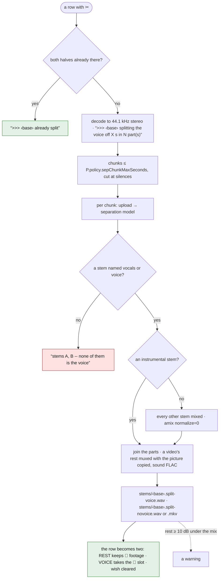

S1 Decode to 44.1 kHz stereo pcm. S2 Chunk at P.policy.sepChunkMaxSeconds (300 s) on silences. S3 Per chunk: upload, run the separation model; voice = `vocals|voice` stem, rest = `instrumental` stem (or every other stem mixed with amix normalize=0). S4 Join the parts; a video's rest muxed as mkv, picture copied. S5 Write `stems/<base>.split-voice.wav` and `<base>.split-novoice.wav|.mkv` (names keep the timestamp). S6 Log ">>> [base] splitting the voice off X s in N part(s) (<sep model>)" before the first chunk goes up, then ">>> [base] split into A and B" and a loudness report; warn when the rest is ≥ 10 dB under the mix. S7 Source row → two rows: rest keeps footage, voice takes the narrator slot; wish cleared; project saved. Skip when both halves exist.

### F1.3 Per source: audio → text → word times → speakers → segments

<sub><!-- back -->[← F1.2](#f12-voice-separation-rows-with-) · [↑ 04 Prepare](#04--prepare) · [all flows](11-flow-index.md#3-all-flows) · [F1.4 →](#f14-asr-in-chunks)</sub>

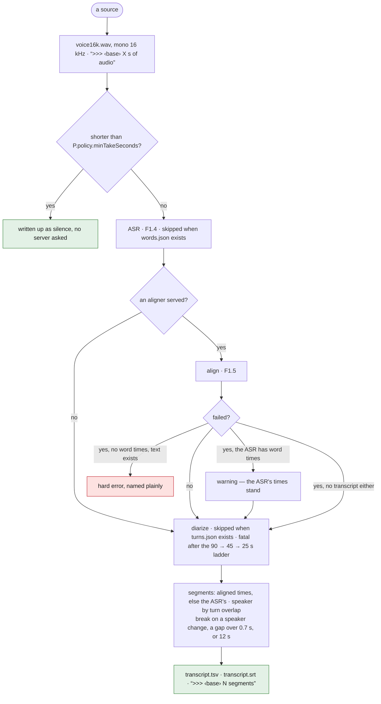

S1 `voice16k.wav` (mono 16 kHz) unless present; log ">>> [base] X s of audio". S2 **Short take**: < P.policy.minTakeSeconds (2.0) → written up as silence, no server asked (">>> [base] X s long -- a start/stop, not a take: written up as silence"). S3 ASR ([F1.4](#f14-asr-in-chunks)) unless `words.json` exists. S4 Alignment ([F1.5](#f15-forced-alignment)) when an aligner is served and `words.aligned.json` absent; failure = warning if the ASR gave word times, hard error if not, silent with no transcript either (nothing to align). S5 Diarization unless `turns.json` exists (fatal after the window ladder). S6 Segments: words from aligned or ASR times; speaker by greatest turn overlap, else nearest turn within 1 s, else SPEAKER_00 when no turns, else "?"; word end clamped to start + 2 s; segment breaks on speaker change, gap > 0.7 s, or 12 s; write `transcript.tsv`, `transcript.srt`; log ">>> [base] N segments".

### F1.4 ASR in chunks

<sub><!-- back -->[← F1.3](#f13-per-source-audio--text--word-times--speakers--segments) · [↑ 04 Prepare](#04--prepare) · [all flows](11-flow-index.md#3-all-flows) · [F1.5 →](#f15-forced-alignment)</sub>

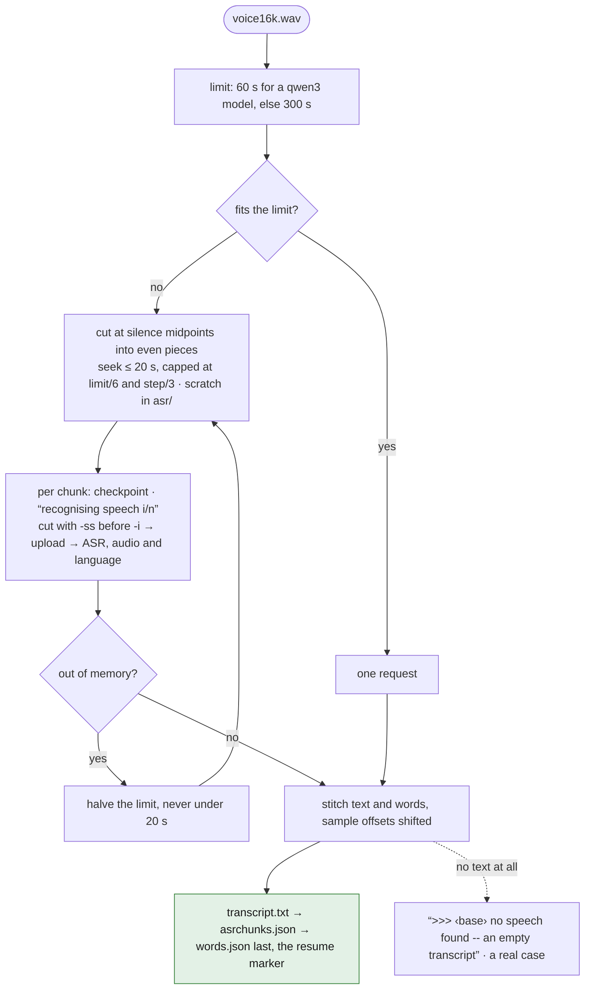

S1 Chunk limit 60 s for a qwen3-family model, else 300 s; out-of-memory → halve down to 20 s, retry (logged). S2 File fits → one request; else cut at silence midpoints into even pieces (seek ≤ 20 s, capped at limit/6 and step/3); scratch in `asr/`, removed on success. S3 Per chunk: checkpoint, progress "recognising speech i/n", cut with -ss before -i, upload, run ASR with `{audio, language}`. S4 Stitch `{text, words}`, sample offsets shifted; write `transcript.txt`, `asrchunks.json`, `words.json` last. Empty text is a real case (">>> [base] no speech found -- an empty transcript").

### F1.5 Forced alignment

<sub><!-- back -->[← F1.4](#f14-asr-in-chunks) · [↑ 04 Prepare](#04--prepare) · [all flows](11-flow-index.md#3-all-flows) · [F1.6 →](#f16-frames-per-video)</sub>

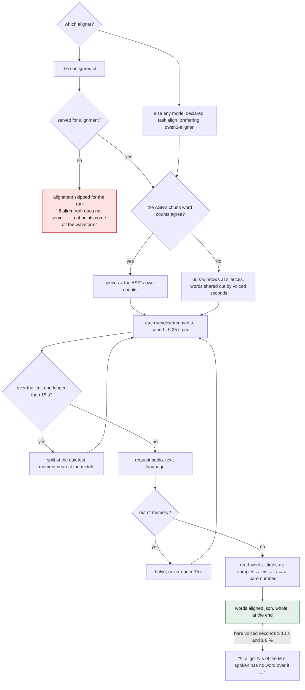

S1 Aligner = configured id, else every model declared task align, preferring qwen3-aligner; the first to answer serves the rest of the run. A configured id not served for alignment is not replaced: alignment skipped for the run with "!!! align: <url> does not serve \"X\" for alignment -- cut points come off the waveform". S2 Pieces = the ASR's own chunks when word counts agree, else 60 s windows cut at silences, words shared by voiced seconds. S3 Each window trimmed to sound (0.25 s pad); over the limit and > 15 s → split at the quietest moment nearest the middle (inside the middle three quarters); out-of-memory → halve, ≥ 15 s. S4 Request `{audio, text, language}`; reply words from `words|alignment|segments|result.*`; times read as samples, then milliseconds, then seconds, then a bare number (samples when > 120 s); words stored lower-cased, written form restored by the word list ([F1.13](#f113-the-sessions-word-list-shared-by-retakes-joins-finaltxt-and-subtitles)). S5 Write `words.aligned.json` whole at the end. S6 Warn "!!! align: N s of the M s spoken has no word over it -- the times are wrong, and the cut will drop that footage" when bare voiced seconds ≥ 10 s and ≥ 8 %.

### F1.6 Frames per video

<sub><!-- back -->[← F1.5](#f15-forced-alignment) · [↑ 04 Prepare](#04--prepare) · [all flows](11-flow-index.md#3-all-flows) · [F1.7 →](#f17-describe-per-footage-source-chunks-of-ppolicydescribeframesperreq--4)</sub>

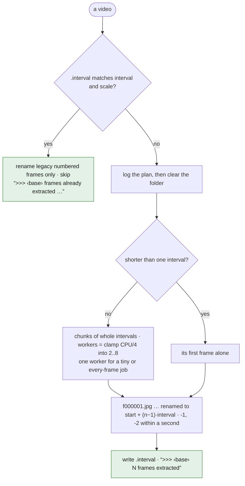

S1 Marker `.interval` = "<interval>|<scale>" matches → only rename legacy numbered frames; skip (">>> [base] frames already extracted (Xs, scale), skipping"). S2 Else log the plan (">>> [base] extracting a frame every Xs at <scale>" / "…extracting EVERY frame -- gigabytes"), clear the folder; filter `fps=1/interval` + scale (take shorter than one interval → its first frame alone). S3 Parallel chunks of whole intervals (workers clamp(CPU/4, 2, 8); 1 for tiny or every-frame jobs); progress from ffmpeg's `-progress`. S4 Rename `f000001.jpg…` to `<start + (n−1)·interval>` stamps (-1, -2 within one second). S5 Write the marker; log ">>> [base] N frames extracted".

### F1.7 Describe (per footage source, chunks of P.policy.describeFramesPerReq = 4)

<sub><!-- back -->[← F1.6](#f16-frames-per-video) · [↑ 04 Prepare](#04--prepare) · [all flows](11-flow-index.md#3-all-flows) · [F1.8 →](#f18-fix-the-transcripts-blocks-of-ppolicyfixblocklines--25-lines)</sub>

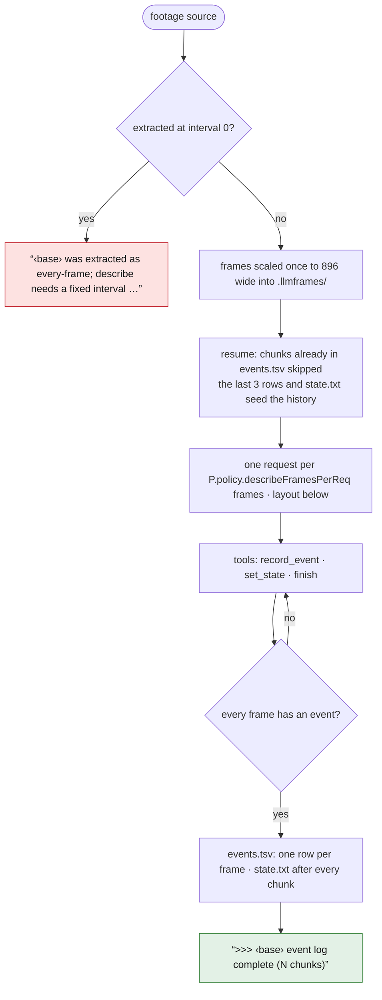

```text
User Context
STATE so far: …
Frames cover t=As to t=Bs, X s apart.
Just before this: ‹the last events›
--- context before (do not describe) ---
--- spoken during these frames ---
--- context after (do not describe) ---
[+0.0s] FRAME 1 of 4  ‹image›
[+1.0s] FRAME 2 of 4  ‹image›
…
```

S1 Frames sorted by stamp (interval-0 folder refused: "<base> was extracted as every-frame; describe needs a fixed interval — rerun Prepare with e.g. 1s"; missing or empty folders likewise); scaled once to 896 wide into `.llmframes/` unless the preset was 896w (LLM) or 480p. Each recording heard alongside the video logged with its offset (">>> [video] hearing X alongside it, starting Y s in"). S2 Resume: chunks whose start is in `events.tsv` skipped; last 3 rows seed the rolling window; `state.txt` seeds the STATE ("Recording just started."). S3 Message: User Context; "STATE so far: …"; "Frames cover t=As to t=Bs, X s apart."; "Just before this:" + last events; speech block (always three sections: context before, spoken during, context after; before/after within 10 s, ≤ 2 per source); then per frame "[+N.Ns] FRAME i of n" + image. S4 Cache on the whole content (images inline). S5 **Tools** ([`02-services.md` §3.2](02-services.md#32-describe-per-chunk-of-frames)): `record_event(frame, text, calm)`, `set_state(text)`, `finish`. Prototype: one "EVENT [+Ns]: …" line per frame + "STATE: …", parsed leniently. S6 One `events.tsv` row per frame (no event → "same"; a batch's first frame with no history must not be "same"); `state.txt` after every chunk. S7 Log ">>> [base] event log complete (N chunks)", or "(N chunks, M answered from the cache)" when any were.

### F1.8 Fix the transcripts (blocks of P.policy.fixBlockLines = 25 lines)

<sub><!-- back -->[← F1.7](#f17-describe-per-footage-source-chunks-of-ppolicydescribeframesperreq--4) · [↑ 04 Prepare](#04--prepare) · [all flows](11-flow-index.md#3-all-flows) · [F1.9 →](#f19-mark-retakes-gaming-style)</sub>

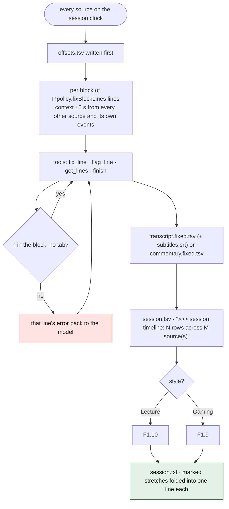

S1 Place every source on the session clock; load transcripts and event logs. S2 Per block: checkpoint; context ±5 s from every other source (events and lines) + own events; message "Context around these lines:\n…\nTranscript lines to clean (N lines, return exactly N):\n…". S3 **Tools**: `fix_line(n, text)` per line; `finish`. Prototype: N TSV lines back, discarded unless count, times (±0.01) and speakers identical; two tries; originals kept on failure. Only valid blocks cached. S4 Write `<source>/transcript.fixed.tsv` (+ `subtitles.srt` for a video) or `commentary.fixed.tsv`. (`offsets.tsv` is written earlier, in S1's placement pass, before any block goes out.) S5 Merge into `session.tsv` (sorted by start; events labelled EVENT); log ">>> session timeline: N rows across M source(s)". S6 Run the style's marking pass ([F1.9](#f19-mark-retakes-gaming-style) or [F1.10](#f110-repair-the-joins-lecture-style)); failure leaves the timeline unmarked ("!!! retakes: … -- the timeline stands unmarked"). S7 Write `session.txt` exactly as the cut model sees it (marked stretches folded to one line each: "<stamp> (abandoned attempt to <stamp>, said again at <stamp> -- already removed, read straight past it)").

### F1.9 Mark retakes (Gaming style)

<sub><!-- back -->[← F1.8](#f18-fix-the-transcripts-blocks-of-ppolicyfixblocklines--25-lines) · [↑ 04 Prepare](#04--prepare) · [all flows](11-flow-index.md#3-all-flows) · [F1.10 →](#f110-repair-the-joins-lecture-style)</sub>

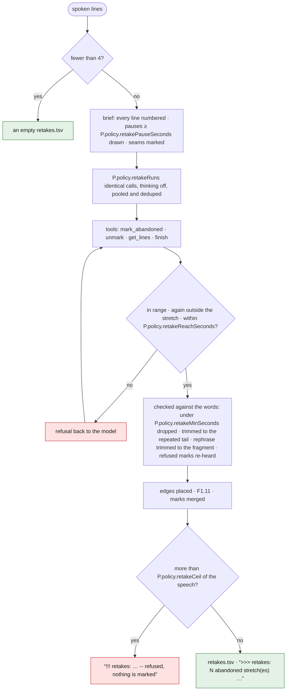

S1 Spoken lines (< 4 → empty `retakes.tsv`). S2 Brief: spoken lines numbered, "(N.Ns pause)" at gaps ≥ P.policy.retakePauseSeconds (1.5 s), "--- the recording stops here; the next one begins ---" at source changes. S3 P.policy.retakeRuns (3) identical calls (thinking off), each its own cache slot (run index in the key), answers pooled, deduped. Prototype: strict JSON `{"abandoned":[{"from","to","again"}]}`, 1-based line numbers. **Tools**: `mark_abandoned(from, to, again)`, `unmark`, `finish` (tool validates: range, `again` inside the stretch, beyond the timeline, farther than P.policy.retakeReachSeconds 180 s). S4 Verify against the words: removal < P.policy.retakeMinSeconds (0.3 s) dropped; `again = 0` only for a whole take; repeated tail found by fuzzy match (≥ 70 % run, ≤ 3 skips; words equal, prefix ≥ 3 bytes, or one edit), mark trimmed to it; rephrase trimmed to the broken-off tail (fragments ≤ 6 s); refused marks re-heard by a second ASR pass on both attempts. S5 Place edges ([F1.11](#f111-place-the-edges-of-a-mark)), merge marks. S6 > P.policy.retakeCeil (40 %) of the speech would go → refuse everything: "!!! retakes: <m:ss> of <m:ss> of speech called abandoned -- refused, nothing is marked"; empty `retakes.tsv` written. S7 Write `retakes.tsv` (empty on purpose when none); log ">>> retakes: N abandoned stretch(es), m:ss of speech, kept out of the cut".

### F1.10 Repair the joins (Lecture style)

<sub><!-- back -->[← F1.9](#f19-mark-retakes-gaming-style) · [↑ 04 Prepare](#04--prepare) · [all flows](11-flow-index.md#3-all-flows) · [F1.11 →](#f111-place-the-edges-of-a-mark)</sub>

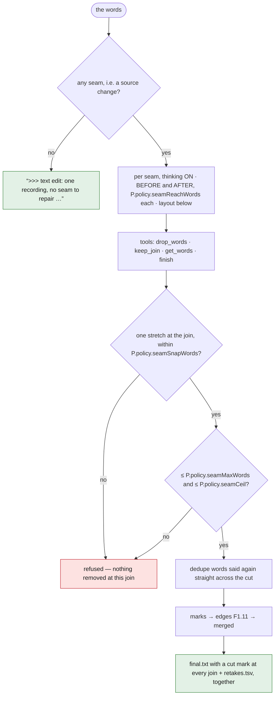

```text
JOIN k of n.
BEFORE (the end of the take that was interrupted):
… the last P.policy.seamReachWords words …
AFTER (the beginning of the take that follows):
… the first P.policy.seamReachWords words …
```

S1 Words of every recording except the narrator mic (< 4 → empty). S2 Seams = source changes; none → ">>> text edit: one recording, no seam to repair -- every word stands". S3 Per seam (thinking ON): "JOIN k of n." + "BEFORE (the end of the take that was interrupted):" + last P.policy.seamReachWords (140) words + "AFTER (the beginning of the take that follows):" + first 140 words. **Tools**: `drop_words(side, count)`, `keep_join`, `finish`. Prototype: `{"joined": "…"}` matched backwards (preferring the later saying); dropped words must be one stretch at the join (snap 3 words; other stretches ≤ 2 words are respellings); refusals logged "!!! text edit: join k: <reason> -- nothing removed there" (no words; not at the join; several stretches; > P.policy.seamMaxWords 40 or > P.policy.seamCeil 60 %). Cached only when usable. S4 Dedupe words repeated straight across a cut (3 words either side; earlier goes). S5 Marks from dropped runs; edges ([F1.11](#f111-place-the-edges-of-a-mark)); merge. S6 Write `final.txt` (surviving words as written; `|cut N|` / `|cut|` at every join) and `retakes.tsv` together; log ">>> text edit: N of M words removed in K stretch(es)".

### F1.11 Place the edges of a mark

<sub><!-- back -->[← F1.10](#f110-repair-the-joins-lecture-style) · [↑ 04 Prepare](#04--prepare) · [all flows](11-flow-index.md#3-all-flows) · [F1.12 →](#f112-hand-edit-the-text-lecture)</sub>

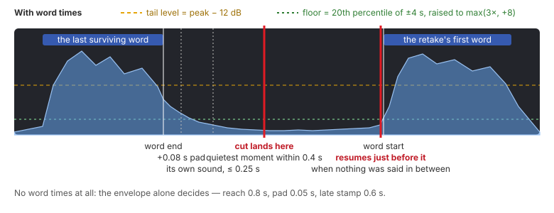

<sub>Illustration of the rule, not a measurement.</sub>

With word times: cut ends after the last surviving word (0.08 s pad; follows the word's own sound up to 0.25 s, then the quietest moment within 0.4 s), resumes just before the retake's first word when nothing was said between. Without: mono envelope alone (reach 0.8 s, pad 0.05 s, late stamp 0.6 s). Envelope floor = 20th percentile of ±4 s raised to max(3×, +8); tail level = peak − 12 dB.

### F1.12 Hand-edit the text (Lecture)

<sub><!-- back -->[← F1.11](#f111-place-the-edges-of-a-mark) · [↑ 04 Prepare](#04--prepare) · [all flows](11-flow-index.md#3-all-flows) · [F1.13 →](#f113-the-sessions-word-list-shared-by-retakes-joins-finaltxt-and-subtitles)</sub>

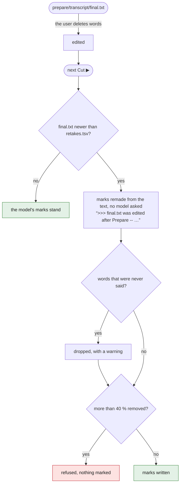

S1 User edits `prepare/transcript/final.txt` (deletes words; join marks may stay or go). S2 Next Cut ▶, if its mtime is after `retakes.tsv`'s: marks remade from the text, no model (">>> final.txt was edited after Prepare -- the marks are remade from it, no model asked"); never-said words dropped with a warning; > 40 % removed refused. REVIEW: a rewrite SHOULD also offer this file in an editor on the Prepare page, join marks as clickable seams.

## 3. Data written

See [`01-project-and-files.md` §1](01-project-and-files.md#1-layout) (prepare/…).

## 4. Parameters used

P.policy: minTakeSeconds, retakePause, retakeRuns, retakeReach, retakeMin, retakeCeil, retakeFrag, againReach, seamReach, seamMaxWords, seamCeil, seamSnap, seamNoise, describeFramesPerReq, describeRecentEvents, describeCtxSegs, describeCtxWindow, fixBlock. P.audio: chunk sizes, silence threshold, diarization windows and anchor sizes, merge gap/length. Engineering: frame workers, quality, scratch handling. Full list in [`10-parameters.md`](10-parameters.md).

## 5. Rules

- Every stage skips when its output exists; resume markers written last and whole; scratch dirs survive failure, go on success.
- Server's own documents never rewritten; derived files live beside them.
- Only usable answers are cached; the fix pass changes text only; the retake pass answers in line numbers; the join pass can only delete; "prefer the later saying" is the direction of the match, not a request to the model.
- Marks are markings, never deletions; an empty marks file means "asked, none".
- No aligner is a working setup; no ASR word times and no aligner is a hard failure named plainly; diarization failure is fatal after the ladder; no speech is a real case at every layer.
- ⏸ resumes; ⏹ restarts only the describing, and only on the next ▶.

### F1.13 The session's word list (shared by retakes, joins, final.txt and subtitles)

<sub><!-- back -->[← F1.12](#f112-hand-edit-the-text-lecture) · [↑ 04 Prepare](#04--prepare) · [all flows](11-flow-index.md#3-all-flows) · [F2.1 →](05-cut.md#f21-play-the-recording-)</sub>

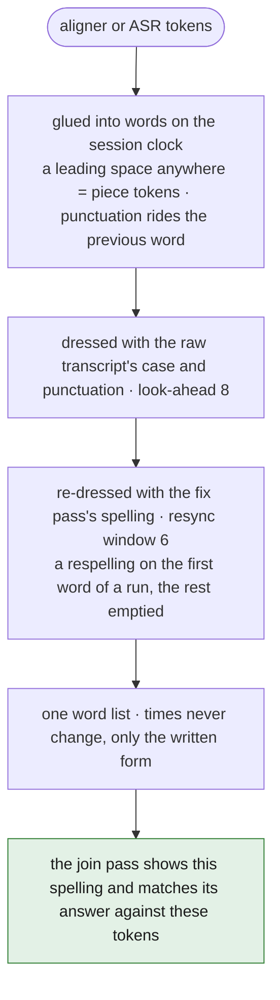

After the fix pass, one word list for the whole session: aligner (or ASR) tokens glued into words on the session clock (a leading space anywhere → piece tokens, none → whole words; punctuation-only tokens ride the previous word without moving its end), dressed with the raw transcript's case and punctuation (look-ahead 8), then re-dressed with the fix pass's spelling (resync window 6; a whole respelling printed on a run's first word, the rest emptied; a line with no word in common left alone). Times never change, only the written form. The join pass shows the model this spelling and matches its answer back against exactly these tokens (a word printed as two owns both; survives if either does).

## 6. Details confirmed against the code (verification pass)

- **Diarization ([F1.3](#f13-per-source-audio--text--word-times--speakers--segments) S5) is a two-pass anchored scan**: pass 1 scans windows at hop ⅔ window (min 10 s) — "finding voices i/n"; anchor window = most voices with ≥ 4 s of speech, ties → best-represented quietest voice; up to min(12, win/4) s of each voice cut and concatenated into an anchor (">>> [base] anchor: N voice(s) in X s of a Y s window -- Z s of new audio each"); pass 2 prepends the anchor to every (win − anchor − 1) s window — "placing speakers i/n" — and matches slots to anchor blocks one-to-one by overlap ≥ 0.5 s, strongest claim first; unmatched slots get their own ids; < 15 s of new audio per window → error "anchor too long (X s of Y s window)"; no voice long enough → ">>> [base] diarization: no voice long enough to anchor -- no turns" and `[]`.
- **Segments**: a word between turns takes the running segment's speaker; a segment started unknown is renamed once one word identifies it; `transcript.srt` prefixes each cue with `[<speaker>] ` unless unknown. Hard failures: "N words carry no usable start_sample/end_sample -- the answer changed shape"; "<ASR> transcribed this recording but timed no words, no aligner is registered to time them -- register one (task \"align\") -- or use an ASR that answers with word timings" (or "…and the aligner left no times either, which the line above this one says why").
- **meta.env**: VIDEO_FILE/BASE only when there is footage; AUDIO_FILE/BASE from the recording tagged narrator 1; INTERVAL and SCALE always.
- **Separation**: refusals "stems A, B -- none of them is the voice" and "only \"vocals\" came back -- the recording without the voice is the other half of this, and there is no other half"; ">>> [base] already split" on resume; a video's rest muxed with picture copied, sound as FLAC.
- **Describe**: the speech block's literal headings `--- context before (do not describe) ---`, `--- spoken during these frames ---`, `--- context after (do not describe) ---` with `(none)` / `(no speech during these frames)`; a frame matches the event stamped within half an interval; a batch's first frame with no history is written "Calm; same view."; a reply with no label stored "(no event line: …)"; an old-shape single EVENT becomes the first frame's line.
- **Fix**: ">>> [base] block i/n failed validation, keeping original lines"; ">>> [base] N block(s) answered from the cache"; `offsets.tsv`: one row per footage/recording pair, each logged ">>> offset: A starts X s into B". `session.txt` lines read `[<start>s-<end>s | mm:ss] LABEL: text` with LABEL = EVENT, NARRATOR (the narrator's mic) or the speaker id.
- **Retakes**: "!!! retakes: run i: … -- its answer is set aside"; "… -- going on with N"; ">>> retakes: N of M run(s) answered from the cache"; ">>> retakes: none".
- **Joins**: refusals also "the stretch left out (\"…\") stops N words short of the join" / "…starts N words past the join" beyond seamSnap; ">>> text edit: N join(s) repaired, M from the cache"; one line per mark ">>> text edit: a-b goes (\"…\")"; dedupe note "<t>: \"…\" said again straight after the cut -- the earlier one goes"; one recording still writes `final.txt` with every word and an empty `retakes.tsv`. Hand edit: "!!! text edit: N word(s) in the text were never said -- left out, there is no sound for them"; "!!! text edit: N of M words removed -- refused, that is not an edit, nothing is marked" (the same 40 % ceiling as retakes).
- **Prompt bench**: each row's tooltip says what the job gets and answers; the mark's tooltip "Your wording is kept in ~/.config/naivepost/prompts, so a newer built-in prompt will not replace it. Reset puts it back."; Reset live only while this machine holds an edit ("Put the built-in wording back" / "This is the built-in wording, unchanged"); legacy [`prompts/<key>/General.txt|Default.txt`](prompts) are read once and rewritten as [`prompts/<key>.txt`](prompts); an empty prompt file is no prompt.
- **Readouts**: "no input files — add some above" (tooltip "(no sources)"); Outputs "nothing yet" / "N files, size" with "newest <ago>".

<!-- nav -->
---
[← 03 The shell](03-shell.md) · [↑ top](#04--prepare) · [↑ Contents](README.md) · [05 Cut →](05-cut.md)
<!-- /nav -->
