# 05 — Cut

<!-- nav -->
[← 04 Prepare](04-prepare.md) · [↑ Contents](README.md) · [06 Effects →](06-effects.md)

**Flows:** [F2.1](#f21-play-the-recording-) · [F2.2](#f22-play-the-cut-) · [F2.3](#f23-review-every-cut-) · [F2.4](#f24-place-and-step-the-line) · [F2.5](#f25-hush-and-mix-what-the-preview-hears) · [F2.6](#f26-select) · [F2.7](#f27-add-split-remove-) · [F2.8](#f28-trim-and-move) · [F2.9](#f29-copy-paste-lane) · [F2.10](#f210-cameras-and-hearing) · [F2.11](#f211-folds-and-rows) · [F2.12](#f212-insert-a-card-still-video-or-sound) · [F2.13](#f213-undo-redo-revert-clear) · [F2.14](#f214-suggest-a-cut)
<!-- /nav -->

The session on a timeline: thumbnails per camera row, a waveform lane per sound, kept material tinted green. Unfilmed time takes no width. Opens once there is footage.

## 1. Screen

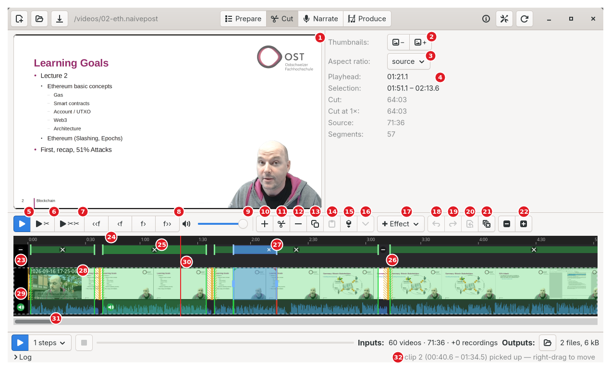

Screenshot of the prototype on the ETH lecture project.

**1** preview · **2** thumbnail size · **3** aspect ratio · **4** readings: playhead, selection, cut, cut at 1×, source, segments · **5** ▶ the recording · **6** ▶✂ the cut · **7** ▶✂✂ review every cut · **8** frame steps · **9** preview volume · **10** Add · **11** Split · **12** Remove · **13** Copy · **14** Paste · **15** Insert · **16** Lane · **17** Effect ▾ · **18** Undo · **19** Redo · **20** Revert · **21** Clear · **22** zoom − + · **23** fold-all badge · **24** ruler · **25** green bar of a kept scene, with its ✕ · **26** fold badge in a dropped gap · **27** the selection, with its ✕ · **28** row name plate · **29** the row's sound switch · **30** the red line · **31** scrollbar · **32** status line

Red playhead: 2 px line on its own layer across both bands. No timeline tooltips, by design; status line and cursor shapes say what a press would do.

**Toolbar groups** (left to right): transport (▶ recording, ▶✂ cut, ▶✂✂ review, frame steps); preview volume; verbs (＋ Add, | Split, － Remove, ⧉ Copy, ⧉ Paste, Insert/Edit, ⇲ Lane); effects dropdown (✚ Effect: ⊕ Zoom, ❝ Text, ▨ SVG, ⏩ Speed, 🔊 Volume, 🏷 Label); history (Undo Ctrl+Z, Redo Ctrl+Shift+Z **or Ctrl+Y**, Revert, ✗ Clear); zoom (−, +). Wheel over the transport bar **and over the preview picture** steps frames (Shift = 5); over the tracks it zooms around the cursor; Shift+wheel or a trackpad sideways swipe pans an eighth of the view. Tooltips and greyed rules: [`inventory/cut.md`](inventory/cut.md) §A, normative.

**Form column**: idle readings (thumbnail size, aspect, playhead clock, selection, cut length, cut at 1×, source length, segments) or the form of what is being placed or edited (insert, effect); forms are live (kept as you type; one Undo reverts the whole edit), pinned heading (✕ closes), pinned button footer.

**Pictures**: the thumbnails come from the frames Prepare extracted. New: on the 250 ms grid restarted at each scene change ([F1.6](04-prepare.md#f16-frames-per-video)) the band has a picture at every zoom; prototype: one frame every Freq seconds, so zoomed in the band shows black between them.

**Tracks**: gutter (fold-all badge, per-lane and per-row sound switches, empty-row ✕), ruler, selection band (green bar per kept scene with ✕ and draggable ends; blue selection with ✕ and ends; fold −/+ badges), effects lane (one row per overlapping group), picture rows (thumbnails; amber striped edges where a recording starts/ends; a yellow wash and frame over a recording the join pass took out entire — flagged for a look, not an error ([F1.10](04-prepare.md#f110-repair-the-joins)); each row's first audio track as a strip below; camera and speaker badges on the scene under the line or held; pinned name plate per row — recording base name, "from m:ss" for a cut lane windowing a file, "+1.23 s" when the source has a hand correction; in/out marks as 3 px lines with flag triangles across the whole band, green in, red out; every insert a violet band across every row, hatched when spliced, with a plated `card` mark naming the file, plus own marks on the wave strips if sound-only; rose wash over the picture under any speed effect; dashed white outline around the row a click set the preview to watch, gone when ▶ hands the preview back), then the separate recordings' lanes, then the scrollbar (hidden when everything fits; thumb geared at high zoom so one screenful is always 40 px of drag).

## 2. Model (summary; full schema in `01-project-and-files.md` §3)

Session clock; rows by greedy interval colouring with pins; filmed runs and cells; folds have zero width; x↔time through the cells (half-open on the right); zoom 4 px/s at open, floor = fit the filmed length, ceiling 240 px/s; scenes `[s,e)` on a row with inserts, lanes, quiet lists; effects; undo snapshots (segments, effects, aspect, shift, rows, lanes, nrows), depth 50; base = the last suggestion or what the page opened with.

## 3. Transport flows

### F2.1 Play the recording (▶)

<!-- back -->[← F1.13](04-prepare.md#f113-the-sessions-word-list-shared-by-retakes-joins-finaltxt-and-subtitles) · [↑ 05 Cut](#05--cut) · [all flows](11-flow-index.md#3-all-flows) · [F2.2 →](#f22-play-the-cut-)

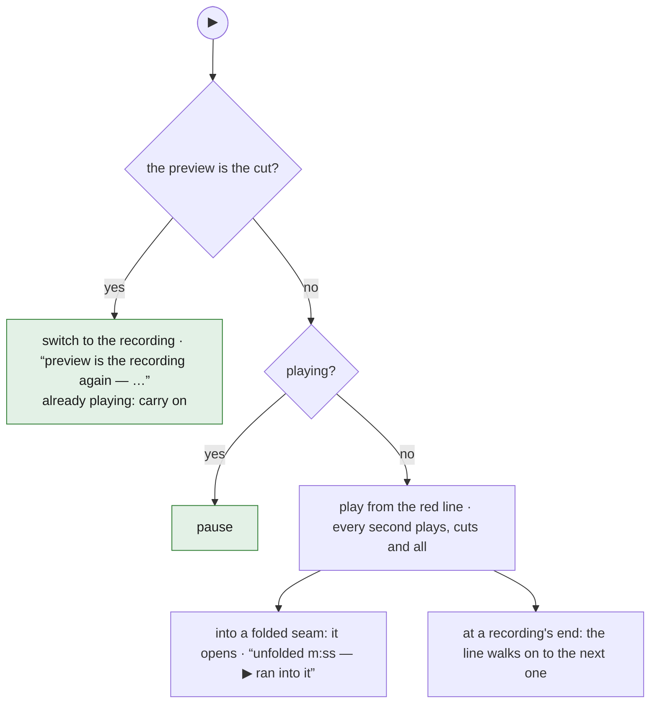
```mermaid
flowchart TD
  A(["▶"]) --> C{"the preview is the cut?"}
  C -- yes --> SW["switch to the recording · “preview is the recording again — …”<br/>already playing: carry on"]:::done
  C -- no --> P{"playing?"}
  P -- yes --> PA["pause"]:::done
  P -- no --> PL["play from the red line · every second plays, cuts and all"]
  PL --> F["into a folded seam: it opens · “unfolded m:ss — ▶ ran into it”"]
  PL --> E["at a recording's end: the line walks on to the next one"]
  classDef refuse fill:#fde2e1,stroke:#c01c28,color:#1a1a1a
  classDef done fill:#e3f1e6,stroke:#2e7d32,color:#1a1a1a
  classDef ask fill:#e8eefc,stroke:#3a63c8,color:#1a1a1a
```

S1 Preview is the cut → switch to the recording ("preview is the recording again — everything plays, cuts and all"); if already playing, carry on, stop. S2 Else toggle: playing → pause; else play from the red line. S3 While playing every second plays, cuts and all; into a folded seam → it opens ("unfolded m:ss — ▶ ran into it"); at a recording's end the line walks on to the next one (or a camera still rolling then). S4 Clock shows session time; line follows the player ten times a second, smoothed live clock in between.

### F2.2 Play the cut (▶✂)

<!-- back -->[← F2.1](#f21-play-the-recording-) · [↑ 05 Cut](#05--cut) · [all flows](11-flow-index.md#3-all-flows) · [F2.3 →](#f23-review-every-cut-)

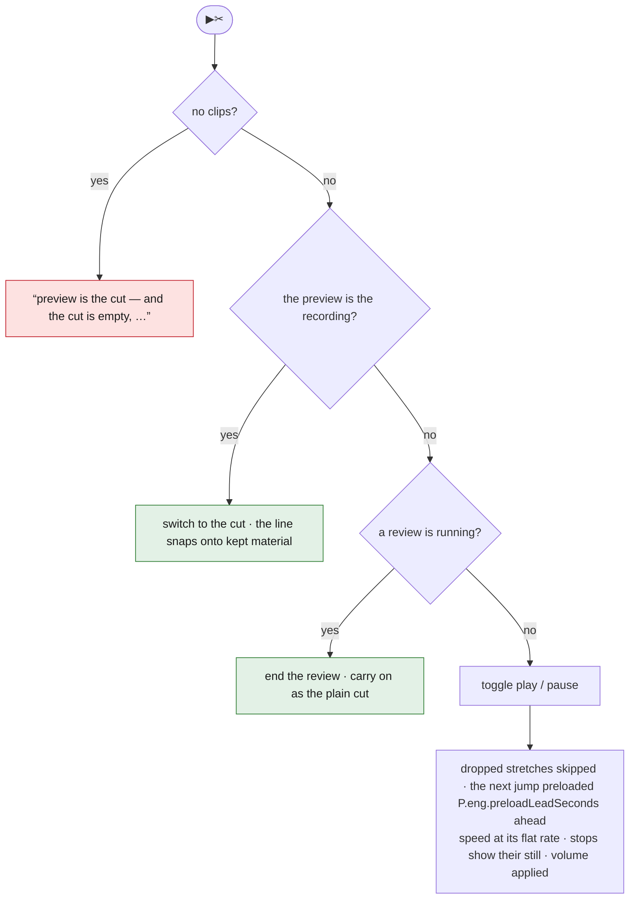
```mermaid
flowchart TD
  A(["▶✂"]) --> E{"no clips?"}
  E -- yes --> G["“preview is the cut — and the cut is empty, …”"]:::refuse
  E -- no --> R{"the preview is the recording?"}
  R -- yes --> SW["switch to the cut · the line snaps onto kept material"]:::done
  R -- no --> RV{"a review is running?"}
  RV -- yes --> END["end the review · carry on as the plain cut"]:::done
  RV -- no --> T["toggle play / pause"]
  T --> SKIP["dropped stretches skipped · the next jump preloaded P.eng.preloadLeadSeconds ahead<br/>speed at its flat rate · stops show their still · volume applied"]
  classDef refuse fill:#fde2e1,stroke:#c01c28,color:#1a1a1a
  classDef done fill:#e3f1e6,stroke:#2e7d32,color:#1a1a1a
  classDef ask fill:#e8eefc,stroke:#3a63c8,color:#1a1a1a
```

S1 Greyed with no clips. S2 Preview is the recording → switch to the cut (line snaps onto kept material; "preview is the cut — the clock reads the finished video", or with no clips "preview is the cut — and the cut is empty, so ▶✂ has nothing to play until a clip is added"); if playing, carry on. Other ways in (Space, picture click, run bar) refuse an empty cut: "the cut is empty — add a clip to play it, or press ▶ to play the recording instead". S3 Review running → end it, carry on as the plain cut. S4 Else toggle. S5 While playing: removed stretches skipped (line jumps to the next clip's first playable second; past the last clip → pause); next jump preloaded three seconds ahead in a spare pipeline so the join does not freeze (P.eng.preloadLeadSeconds; the same spare arms the review's next run-up and the walk-on at a recording's end, in every mode); speed effects at their flat rate; stops show their still; volume effects apply; clock reads the cut's own time. S6 Dropped stretches dimmed on the tracks.

### F2.3 Review every cut (▶✂✂)

<!-- back -->[← F2.2](#f22-play-the-cut-) · [↑ 05 Cut](#05--cut) · [all flows](11-flow-index.md#3-all-flows) · [F2.4 →](#f24-place-and-step-the-line)

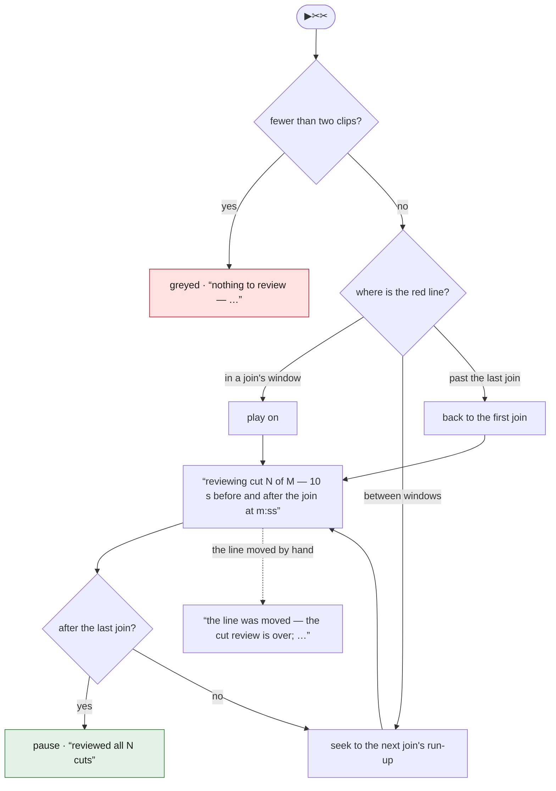
```mermaid
flowchart TD
  A(["▶✂✂"]) --> F{"fewer than two clips?"}
  F -- yes --> G["greyed · “nothing to review — …”"]:::refuse
  F -- no --> W{"where is the red line?"}
  W -- "in a join's window" --> PLAY["play on"]
  W -- "between windows" --> SEEK["seek to the next join's run-up"]
  W -- "past the last join" --> FIRST["back to the first join"]
  PLAY --> S["“reviewing cut N of M — 10 s before and after the join at m:ss”"]
  SEEK --> S
  FIRST --> S
  S --> N{"after the last join?"}
  N -- yes --> DONE["pause · “reviewed all N cuts”"]:::done
  N -- no --> SEEK
  S -. the line moved by hand .-> OVER["“the line was moved — the cut review is over; …”"]
  classDef refuse fill:#fde2e1,stroke:#c01c28,color:#1a1a1a
  classDef done fill:#e3f1e6,stroke:#2e7d32,color:#1a1a1a
  classDef ask fill:#e8eefc,stroke:#3a63c8,color:#1a1a1a
```

S1 Greyed with fewer than two clips ("nothing to review — a cut needs two clips to have a join between them"). S2 Start from the red line: inside a join's window (P.policy.reviewPadSeconds = 10 s either side of the join, clamped to the clips) → play on; between windows → seek to the next join's run-up; past the last → first join. S3 Play as the cut; once the seconds after a join have played, seek to the next run-up, or play on into it if already behind the line. S4 Status "reviewing cut N of M — 10 s before and after the join at m:ss"; after the last: pause, "reviewed all N cuts". S5 ▶✂✂ while running pauses and ends the review; ▶ or ▶✂ switch over without stopping; moving the line by hand ends it ("the line was moved — the cut review is over; ▶✂✂ starts it again").

**One rule for the three buttons**: each wears ⏸ only while its own thing runs; pressing it pauses; pressing another switches the preview without stopping; exactly one is lit (▶ recording, ▶✂ cut, ▶✂✂ review).

### F2.4 Place and step the line

<!-- back -->[← F2.3](#f23-review-every-cut-) · [↑ 05 Cut](#05--cut) · [all flows](11-flow-index.md#3-all-flows) · [F2.5 →](#f25-hush-and-mix-what-the-preview-hears)

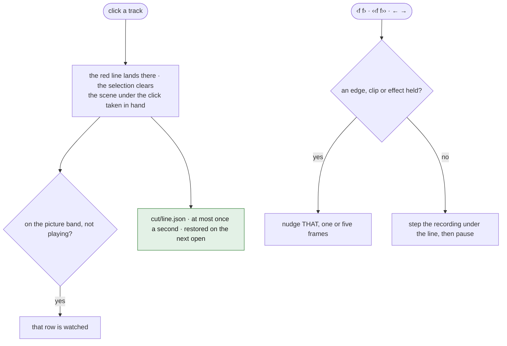
```mermaid
flowchart TD
  A(["click a track"]) --> L["the red line lands there · the selection clears<br/>the scene under the click taken in hand"]
  L --> W{"on the picture band, not playing?"}
  W -- yes --> WATCH["that row is watched"]
  A2(["‹f f› · ‹‹f f›› · ← →"]) --> H{"an edge, clip or effect held?"}
  H -- yes --> NUDGE["nudge THAT, one or five frames"]
  H -- no --> STEP["step the recording under the line, then pause"]
  L --> SAVE["cut/line.json · at most once a second · restored on the next open"]:::done
  classDef refuse fill:#fde2e1,stroke:#c01c28,color:#1a1a1a
  classDef done fill:#e3f1e6,stroke:#2e7d32,color:#1a1a1a
  classDef ask fill:#e8eefc,stroke:#3a63c8,color:#1a1a1a
```

S1 Click on a track → red line there, selection cleared, scene under the click in hand; also watches that row, but only on the picture band, while nothing plays, with sources loaded (a gutter click does neither). S1b A second left press on the picture band (clear of the green and the effects lane) picks up by the wider 12 px reach: held edge, then any border, then the whole clip — how to take a clip or card whose green sits on another row. S2 ‹f f› step one frame (Shift/‹‹f f›› five) of the recording under the line, then pause; with an edge, clip or effect held they nudge that instead. S3 ←/→ same, only while something is held; Space toggles play. S4 Line position kept in `cut/line.json` (written at most once a second while moving, flushed on close); restored once per project on next open if a recording still covers it, cued to that frame and scrolled into view.

### F2.5 Hush and mix (what the preview hears)

<!-- back -->[← F2.4](#f24-place-and-step-the-line) · [↑ 05 Cut](#05--cut) · [all flows](11-flow-index.md#3-all-flows) · [F2.6 →](#f26-select)

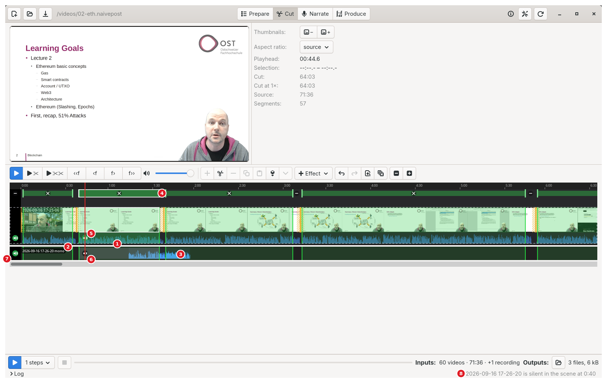

Screenshot of the prototype on the ETH lecture project, staged: the lecture has no separate recordings, so 45 s of another day's recording was added to a copy of the project as `2026-09-16 17-26-20.wav`, placing it at 1:14–1:59 on the session clock.

**1** the camera row's own sound strip · **2** the recorders' band: one lane per separate recording or extra track, name plate with the channel layout ("mono") · **3** the lane's sound over footage that has its own: both play unless a scene silences one · **4** the held scene (clip 2, picked up) · **5** its speaker badge on the camera sound: heard · **6** its speaker badge on the lane: silenced · **7** the lane's gutter switch: the lane for the whole cut · **8** status "2026-09-16 17-26-20 is silent in the scene at 0:40"

Sound overlaps whenever two sources were recording at once: a camera's own sound, a separate recording (a narrator mic, a phone, a second recorder), each extra ticked track of a multi-track file, and a second camera's sound. Each is one lane, placed by the time stamp in its name and slid by a right-drag ([F2.8](#f28-trim-and-move)). Every lane is heard by default. A scene's speaker badges decide what that scene hears; a gutter switch turns a lane off for the whole cut ([F2.10](#f210-cameras-and-hearing)). The render mixes what each scene hears, the same way ([08](08-produce.md)).

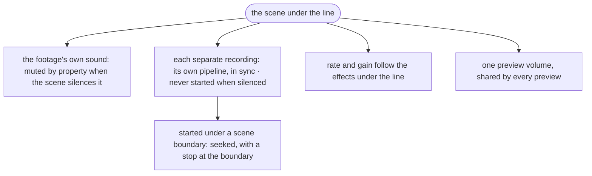
```mermaid
flowchart TD
  S(["the scene under the line"]) --> FO["the footage's own sound: muted by property when the scene silences it"]
  S --> LA["each separate recording: its own pipeline, in sync · never started when silenced"]
  LA --> B["started under a scene boundary: seeked, with a stop at the boundary"]
  S --> FX["rate and gain follow the effects under the line"]
  S --> VOL["one preview volume, shared by every preview"]
  classDef refuse fill:#fde2e1,stroke:#c01c28,color:#1a1a1a
  classDef done fill:#e3f1e6,stroke:#2e7d32,color:#1a1a1a
  classDef ask fill:#e8eefc,stroke:#3a63c8,color:#1a1a1a
```

Separate recordings overlapping the footage play as their own pipelines, in sync; a lane the scene under the line silences is never started; silenced footage sound is muted by property; a lane started under a scene boundary is seeked, with a stop at it. Rate and gain follow the effects under the line. Preview volume: one number shared by every preview.

## 4. Editing flows

### F2.6 Select

<!-- back -->[← F2.5](#f25-hush-and-mix-what-the-preview-hears) · [↑ 05 Cut](#05--cut) · [all flows](11-flow-index.md#3-all-flows) · [F2.7 →](#f27-add-split-remove-)

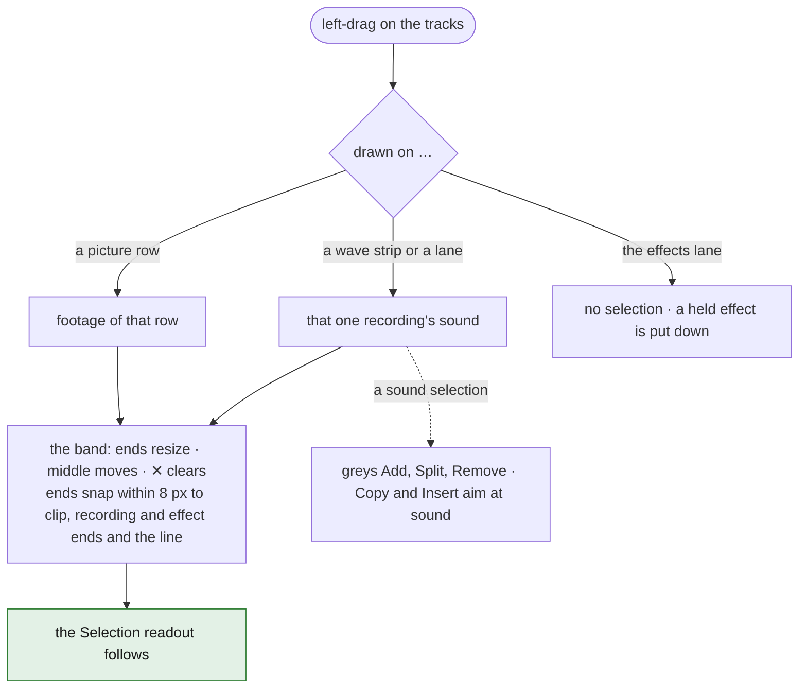
```mermaid
flowchart TD
  A(["left-drag on the tracks"]) --> W{"drawn on …"}
  W -- "a picture row" --> F["footage of that row"]
  W -- "a wave strip or a lane" --> S["that one recording's sound"]
  W -- "the effects lane" --> N["no selection · a held effect is put down"]
  F --> BAND["the band: ends resize · middle moves · ✕ clears<br/>ends snap within 8 px to clip, recording and effect ends and the line"]
  S --> BAND
  BAND --> R["the Selection readout follows"]:::done
  S -. a sound selection .-> G["greys Add, Split, Remove · Copy and Insert aim at sound"]
  classDef refuse fill:#fde2e1,stroke:#c01c28,color:#1a1a1a
  classDef done fill:#e3f1e6,stroke:#2e7d32,color:#1a1a1a
  classDef ask fill:#e8eefc,stroke:#3a63c8,color:#1a1a1a
```

S1 Left-drag on any track area no control claims (picture row, wave strip, lane, ruler, empty part of the selection band) draws a selection scoped to what it was drawn on (that row's footage, or one recording's sound). Only the effects lane refuses: a press on empty lane puts a held effect down instead. S2 Ends resize, middle moves, ✕ clears; ends snap within 8 px to clip borders, recording ends, effect ends, the playhead. S3 In/out marks and the Selection readout follow the band. S4 A sound selection greys Add/Split/Remove and re-aims Copy and Insert at sound.

### F2.7 Add, Split, Remove, ⌦

<!-- back -->[← F2.6](#f26-select) · [↑ 05 Cut](#05--cut) · [all flows](11-flow-index.md#3-all-flows) · [F2.8 →](#f28-trim-and-move)

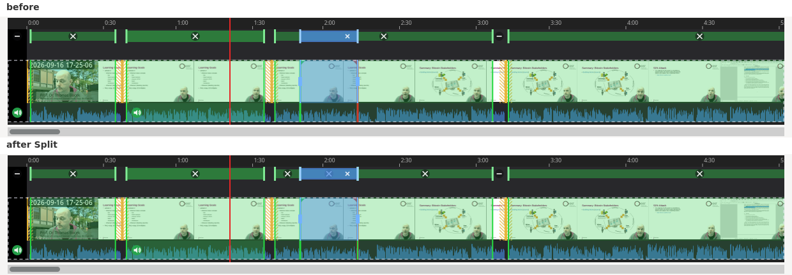

Screenshot of the prototype on the ETH lecture project. Nothing is removed; the selection stays up.

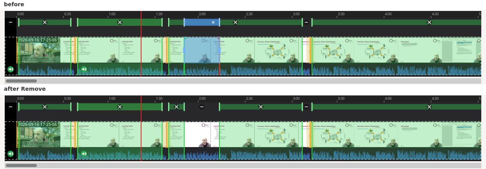

Screenshot of the prototype on the ETH lecture project. The gap gets a fold badge.

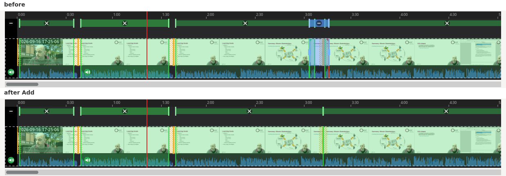

Screenshot of the prototype on the ETH lecture project. The gap at 3:05 is filled; both ends snapped.

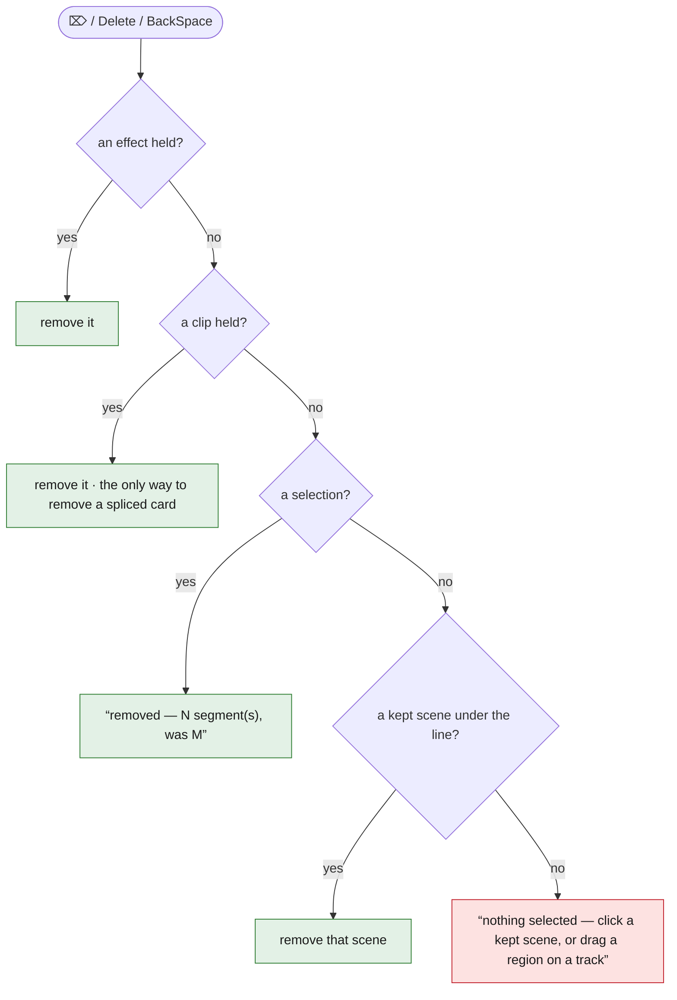
```mermaid
flowchart TD
  D(["⌦ / Delete / BackSpace"]) --> E{"an effect held?"}
  E -- yes --> RE["remove it"]:::done
  E -- no --> C{"a clip held?"}
  C -- yes --> RC["remove it · the only way to remove a spliced card"]:::done
  C -- no --> S{"a selection?"}
  S -- yes --> RS["“removed — N segment(s), was M”"]:::done
  S -- no --> U{"a kept scene under the line?"}
  U -- yes --> RU["remove that scene"]:::done
  U -- no --> NO["“nothing selected — click a kept scene, or drag a region on a track”"]:::refuse
  classDef refuse fill:#fde2e1,stroke:#c01c28,color:#1a1a1a
  classDef done fill:#e3f1e6,stroke:#2e7d32,color:#1a1a1a
  classDef ask fill:#e8eefc,stroke:#3a63c8,color:#1a1a1a
```

- **Add**: keep the selection as scenes (one per filmed run; under P.policy.minSceneSeconds = 1 s refused: "nothing to add: X s selected, a scene is 1 s or more"; no band: "drag a region on a track first"; sound band: "＋ Add keeps footage — the selection is <base>'s sound"); both ends snap to word edges, silences, line edges, visual cuts within 5 s; span taken off every other row. Status: "added — ↶ Undo (Ctrl+Z) takes it back" (one row), "added on <cam> — …" (more rows, nothing stolen), "added on <cam>, and taken off the other camera — …" (stolen).
- **Split**: a border at each end of the selection, nothing removed (halves ≥ 0.04 s; right half marked so coalescing does not undo it); the selection deliberately stays up; "split at <a> and <b> — N scenes, was M", naming only borders actually drawn. No selection → one border at the red line, right half taken in hand. Refusals: "| Split cuts footage — the selection is <base>'s sound", "nothing to split: the cut keeps nothing between a and b", "nothing to split at a – b", "| Split cuts at the red line — click a track to put it somewhere", "nothing to split at m:ss".
- **Remove**: drop exactly the selection — "removed X s — N scene(s), was M (↶ Undo takes it back)", or "…the scene it went through is two now…" if the count rose; remainders ≥ 0.04 s survive. Refusals: "drag a region on a track first", "－ Remove drops footage — the selection is <base>'s sound", "nothing to remove: the cut keeps nothing between a and b".
- **⌦ / Delete** (and BackSpace): in order: a held effect; a held clip (the only way to remove a spliced card); a selection ("removed — N segment(s), was M"); the scene under the line; else "nothing selected — click a kept scene, or drag a region on a track".
- **✕ badges**: on a green bar (drop that scene), on the selection, on a cut lane, on an empty row, on an effect.

### F2.8 Trim and move

<!-- back -->[← F2.7](#f27-add-split-remove-) · [↑ 05 Cut](#05--cut) · [all flows](11-flow-index.md#3-all-flows) · [F2.9 →](#f29-copy-paste-lane)

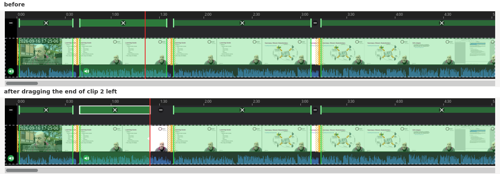

Screenshot of the prototype on the ETH lecture project. Status afterwards: “clip 2: 00:40.6 – 01:24.1 (43.5 s)”.

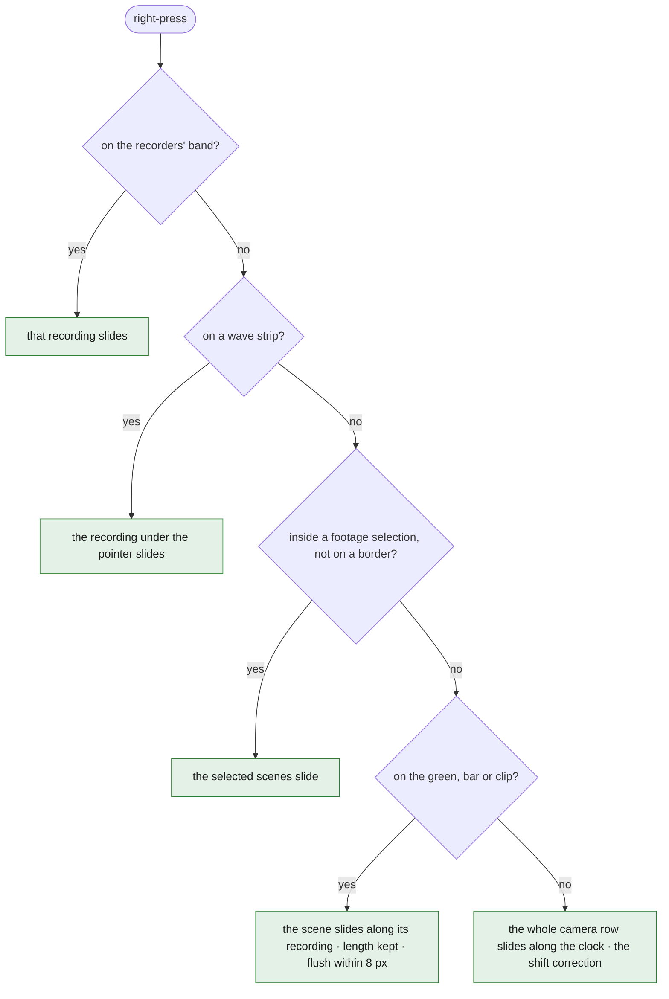
```mermaid
flowchart TD
  R(["right-press"]) --> A{"on the recorders' band?"}
  A -- yes --> M1["that recording slides"]:::done
  A -- no --> B{"on a wave strip?"}
  B -- yes --> M2["the recording under the pointer slides"]:::done
  B -- no --> C{"inside a footage selection, not on a border?"}
  C -- yes --> M3["the selected scenes slide"]:::done
  C -- no --> D{"on the green, bar or clip?"}
  D -- yes --> M4["the scene slides along its recording · length kept · flush within 8 px"]:::done
  D -- no --> M5["the whole camera row slides along the clock · the shift correction"]:::done
  classDef refuse fill:#fde2e1,stroke:#c01c28,color:#1a1a1a
  classDef done fill:#e3f1e6,stroke:#2e7d32,color:#1a1a1a
  classDef ask fill:#e8eefc,stroke:#3a63c8,color:#1a1a1a
```

S1 Where the pointer shows a resize arrow (within 6 px of a clip border on the pictures or green bar), either button drags that border: an end not below start + 1 s, past the next clip or the recording's end; a start not above end − 1 s, below the previous clip or the recording's start; picture scrubs live (throttled); on release a neighbour within 0.04 s merges (same camera only, never an insert), the drag clears a Split border between them ("joined into one scene, a – b (X s) — ↶ Undo puts the border back"), and the picture lands on the edge ("clip N: a – b (X s)"). S2 The right button moves; what it takes, in order: recorders' band → wave strip under the pointer (that one recording) → **a footage selection the press falls inside** (the selected scenes, even over a green bar, unless on a border) → green, bar or clip (scene slides along its recording, length kept, clear of neighbours, flush within 8 px) → else the whole camera row along the clock (shift correction). Row change when the recording fits ("<what> moved to row N — its kept scenes came along"); folds near the grab open for the drag, refold after; sideways travel counts from 3 px, a vertical row change needs none; one Undo per gesture; status "<what> moved +1.23 s", or "<what> is back where it started" if it ends where it began. S3 An unmoved press is a click; a right click never moves the line.

### F2.9 Copy, Paste, Lane

<!-- back -->[← F2.8](#f28-trim-and-move) · [↑ 05 Cut](#05--cut) · [all flows](11-flow-index.md#3-all-flows) · [F2.10 →](#f210-cameras-and-hearing)

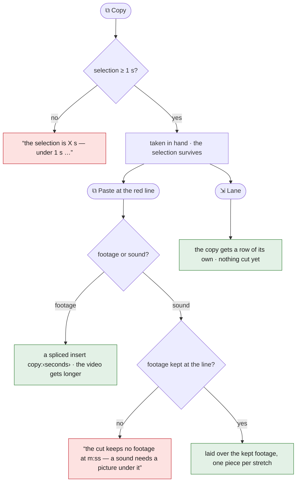
```mermaid
flowchart TD
  C(["⧉ Copy"]) --> L{"selection ≥ 1 s?"}
  L -- no --> R1["“the selection is X s — under 1 s …”"]:::refuse
  L -- yes --> H["taken in hand · the selection survives"]
  H --> P(["⧉ Paste at the red line"])
  P --> K{"footage or sound?"}
  K -- footage --> SP["a spliced insert copy:‹seconds› · the video gets longer"]:::done
  K -- sound --> OV{"footage kept at the line?"}
  OV -- no --> R2["“the cut keeps no footage at m:ss — a sound needs a picture under it”"]:::refuse
  OV -- yes --> LAY["laid over the kept footage, one piece per stretch"]:::done
  H --> LN(["⇲ Lane"]) --> ROW["the copy gets a row of its own · nothing cut yet"]:::done
  classDef refuse fill:#fde2e1,stroke:#c01c28,color:#1a1a1a
  classDef done fill:#e3f1e6,stroke:#2e7d32,color:#1a1a1a
  classDef ask fill:#e8eefc,stroke:#3a63c8,color:#1a1a1a
```

S1 Copy takes the selection in hand (≥ 1 s; "copied m:ss – m:ss (X s) — click where it goes, then ⧉ Paste"); the selection survives. S2 Paste at the red line ("click the timeline where the copy goes first"; on success "pasted X s from m:ss at m:ss — the cut is a, was b"): footage → spliced insert `copy:<seconds>` (cut opened there, those seconds play again, video gets longer); sound → laid over the kept footage at the line, one piece per kept stretch, replacing the recording it was copied from ("laid X s of <base> over the footage at m:ss", or "…over N stretches of footage at m:ss" across holes; refused: "the cut keeps no footage at m:ss — a sound needs a picture under it"). Pasting consumes the copy; Esc drops it. S3 ⇲ Lane: footage copy on its own row (a cut lane windowing the file), nothing cut yet ("X s from a is now the <name> lane, starting at b").

### F2.10 Cameras and hearing

<!-- back -->[← F2.9](#f29-copy-paste-lane) · [↑ 05 Cut](#05--cut) · [all flows](11-flow-index.md#3-all-flows) · [F2.11 →](#f211-folds-and-rows)

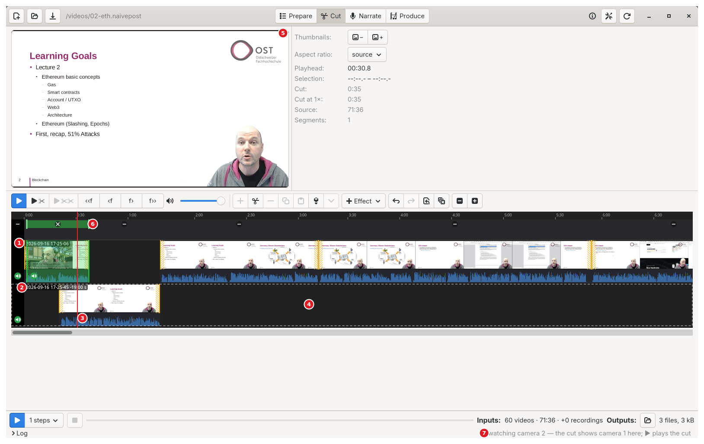

Screenshot of the prototype on the ETH lecture project, staged: the lecture has no simultaneous recordings, so the second file was shifted 19 s back in a copy of the project and the cut cleared, to show two cameras running at once.

**1** camera 1 (17-25-06, 0:00–0:37) · **2** camera 2 (17-25-45) with its shift correction "−19.00 s" in the name plate · **3** the overlap 0:20–0:37: both cameras filmed it · **4** dashed outline: the watched row · **5** the preview shows the watched row, not the cut · **6** the one kept scene, taken from camera 1 · **7** status "watching camera 2 — the cut shows camera 1 here; ▶ plays the cut"

Recordings that run at the same time (by the time stamps in their names, or after a shift) are laid out on rows by greedy interval colouring: a recording goes on the lowest row free for its whole span, so one camera's files share a row and a second camera gets its own. Overlapping time is laid out once; each row shows its own pictures and sound. A kept scene takes its picture from one row (the lens badge, S1) and hears the lanes its speaker badges allow (S2). Clips never overlap: in the staged shot, ＋ Add over the same seconds on camera 2 added nothing.

Prototype: a right-drag that slides a recording pins **every** recording to the row it is on (`rows` in `cut.json`), so a drag that creates an overlap leaves both recordings on one row, the later drawn over the earlier, and the earlier one's overlapped seconds cannot be seen or picked. The rewrite pins only the recording dragged and re-run the colouring, so an overlap made by a drag gets a row of its own, as the same overlap does when read from the file names.

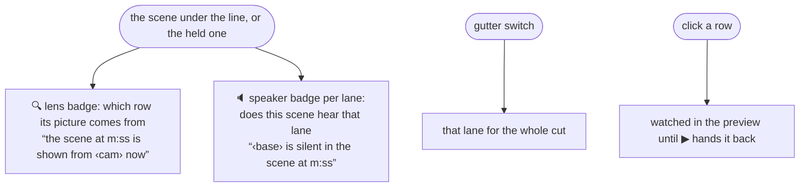
```mermaid
flowchart TD
  S(["the scene under the line, or the held one"]) --> LENS["🔍 lens badge: which row its picture comes from<br/>“the scene at m:ss is shown from ‹cam› now”"]
  S --> SPK["🔈 speaker badge per lane: does this scene hear that lane<br/>“‹base› is silent in the scene at m:ss”"]
  G(["gutter switch"]) --> ALL["that lane for the whole cut"]
  C(["click a row"]) --> W["watched in the preview until ▶ hands it back"]
  classDef refuse fill:#fde2e1,stroke:#c01c28,color:#1a1a1a
  classDef done fill:#e3f1e6,stroke:#2e7d32,color:#1a1a1a
  classDef ask fill:#e8eefc,stroke:#3a63c8,color:#1a1a1a
```

S1 Lens badge on a scene picks the row its picture comes from ("the scene at m:ss is shown from <cam> now"). S2 Speaker badges per lane on the held/current scene toggle whether that scene hears that lane ("<base> is silent in the scene at m:ss"); the gutter switch toggles a lane for the whole cut. S3 A click on a row watches it in the preview until ▶ takes the preview back to the cut; if the line is in a kept scene shown from another row, status says once "watching camera N — the cut shows camera M here; ▶ plays the cut".

### F2.11 Folds and rows

<!-- back -->[← F2.10](#f210-cameras-and-hearing) · [↑ 05 Cut](#05--cut) · [all flows](11-flow-index.md#3-all-flows) · [F2.12 →](#f212-insert-a-card-still-video-or-sound)

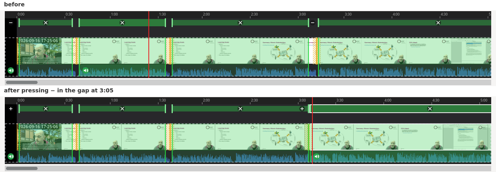

Screenshot of the prototype on the ETH lecture project. The fold is a view: nothing in the cut changes, and it is saved in cut.json.

S1 Folds cover stretches **the cut drops** (holes between kept clips; each filmed run's head and tail), not unfilmed time, which is never laid out. − in such a gap folds it to a seam; + on the seam unfolds; the gutter badge folds/unfolds all. Gaps under 20 px get no badge; badges sit just inside the neighbouring bars, not mid-gap. A fold is a view, never an edit, never used to measure a drag — but it **is** saved: `folds` in `cut.json`, written on every toggle, read back on open, no undo step. S2 An emptied bottom row stays until its ✕; a cut lane's ✕ removes the lane, its pins, shift, pictures and sound.

### F2.12 Insert a card, still, video or sound

<!-- back -->[← F2.11](#f211-folds-and-rows) · [↑ 05 Cut](#05--cut) · [all flows](11-flow-index.md#3-all-flows) · [F2.13 →](#f213-undo-redo-revert-clear)

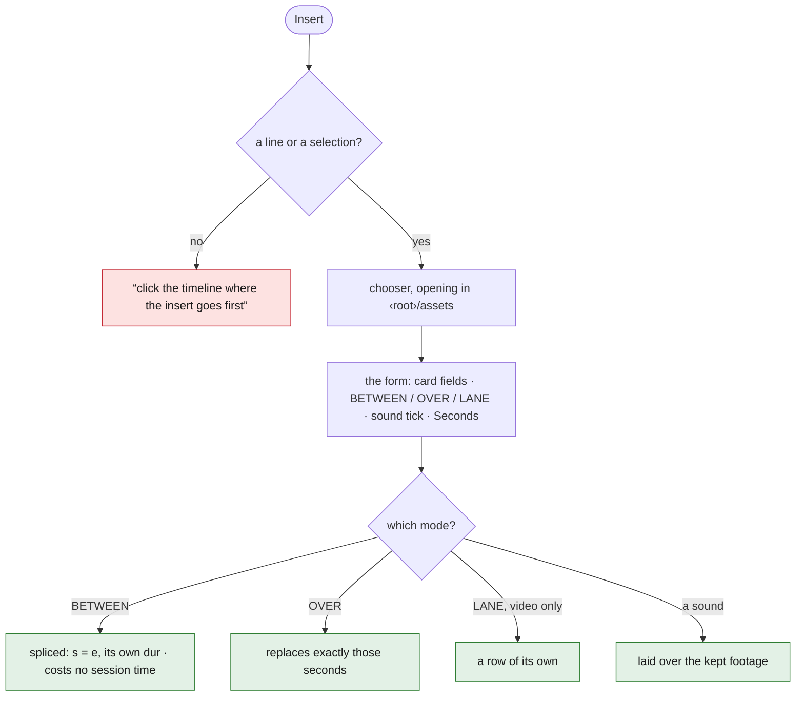
```mermaid
flowchart TD
  A(["Insert"]) --> W{"a line or a selection?"}
  W -- no --> R["“click the timeline where the insert goes first”"]:::refuse
  W -- yes --> CH["chooser, opening in ‹root›/assets"]
  CH --> F["the form: card fields · BETWEEN / OVER / LANE · sound tick · Seconds"]
  F --> K{"which mode?"}
  K -- "BETWEEN" --> SP["spliced: s = e, its own dur · costs no session time"]:::done
  K -- "OVER" --> OV["replaces exactly those seconds"]:::done
  K -- "LANE, video only" --> LN["a row of its own"]:::done
  K -- "a sound" --> SO["laid over the kept footage"]:::done
  classDef refuse fill:#fde2e1,stroke:#c01c28,color:#1a1a1a
  classDef done fill:#e3f1e6,stroke:#2e7d32,color:#1a1a1a
  classDef ask fill:#e8eefc,stroke:#3a63c8,color:#1a1a1a
```

S1 Needs a line or a selection ("click the timeline where the insert goes first"). S2 Chooser "Insert a clip, image, animation or sound" (or "Insert a sound over the selected seconds" for a sound-scoped selection), opening in `assets/`, where the built-in SVG cards and `CARDS.md` are written on first use. S3 Defaults: selection → its length, overwrite; none → splice, the file's own length (video/audio duration, SVG animation length, else P.policy.insertDefaultSeconds = 4). S4 Form in the column: one entry per declared card field (Logo… picker for logo fields); radios Insert BETWEEN the footage / Play OVER the footage / Put it on a LANE of its own (video only); sound tick — shown only when there is a sound to answer for (the insert's own, or seconds it lands over have one), greyed while LANE is chosen: "Play it SILENT — the insert's own sound is not used" when spliced, "Keep the sound running under it — only the picture is replaced" when over; Seconds. S5 Placed: spliced → `s == e` with `dur`; overwriting → replaces those seconds; sound → over kept footage; lane → adds a row. Status "<file> inserted at m:ss for X s, <how> — the cut is now a (was b) — ↶ Undo takes it back". S6 Right-click or double left click a card on the track to hold it; Insert becomes Edit, re-opens the form ("that card is no longer in the cut" if gone); switching modes returns or takes footage.
S7 Preview: cards render at 8 fps (one frame for stills) via ffmpeg, nearest rendered frame shown; a spliced card holds the footage while it plays on the wall clock; card sound is its own pipeline.

### F2.13 Undo, Redo, Revert, Clear

<!-- back -->[← F2.12](#f212-insert-a-card-still-video-or-sound) · [↑ 05 Cut](#05--cut) · [all flows](11-flow-index.md#3-all-flows) · [F2.14 →](#f214-suggest-a-cut)

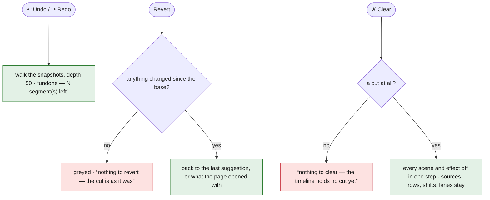
```mermaid
flowchart TD
  U(["↶ Undo / ↷ Redo"]) --> S["walk the snapshots, depth 50 · “undone — N segment(s) left”"]:::done
  R(["Revert"]) --> N{"anything changed since the base?"}
  N -- no --> RN["greyed · “nothing to revert — the cut is as it was”"]:::refuse
  N -- yes --> RB["back to the last suggestion, or what the page opened with"]:::done
  C(["✗ Clear"]) --> E{"a cut at all?"}
  E -- no --> CN["“nothing to clear — the timeline holds no cut yet”"]:::refuse
  E -- yes --> CL["every scene and effect off in one step · sources, rows, shifts, lanes stay"]:::done
  classDef refuse fill:#fde2e1,stroke:#c01c28,color:#1a1a1a
  classDef done fill:#e3f1e6,stroke:#2e7d32,color:#1a1a1a
  classDef ask fill:#e8eefc,stroke:#3a63c8,color:#1a1a1a
```

Undo/Redo walk the snapshots ("undone — N segment(s) left"); Revert restores the base ("reverted to the N segment(s) of the last suggestion (↶ Undo brings your edits back)", or "reverted — N hand-made segment(s) gone, the cut is empty" if the base is empty; greyed and refused with "nothing to revert — the cut is as it was" if nothing changed); Clear removes every scene and effect in one step ("cleared N scene(s) and M effect(s)"; before any undo step refused: "nothing to clear — the timeline holds no cut yet"; sources, rows, shifts, lanes stay).

## 5. Suggest (▶ on the run bar while the preview is not started)

### F2.14 Suggest a cut

<!-- back -->[← F2.13](#f213-undo-redo-revert-clear) · [↑ 05 Cut](#05--cut) · [all flows](11-flow-index.md#3-all-flows) · [F3.1 →](06-effects.md#f31-zoom-by-hand)

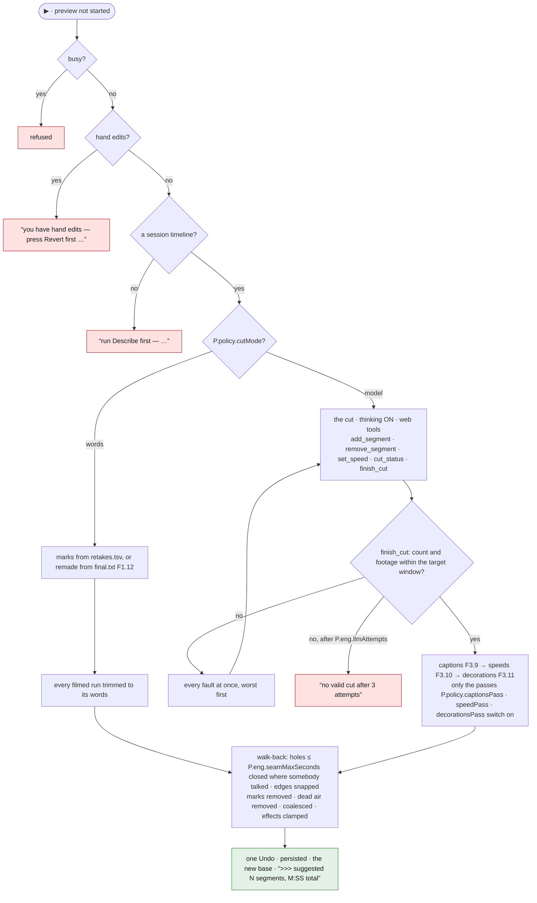
```mermaid
flowchart TD
  A(["▶ · preview not started"]) --> G1{"busy?"}
  G1 -- yes --> R0["refused"]:::refuse
  G1 -- no --> G2{"hand edits?"}
  G2 -- yes --> R1["“you have hand edits — press Revert first …”"]:::refuse
  G2 -- no --> G3{"a session timeline?"}
  G3 -- no --> R2["“run Describe first — …”"]:::refuse
  G3 -- yes --> ST{"P.policy.cutMode?"}
  ST -- words --> L1["marks from retakes.tsv, or remade from final.txt F1.12"]
  L1 --> L2["every filmed run trimmed to its words"]
  L2 --> WB
  ST -- model --> M1["the cut · thinking ON · web tools<br/>add_segment · remove_segment · set_speed · cut_status · finish_cut"]
  M1 --> FC{"finish_cut: count and footage within the target window?"}
  FC -- no --> FIX["every fault at once, worst first"] --> M1
  FC -- "no, after P.eng.llmAttempts" --> FAIL["“no valid cut after 3 attempts”"]:::refuse
  FC -- yes --> M2["captions F3.9 → speeds F3.10 → decorations F3.11<br/>only the passes P.policy.captionsPass · speedPass · decorationsPass switch on"]
  M2 --> WB
  WB["walk-back: holes ≤ P.eng.seamMaxSeconds closed where somebody talked · edges snapped<br/>marks removed · dead air removed · coalesced · effects clamped"]
  WB --> DONE["one Undo · persisted · the new base · “>>> suggested N segments, M:SS total”"]:::done
  classDef refuse fill:#fde2e1,stroke:#c01c28,color:#1a1a1a
  classDef done fill:#e3f1e6,stroke:#2e7d32,color:#1a1a1a
  classDef ask fill:#e8eefc,stroke:#3a63c8,color:#1a1a1a
```

S1 Guards: busy; hand edits ("you have hand edits — press Revert first for a fresh suggestion"); no session timeline ("run Describe first — the suggestion reads the session timeline, and there is none").
S2a **P.policy.cutMode = words** (the prototype's Lecture): no model. Marks from `retakes.tsv`, or remade from `final.txt` if edited later ([F1.12](04-prepare.md#f112-hand-edit-the-text)). Cut = hand-placed inserts + every filmed run trimmed to its words (just before the first to just after the last, placed by the sound within 0.4 s, never outside the run) → marked stretches removed → dead air removed (silences over P.policy.deadAirMaxSeconds = 8 inside a clip cut, leaving P.policy.deadAirKeepSeconds = 0.5) → coalesce → persist → base. Status "cut by the words: N segments"; log ">>> cut by the words: N stretch(es) taken out, m:ss of silence, N segments, M:SS total".
S2b **P.policy.cutMode = model** (the prototype's Gaming): up to four jobs on the bar — the cut, then only the passes the policy switches on (P.policy.captionsPass, speedPass, decorationsPass; a context that says "no captions, no speed changes, no effects" means those jobs are never called, not called and told to return nothing). (1) The cut: target length from P.policy.targetLengthSeconds (derived from the context by [F0.7](03-shell.md#f07-derive-the-editing-policy-new); prototype: a regex over the context); message = User Context + "SESSION LENGTH: N seconds…" + the target block ("KEEP between A and B seconds of footage, in at most K segments…" or "NO TARGET LENGTH…") + "SESSION TIMELINE:" + `session.txt`; thinking on; web tools offered (dropped after a first rejection). **Tools**: `add_segment`, `remove_segment`, `set_speed`, `finish_cut` ([`02-services.md` §3.6](02-services.md#36-cut-model-chosen)); the prototype's whole-reply checks (timestamps past the end, with the mm:ss hint; fewer than min(1 + target/30, 4) segments; more than max(target/5, 40); footage outside target × [0.6, 1.2 | 1.5] × [1, 4]) become `finish_cut`'s answer. Up to P.eng.llmAttempts = 3 rounds of correction; "no valid cut after 3 attempts". Streaming progress counts segments. (2) Captions, (3) speeds, (4) decorations: [`06-effects.md`](06-effects.md) [F3.9](06-effects.md#f39-captions-proposed-by-the-model-after-the-cut)–[F3.11](06-effects.md#f311-decorations-proposed-by-the-model).
S3 Apply: one Undo; hand-placed inserts kept; holes ≤ P.eng.seamMaxSeconds (1.5) closed only if somebody talked in them; both edges of every segment snapped (silence midpoint 0.8, word edge 0.9, line edge 0.95, visual cut where nobody talks; within 5 s; outward preferred); marked stretches removed; dead air removed; coalesce; effects clamped to the footage kept and replaced as a list; persist; base. Log ">>> suggested N segments, M:SS total" and ">>> …and N effect(s): the speeds, the captions and the decorations".

## 6. Parameters used

Parameters ([10](10-parameters.md)): minSceneSeconds (1.0), minPieceSeconds (0.04), snapToleranceSeconds (5.0), talkPadSeconds (0.2), deadAirMaxSeconds (8), deadAirKeepSeconds (0.5), seamMaxSeconds (1.5), reviewPadSeconds (10), targetLengthSeconds (0 = none), suggestMinSegments/maxSegments formulas, footageWindow factors, maxSpeedRate (4), insertDefaultSeconds (4), captionBatch (5). P.preview: playTick 100 ms, preloadLead 3 s, rateSeekGap 250 ms, thumb batch 6, card fps 8. Engineering: pixel reaches (6, 8, 10, 12 px), band heights, colours, zoom limits, undo depth, waveform cache format.

## 7. Rules

- One thing held at a time; picking up is not an edit; one Undo per drag; an unmoved press is a click.
- A border belongs to both buttons; moving is the right button's verb; a selection is of what it was drawn on.
- Unfilmed time has no width; the seam second belongs to the later take; preview and render agree on half-open ranges.
- Inserts are files: never trimmed, merged, dropped by a re-suggest or given a hearing answer; a spliced insert costs no session time.
- A clip may not leave its recording; clips never overlap; Remove takes exactly the selection.
- Suggest replaces the footage half and the effects, keeps inserts, and sets the base; every model reply is walked back onto the timeline.
- `cut.json` is written by one function; its existence unlocks Narrate and Produce.
- Nothing decodes inside a draw; the tracks are a window drawn under a translate; the page is rebuilt only when Prepare's output changed.

## 8. Details confirmed against the code (verification pass)

- **Refusals** (normative strings, full list in [`inventory/cut.md`](inventory/cut.md) §E): Copy "select a stretch of the pictures or of a lane first — ⧉ Copy takes the selection in hand" / "the selection is X s — under 1 s there is nothing worth copying"; sound copy "copied X s of <lane> (a – b) — click where it goes, then ⧉ Paste"; Lane "click the timeline where the new lane starts first" / "nothing is rolling at m:ss any more" / "that copy is too short to be a lane of its own"; Paste "<base> is not in the session any more — the copied sound has nowhere to come from"; ⌦ "⌦ drops footage — the selection is <base>'s sound" / "the playhead is not on a kept scene — click a green one, or drag a region". A sound copy starting before its recording is read from the lane's first second; a paste with nowhere to go leaves the copy in hand.
- **Preview sound**: each change of the footage's own mute logs one line naming the reason (">>> preview: the footage's own sound is heard again" / "… is muted -- a card or a stop stands over the picture" / "… is muted -- the scene under the line does not hear it"); gain and mute go to an app-owned element, never the player's per-application stream volume (the sound server remembers it between runs), which is reset to full once at build; a failing pipeline says so ("!!! <page>: playback failed — <reason>", status "<page> would not play — see log"; a mix lane "!!! preview: <base> will not play — …").
- **Suggest**: thinking on for the first attempt, off after an all-reasoning reply (">>> suggest: the model spent the whole call thinking and wrote nothing — asking again with thinking off"); web tools withdrawn on the first rejection (">>> suggest: asking again without the web tools"); progress "N moments, at m:ss of m:ss" placed by the last closed segment's end, never below 0.02 nor backwards, pulsing under "thinking over the whole session" until the first segment closes; segments with no recording at either end dropped before the length is judged (">>> suggest attempt N: M segment(s) dropped for having no footage"); the checks answer with every fault at once, worst first, joined by "; ", and the past-the-end fault shows the conversion on the model's own number ("2804 is not a second: a stamp [28:04] is mm*60+ss, 1684"); a `speed`/`rate` on a segment is a speed effect over it, exempt from any decorations cap. Streamed progress everywhere = objects closed inside the text's last `"<key>": [` (braces inside strings ignored) and the last closed object's `end`.

<!-- nav -->
---
[← 04 Prepare](04-prepare.md) · [↑ top](#05--cut) · [↑ Contents](README.md) · [06 Effects →](06-effects.md)
<!-- /nav -->
