# 06 — Effects

<!-- nav -->
[← 05 Cut](05-cut.md) · [↑ Contents](README.md) · [07 Narrate →](07-narrate.md)

**Flows:** [F3.1](#f31-zoom-by-hand) · [F3.2](#f32-aspect-ratio) · [F3.3](#f33-speed-and-stop-by-hand) · [F3.4](#f34-text-caption-by-hand) · [F3.5](#f35-svg-drawing-by-hand) · [F3.6](#f36-volume-by-hand) · [F3.7](#f37-label-by-hand) · [F3.8](#f38-hold-move-resize-edit-remove) · [F3.9](#f39-captions-proposed-by-the-model-after-the-cut) · [F3.10](#f310-speeds-proposed-by-the-model) · [F3.11](#f311-decorations-proposed-by-the-model) · [F3.12](#f312-clamp-to-the-cut-as-applied)
<!-- /nav -->

Zoom, speed (incl. stop), text, SVG drawing, volume, label. Each: one record in `cut.json`'s `fx` list, a bar on the effects lane, placed by hand (preview or lane) or proposed by the model after the cut. Preview and render share the functions turning an effect into a camera path, fitted title, fade or gain.

## 1. Record

| field | zoom | speed/stop | text | svg | volume | label |
|---|---|---|---|---|---|---|
| t, dur | session second; total length incl. fades (the bar) | ✓ | ✓ | ✓ | ✓ | ✓ |
| trans, tout, ease | glide in/out | ramp in/out (or the still's fades) | fade in/out | fade in/out | ramp in/out | – |
| cx, cy, hf | rect centre + height as fractions of the SOURCE frame (width follows the aspect) | – | box centre + height as fractions of the OUTPUT frame | same | – | – |
| wf | – | – | box width / output width | same | – | – |
| stay | pull back (false) or reframe until the next zoom (true) | – | – | – | – | – |
| rate, snd | – | rate (1 own clock; 0 = stop); sound answer "" / pitch / own / scene / mute | – | – | – | – |
| gain | – | – | – | – | linear gain, 0 = silence | – |
| text / src | – | – | the words | the file | – | the name |

Legacy: `view` → zoom; `mute` → `snd: "mute"`. `ease` stores "" for linear, keeping old files byte-identical. Text/svg with no box → its kind's default (text: lower third; svg: middle); model-proposed captions carry no box → lower third.

## 2. The lane and the preview

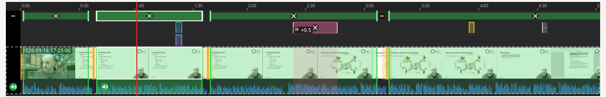

<sub>Screenshot of the prototype on the ETH lecture project.</sub> Effects placed by hand for the shot: zoom and text at 1:21, speed ×0.5 at 2:23 (the rose wash on the pictures), volume at 3:55, label at 4:32.

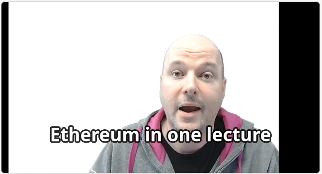

<sub>Screenshot of the prototype on the ETH lecture project.</sub> At 1:22: the zoom frames the lecturer, the caption is fitted into its box — the same functions the render uses.

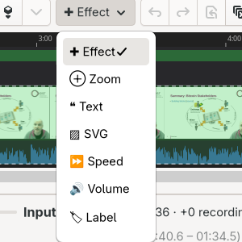

<sub>Screenshot of the prototype on the ETH lecture project.</sub>

Colours: zoom (0.25,0.72,0.82), staying zoom (0.95,0.62,0.15), speed/stop (0.92,0.42,0.6), text (0.6,0.55,0.95), svg (0.4,0.8,0.5), volume (0.95,0.85,0.2), label grey-white. Rows: first-fit by seconds (span floor 0.4 s); lane one row deep even when empty.

Preview (paused): outside the camera rect dimmed black 0.45; rect stroked white with a plate; visible overlays at real alpha, the held one full with a dashed violet outline; a box being drawn dashed. Playing: only the black mask over what the finished frame hides, plus titles; camera layer on the smoothed live clock. A stop's still: rendered from the scene's own camera, fitted on the footage's transform.

Preview vs render, deliberately different: preview runs speed at one flat rate (a rate change is a flushing seek); render follows ramps and averages overlaps; the two 1× sound answers cannot be previewed. Only "1× to the scene's end" draws the dashed debt tail ("1× to the effect's end" closes its gap on the effect's last frame); tail suppressed under 0.05 s of debt; "sound X s behind|ahead" plate once wider than 60 px.

## 3. Flows

**Prototype, for [F3.9](#f39-captions-proposed-by-the-model-after-the-cut)–[F3.11](#f311-decorations-proposed-by-the-model):** none of the tools named there exists. All three passes get one JSON reply the app parses, as the cut pass does ([`05-cut.md`](05-cut.md) [F2.14](05-cut.md#f214-suggest-a-cut)); the prototype's only tools are the web tools, only on the cut call. The tool shapes below are the rewrite.

### F3.1 Zoom by hand

<sub><!-- back -->[← F2.14](05-cut.md#f214-suggest-a-cut) · [↑ 06 Effects](#06--effects) · [all flows](11-flow-index.md#3-all-flows) · [F3.2 →](#f32-aspect-ratio)</sub>

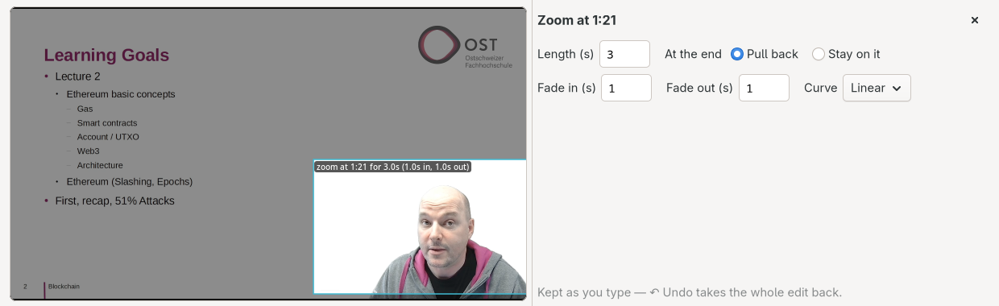

<sub>Screenshot of the prototype on the ETH lecture project.</sub> A free rectangle, not the cut's shape (see the REVIEW below).

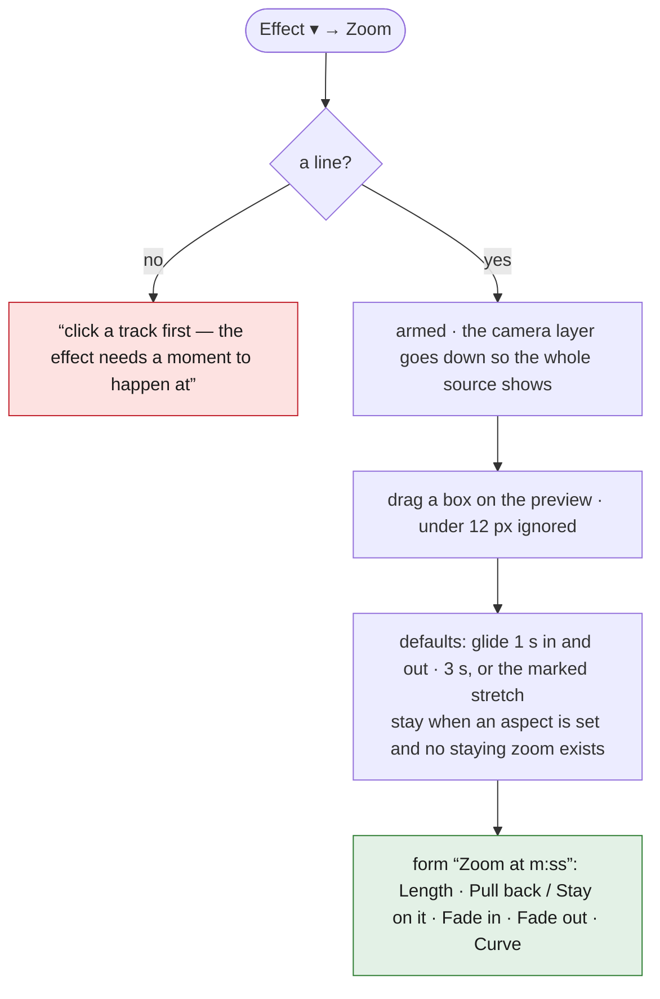
```mermaid
flowchart TD
  A(["Effect ▾ → Zoom"]) --> L{"a line?"}
  L -- no --> R["“click a track first — the effect needs a moment to happen at”"]:::refuse
  L -- yes --> ARM["armed · the camera layer goes down so the whole source shows"]
  ARM --> D["drag a box on the preview · under 12 px ignored"]
  D --> DEF["defaults: glide 1 s in and out · 3 s, or the marked stretch<br/>stay when an aspect is set and no staying zoom exists"]
  DEF --> F["form “Zoom at m:ss”: Length · Pull back / Stay on it · Fade in · Fade out · Curve"]:::done
  classDef refuse fill:#fde2e1,stroke:#c01c28,color:#1a1a1a
  classDef done fill:#e3f1e6,stroke:#2e7d32,color:#1a1a1a
  classDef ask fill:#e8eefc,stroke:#3a63c8,color:#1a1a1a
```

S1 ✚ Effect ▾ → ⊕ Zoom arms a drag (no line → "click a track first — the effect needs a moment to happen at"; same entry again disarms). Status/panel text: "Drag a box on the video: the picture zooms there and comes back out on its own, or stays on it — the form that opens is where that is said. The box keeps the cut's shape; let go near the full width or height to snap to it. It starts at the red line and runs 3 s…" (or "It covers the marked stretch — a – b, X s"). Camera layer goes down; whole source visible. S2 Drag a box on the preview (< 12 px ignored; smallest output-shaped window containing it is taken). REVIEW: the prototype's armed-drag text promises the box keeps the cut's shape and snaps near full width/height, but every drawing drag (zoom, text, svg) takes the free-rectangle path, where neither happens; the rewrite MUST make words and gesture agree. S3 Defaults: glide 1 s in and out, length 3 s (or the marked stretch); `stay` when an aspect is set and no staying zoom exists yet (then no glides). S4 Form "Zoom at m:ss": Length (s); At the end: Pull back / Stay on it; Fade in (s); Fade out (s) (greyed when staying: "A camera that stays has no way back, so no fade out."); Curve (Linear). Live; length ≥ 0.4. S5 Status "<label> — ↶ Undo takes it back" (or "… — the video shows this region from here on…").
Nothing armed or held, paused preview, camera settled: a drag takes the zoom in force; a press clear of every box draws it a new rectangle: "<label> re-framed — ↶ Undo takes it back".
Camera path: from the centred full-fill slice; each zoom glides from the camera's position at its start to its rect, holds, and (unless staying) glides back; a staying zoom becomes the new settled frame; nothing reaches backwards; fade-in wins overlaps. Rect clamp hf ∈ [0.02, 12], centre ∈ [−2, 3].

### F3.2 Aspect ratio

<sub><!-- back -->[← F3.1](#f31-zoom-by-hand) · [↑ 06 Effects](#06--effects) · [all flows](11-flow-index.md#3-all-flows) · [F3.3 →](#f33-speed-and-stop-by-hand)</sub>

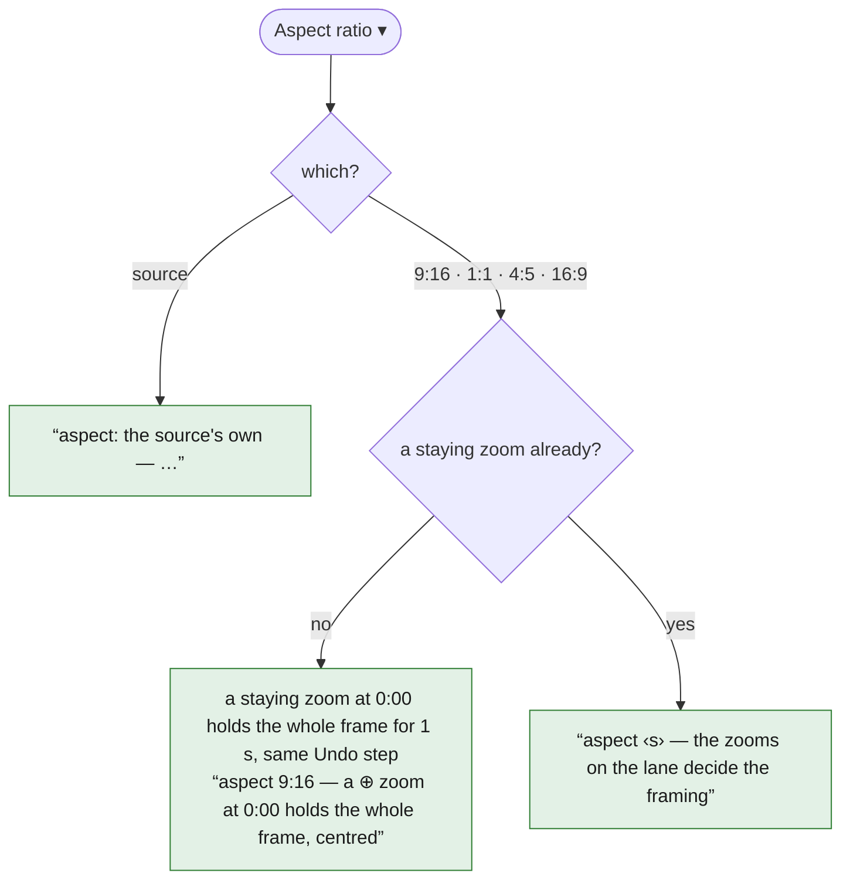
```mermaid
flowchart TD
  A(["Aspect ratio ▾"]) --> K{"which?"}
  K -- source --> S["“aspect: the source's own — …”"]:::done
  K -- "9:16 · 1:1 · 4:5 · 16:9" --> Z{"a staying zoom already?"}
  Z -- no --> ADD["a staying zoom at 0:00 holds the whole frame for 1 s, same Undo step<br/>“aspect 9:16 — a ⊕ zoom at 0:00 holds the whole frame, centred”"]:::done
  Z -- yes --> KEEP["“aspect ‹s› — the zooms on the lane decide the framing”"]:::done
  classDef refuse fill:#fde2e1,stroke:#c01c28,color:#1a1a1a
  classDef done fill:#e3f1e6,stroke:#2e7d32,color:#1a1a1a
  classDef ask fill:#e8eefc,stroke:#3a63c8,color:#1a1a1a
```

Dropdown source / 9:16 / 1:1 / 4:5 / 16:9 in the form column ("the shape of the finished video — source is the footage's own, 9:16 is a vertical short. The whole frame fits inside it (bars either side) until ▭ View frames a region; the outline on the preview is what the finished video shows"). Non-source aspect, no staying zoom → a staying zoom appended at 0:00 holding the whole frame for 1 s, same Undo step ("aspect 9:16 — a ⊕ zoom at 0:00 holds the whole frame, centred"); one already there → "aspect <s> — the zooms on the lane decide the framing"; source → "aspect: the source's own — the video comes out the shape it was filmed".

### F3.3 Speed and stop by hand

<sub><!-- back -->[← F3.2](#f32-aspect-ratio) · [↑ 06 Effects](#06--effects) · [all flows](11-flow-index.md#3-all-flows) · [F3.4 →](#f34-text-caption-by-hand)</sub>

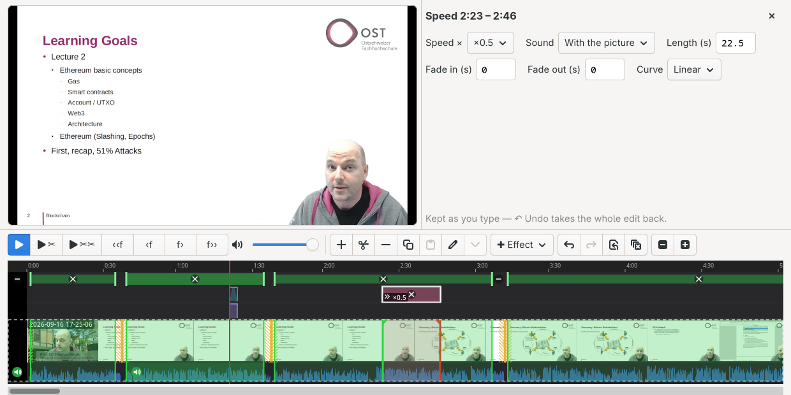

<sub>Screenshot of the prototype on the ETH lecture project.</sub>

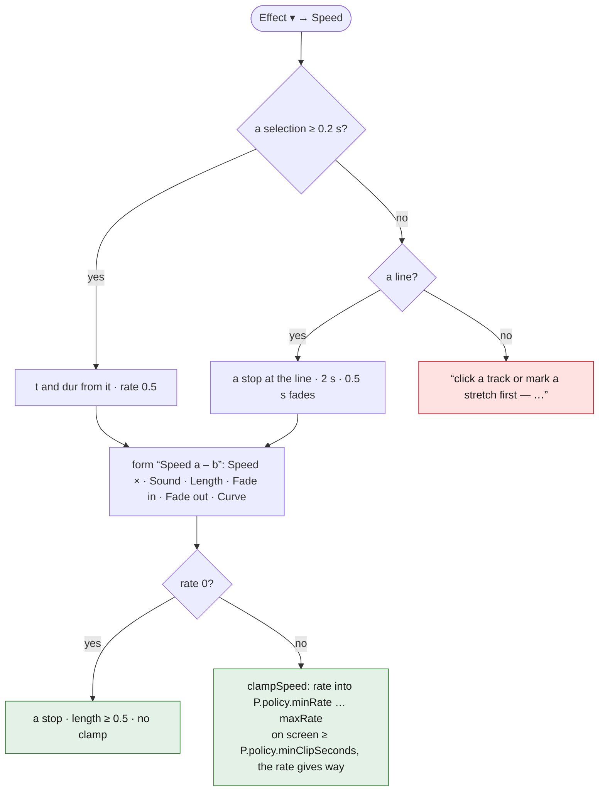
```mermaid
flowchart TD
  A(["Effect ▾ → Speed"]) --> S{"a selection ≥ 0.2 s?"}
  S -- yes --> SL["t and dur from it · rate 0.5"]
  S -- no --> L{"a line?"}
  L -- yes --> ST["a stop at the line · 2 s · 0.5 s fades"]
  L -- no --> R["“click a track or mark a stretch first — …”"]:::refuse
  SL --> F["form “Speed a – b”: Speed × · Sound · Length · Fade in · Fade out · Curve"]
  ST --> F
  F --> Z{"rate 0?"}
  Z -- yes --> STOP["a stop · length ≥ 0.5 · no clamp"]:::done
  Z -- no --> CL["clampSpeed: rate into P.policy.minRate … maxRate<br/>on screen ≥ P.policy.minClipSeconds, the rate gives way"]:::done
  classDef refuse fill:#fde2e1,stroke:#c01c28,color:#1a1a1a
  classDef done fill:#e3f1e6,stroke:#2e7d32,color:#1a1a1a
  classDef ask fill:#e8eefc,stroke:#3a63c8,color:#1a1a1a
```

S1 ⏩ Speed: selection ≥ 0.2 s (every effect's floor for a band to count as marked) → t/dur from it, rate 0.5; only a line → a stop at the line, 2 s, 0.5 s fades; neither → "click a track or mark a stretch first — speed needs seconds to work on". S2 Form "Speed a – b": Speed × (×0 — stop, ×0.25, ×0.5, ×0.75, ×1 — as filmed, ×1.5, ×2, ×4, ×8, ×20, ×100, Custom…); Sound (With the picture / With the picture, pitched / 1× to the effect's end / 1× to the scene's end / Silent); Length (s); Fade in (s) ("…A ramp needs about 0.6s of footage for every × of the rate…"); Fade out (s); Curve; a cost note ("N s on screen: the sound ends N s behind the picture, and going back in sync skips those seconds."). S3 Rate 0 → stop, length ≥ 0.5, no clamp; else clampSpeed: rate ∈ [P.policy.minRate 0.05, P.policy.maxRate 100], on-screen length ≥ P.policy.minClipSeconds (0.5); the rate gives way. S4 Status "… — the footage plays at that rate there and the cut gets longer or shorter to match; ↶ Undo takes it back" / "… — the picture stands still there while the clock runs…".
Arithmetic: overlapping rates average per span; spans rendering under 0.5 s heal into the longer neighbour; ramps are geometric staircases, each stair ≥ P.policy.rampStepSeconds (0.6) on screen, built whole or not at all; footage under a still runs at 1×.

### F3.4 Text (caption) by hand

<sub><!-- back -->[← F3.3](#f33-speed-and-stop-by-hand) · [↑ 06 Effects](#06--effects) · [all flows](11-flow-index.md#3-all-flows) · [F3.5 →](#f35-svg-drawing-by-hand)</sub>

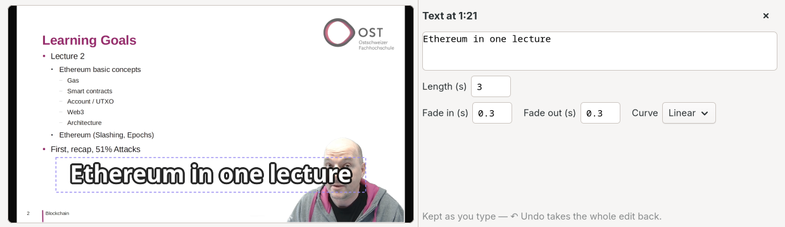

<sub>Screenshot of the prototype on the ETH lecture project.</sub>

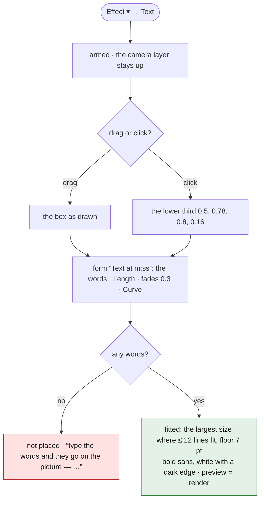
```mermaid
flowchart TD
  A(["Effect ▾ → Text"]) --> ARM["armed · the camera layer stays up"]
  ARM --> K{"drag or click?"}
  K -- drag --> BOX["the box as drawn"]
  K -- click --> LT["the lower third 0.5, 0.78, 0.8, 0.16"]
  BOX --> F["form “Text at m:ss”: the words · Length · fades 0.3 · Curve"]
  LT --> F
  F --> W{"any words?"}
  W -- no --> N["not placed · “type the words and they go on the picture — …”"]:::refuse
  W -- yes --> FIT["fitted: the largest size where ≤ 12 lines fit, floor 7 pt<br/>bold sans, white with a dark edge · preview = render"]:::done
  classDef refuse fill:#fde2e1,stroke:#c01c28,color:#1a1a1a
  classDef done fill:#e3f1e6,stroke:#2e7d32,color:#1a1a1a
  classDef ask fill:#e8eefc,stroke:#3a63c8,color:#1a1a1a
```

S1 ❝ Text arms: "Drag the box the words go in — anywhere on the picture, any shape. A click puts one across the lower third." Camera layer stays up (box is on the output frame). S2 Drag or click (default box: lower third {0.5, 0.78, 0.8, 0.16}); t/dur from the line (3 s) or selection; fades 0.3. S3 Form "Text at m:ss": the words (3-line box; Enter = new line), Length, Fade in, Fade out, Curve; length ≥ 0.3. Empty words not placed ("type the words and they go on the picture — the form applies as you type it"). S4 Fitting: largest size where ≤ 12 lines of 0.58 em per character fit the box (min 7 pt); bold sans-serif, white, dark dilated edge; same function for preview and render. S5 On the preview a box moves — snapping within 10 px to the finished frame's left edge, centre, right edge (and top, middle, bottom); a moved box offers all three of its own lines, a dragged edge only itself — and resizes (independent axes, 16 px floor); a press without travel toggles play/pause wherever it lands.

### F3.5 SVG drawing by hand

<sub><!-- back -->[← F3.4](#f34-text-caption-by-hand) · [↑ 06 Effects](#06--effects) · [all flows](11-flow-index.md#3-all-flows) · [F3.6 →](#f36-volume-by-hand)</sub>

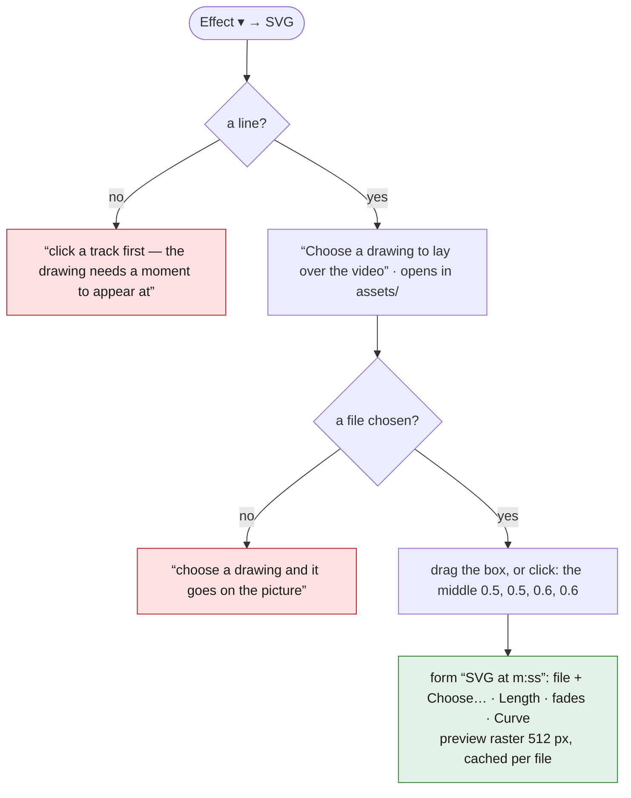
```mermaid
flowchart TD
  A(["Effect ▾ → SVG"]) --> L{"a line?"}
  L -- no --> R1["“click a track first — the drawing needs a moment to appear at”"]:::refuse
  L -- yes --> CH["“Choose a drawing to lay over the video” · opens in assets/"]
  CH --> F{"a file chosen?"}
  F -- no --> R2["“choose a drawing and it goes on the picture”"]:::refuse
  F -- yes --> ARM["drag the box, or click: the middle 0.5, 0.5, 0.6, 0.6"]
  ARM --> FORM["form “SVG at m:ss”: file + Choose… · Length · fades · Curve<br/>preview raster 512 px, cached per file"]:::done
  classDef refuse fill:#fde2e1,stroke:#c01c28,color:#1a1a1a
  classDef done fill:#e3f1e6,stroke:#2e7d32,color:#1a1a1a
  classDef ask fill:#e8eefc,stroke:#3a63c8,color:#1a1a1a
```

▨ SVG asks for the file first ("Choose a drawing to lay over the video", from `assets/`), then arms ("Drag the box <file> goes in — … the drawing keeps its own shape inside it. A click puts one across the middle."). Default box: middle {0.5, 0.5, 0.6, 0.6}. Form "SVG at m:ss": file + Choose…, Length, fades, Curve. Preview raster via ffmpeg, 512 px, transparent, cached per file. No file → not placed.

### F3.6 Volume by hand

<sub><!-- back -->[← F3.5](#f35-svg-drawing-by-hand) · [↑ 06 Effects](#06--effects) · [all flows](11-flow-index.md#3-all-flows) · [F3.7 →](#f37-label-by-hand)</sub>

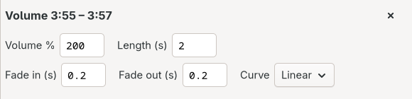

<sub>Screenshot of the prototype on the ETH lecture project.</sub> Defaults: 200 %, 2 s, ramps of 0.2–0.25 s.

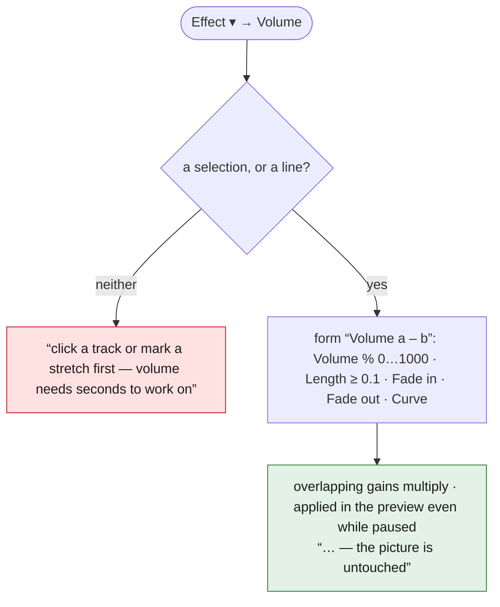
```mermaid
flowchart TD
  A(["Effect ▾ → Volume"]) --> S{"a selection, or a line?"}
  S -- neither --> R["“click a track or mark a stretch first — volume needs seconds to work on”"]:::refuse
  S -- yes --> F["form “Volume a – b”: Volume % 0…1000 · Length ≥ 0.1 · Fade in · Fade out · Curve"]
  F --> OK["overlapping gains multiply · applied in the preview even while paused<br/>“… — the picture is untouched”"]:::done
  classDef refuse fill:#fde2e1,stroke:#c01c28,color:#1a1a1a
  classDef done fill:#e3f1e6,stroke:#2e7d32,color:#1a1a1a
  classDef ask fill:#e8eefc,stroke:#3a63c8,color:#1a1a1a
```

🔊 Volume: selection or line..+2 s ("click a track or mark a stretch first — volume needs seconds to work on"); defaults gain 200 %, ramps 0.25 s. Form "Volume a – b": Volume % (0..1000; "…up to 1000 for a passage recorded too quietly to hear — though a passage lifted that far brings its hiss up with it"), Length (≥ 0.1), Fade in ("0 is the hard step, which on a big change is audible as a click"), Fade out, Curve. Overlapping gains multiply; preview applies gain even paused. Status "… — the picture is untouched".

### F3.7 Label by hand

<sub><!-- back -->[← F3.6](#f36-volume-by-hand) · [↑ 06 Effects](#06--effects) · [all flows](11-flow-index.md#3-all-flows) · [F3.8 →](#f38-hold-move-resize-edit-remove)</sub>

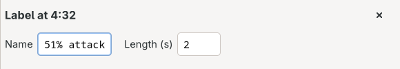

<sub>Screenshot of the prototype on the ETH lecture project.</sub>

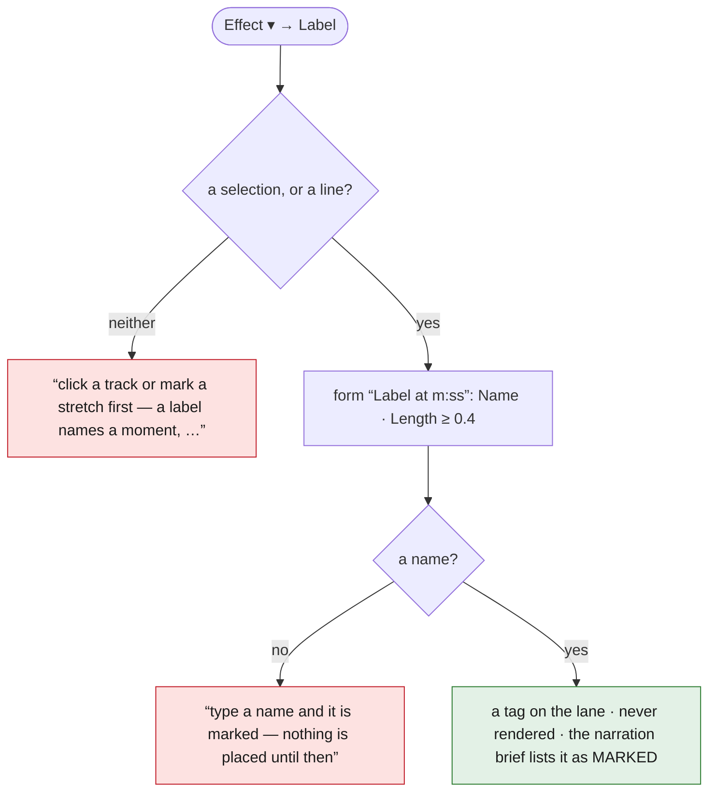
```mermaid
flowchart TD
  A(["Effect ▾ → Label"]) --> S{"a selection, or a line?"}
  S -- neither --> R["“click a track or mark a stretch first — a label names a moment, …”"]:::refuse
  S -- yes --> F["form “Label at m:ss”: Name · Length ≥ 0.4"]
  F --> N{"a name?"}
  N -- no --> NO["“type a name and it is marked — nothing is placed until then”"]:::refuse
  N -- yes --> TAG["a tag on the lane · never rendered · the narration brief lists it as MARKED"]:::done
  classDef refuse fill:#fde2e1,stroke:#c01c28,color:#1a1a1a
  classDef done fill:#e3f1e6,stroke:#2e7d32,color:#1a1a1a
  classDef ask fill:#e8eefc,stroke:#3a63c8,color:#1a1a1a
```

🏷 Label: selection or line..+2 s ("click a track or mark a stretch first — a label names a moment, so it needs one"); Form "Label at m:ss" (Length floor 0.4 s): Name ("what you call this moment -- "the reveal", "boss fight". It changes nothing in the video: it is written into the brief the narration writer is given…"), Length (the stretch a clip must overlap). Empty name not placed ("type a name and it is marked — nothing is placed until then"). Drawn as a tag; never rendered; narration brief lists it as MARKED.

### F3.8 Hold, move, resize, edit, remove

<sub><!-- back -->[← F3.7](#f37-label-by-hand) · [↑ 06 Effects](#06--effects) · [all flows](11-flow-index.md#3-all-flows) · [F3.9 →](#f39-captions-proposed-by-the-model-after-the-cut)</sub>

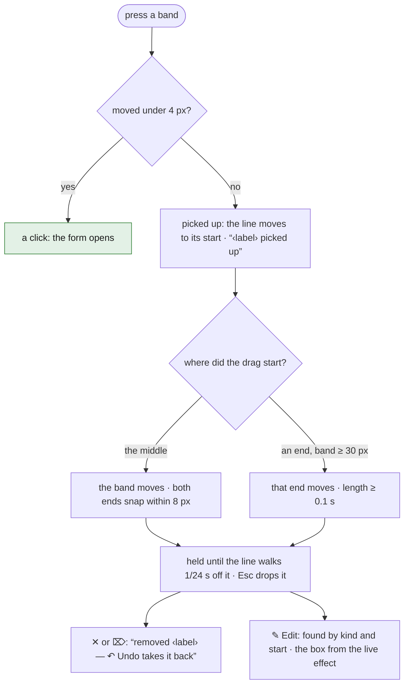
```mermaid
flowchart TD
  P(["press a band"]) --> T{"moved under 4 px?"}
  T -- yes --> FORM["a click: the form opens"]:::done
  T -- no --> PU["picked up: the line moves to its start · “‹label› picked up”"]
  PU --> K{"where did the drag start?"}
  K -- "the middle" --> MV["the band moves · both ends snap within 8 px"]
  K -- "an end, band ≥ 30 px" --> RS["that end moves · length ≥ 0.1 s"]
  MV --> H["held until the line walks 1/24 s off it · Esc drops it"]
  RS --> H
  H --> X["✕ or ⌦: “removed ‹label› — ↶ Undo takes it back”"]
  H --> E["✎ Edit: found by kind and start · the box from the live effect"]
  classDef refuse fill:#fde2e1,stroke:#c01c28,color:#1a1a1a
  classDef done fill:#e3f1e6,stroke:#2e7d32,color:#1a1a1a
  classDef ask fill:#e8eefc,stroke:#3a63c8,color:#1a1a1a
```

S1 A press on a band picks it up (line moves to its start; status "<label> picked up"; Insert becomes ✎ Edit); ends are grips when the band is ≥ 30 px; under 4 px of travel is a click → opens the form. S2 Drag moves the whole band (clamped inside the timeline; both ends offered to snap marks: segment ends, other effects' ends, 8 px) or an end (length ≥ 0.1 s). Frame steps and ←/→ nudge a held effect unsnapped. Hold drops when the line walks > 1/24 s off the band. S3 The ✕ in the band's middle (≥ 32 px) or ⌦ removes it ("removed <label> — ↶ Undo takes it back"). A box or camera rect dragged on the picture ends with "<label> moved — ↶ Undo takes it back" or "<label> resized — …"; undo pushed on the first 2 px of travel. Esc drops the hold and disarms. S4 Edit re-finds the effect by kind and start (|Δt| < 1 ms; "that effect is no longer in the cut — nothing was changed"); box always from the live effect, never the form's snapshot. S5 Forms are live: first answer pushes Undo; every keystroke lands after a debounce; "Kept as you type — ↶ Undo takes the whole edit back."

### F3.9 Captions proposed by the model (after the cut)

<sub><!-- back -->[← F3.8](#f38-hold-move-resize-edit-remove) · [↑ 06 Effects](#06--effects) · [all flows](11-flow-index.md#3-all-flows) · [F3.10 →](#f310-speeds-proposed-by-the-model)</sub>

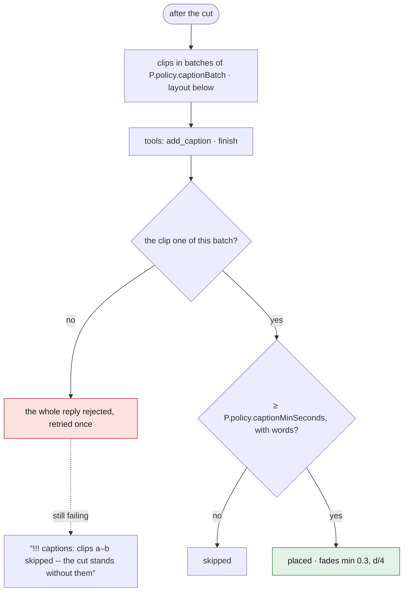
```mermaid
flowchart TD
  A(["after the cut"]) --> B["clips in batches of P.policy.captionBatch · layout below"]
  B --> T["tools: add_caption · finish"]
  T --> V{"the clip one of this batch?"}
  V -- no --> RJ["the whole reply rejected, retried once"]:::refuse
  V -- yes --> L{"≥ P.policy.captionMinSeconds, with words?"}
  L -- no --> SK["skipped"]
  L -- yes --> OK["placed · fades min 0.3, d/4"]:::done
  RJ -. still failing .-> FB["“!!! captions: clips a–b skipped -- the cut stands without them”"]
  classDef refuse fill:#fde2e1,stroke:#c01c28,color:#1a1a1a
  classDef done fill:#e3f1e6,stroke:#2e7d32,color:#1a1a1a
  classDef ask fill:#e8eefc,stroke:#3a63c8,color:#1a1a1a
```

```text
User Context
THE CLIPS, AND WHAT WAS SAID OVER EACH:
CLIP 1: 14.2 s long
  [+0.4s] …   (offsets inside the clip, never session seconds)
CLIP 2: …
```

Batches of P.policy.captionBatch (5) clips; message = User Context + "THE CLIPS, AND WHAT WAS SAID OVER EACH:" + "CLIP n: X s long" + the lines as offsets. **Tools**: `add_caption(clip, start, end, text)`, `finish` ([`02-services.md` §3.7](02-services.md#37-captions--speed--decorations-per-clip)). Validated in the tool: clip must be one given; end−start ≥ P.policy.captionMinSeconds (0.3). Prototype, kept by the rewrite: a clip number outside the batch rejects the **whole** reply ("clip N is not one of the clips given (a to b)") and costs a retry; a caption under the floor or with no words is silently skipped. Prompt rules: captions only if the context asks; clean like a subtitler (no ehm, no stutters, sentence case, swearing kept, never a paraphrase); never caption an aside to the editor. Fades min(0.3, d/4). Failed batch skipped ("!!! captions: clips a–b skipped -- the cut stands without them").

### F3.10 Speeds proposed by the model

<sub><!-- back -->[← F3.9](#f39-captions-proposed-by-the-model-after-the-cut) · [↑ 06 Effects](#06--effects) · [all flows](11-flow-index.md#3-all-flows) · [F3.11 →](#f311-decorations-proposed-by-the-model)</sub>

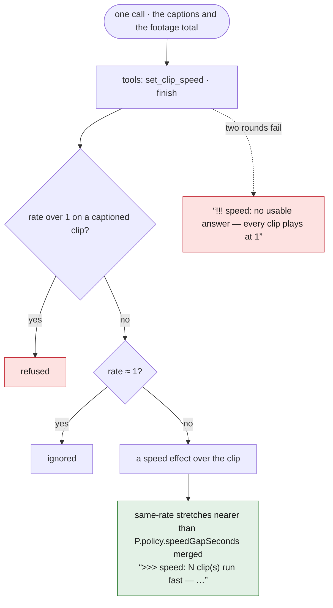
```mermaid
flowchart TD
  A(["one call · the captions and the footage total"]) --> T["tools: set_clip_speed · finish"]
  T --> C{"rate over 1 on a captioned clip?"}
  C -- yes --> R["refused"]:::refuse
  C -- no --> N{"rate ≈ 1?"}
  N -- yes --> IG["ignored"]
  N -- no --> OK["a speed effect over the clip"]
  OK --> M["same-rate stretches nearer than P.policy.speedGapSeconds merged<br/>“>>> speed: N clip(s) run fast — …”"]:::done
  T -. two rounds fail .-> F["“!!! speed: no usable answer — every clip plays at 1”"]:::refuse
  classDef refuse fill:#fde2e1,stroke:#c01c28,color:#1a1a1a
  classDef done fill:#e3f1e6,stroke:#2e7d32,color:#1a1a1a
  classDef ask fill:#e8eefc,stroke:#3a63c8,color:#1a1a1a
```

One call; briefs note captions ("…, N caption(s) -- runs at 1") and the footage total. **Tools**: `set_clip_speed(clip, rate)` (rate > 1 on a captioned clip refused; rate ≈ 1 ignored), `finish`. Up to two rounds (fault appended, call put again), then "!!! speed: no usable answer — every clip plays at 1". Prompt rules: longer dull stretch → higher rate; a clip with speech plays at 1 unless the context asks for more; slow motion only on a short clip the video is about; one rate per clip. Same-rate stretches nearer than P.policy.speedGapSeconds (4) merge. Log ">>> speed: N clip(s) run fast — a of video from b of footage". No length gate.

### F3.11 Decorations proposed by the model

<sub><!-- back -->[← F3.10](#f310-speeds-proposed-by-the-model) · [↑ 06 Effects](#06--effects) · [all flows](11-flow-index.md#3-all-flows) · [F3.12 →](#f312-clamp-to-the-cut-as-applied)</sub>

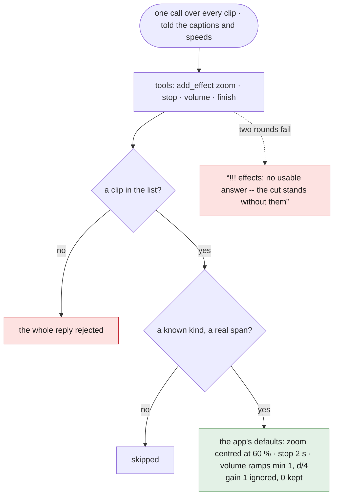
```mermaid
flowchart TD
  A(["one call over every clip · told the captions and speeds"]) --> T["tools: add_effect zoom · stop · volume · finish"]
  T --> V{"a clip in the list?"}
  V -- no --> RJ["the whole reply rejected"]:::refuse
  V -- yes --> K{"a known kind, a real span?"}
  K -- no --> SK["skipped"]
  K -- yes --> D["the app's defaults: zoom centred at 60 % · stop 2 s · volume ramps min 1, d/4<br/>gain 1 ignored, 0 kept"]:::done
  T -. two rounds fail .-> F["“!!! effects: no usable answer -- the cut stands without them”"]:::refuse
  classDef refuse fill:#fde2e1,stroke:#c01c28,color:#1a1a1a
  classDef done fill:#e3f1e6,stroke:#2e7d32,color:#1a1a1a
  classDef ask fill:#e8eefc,stroke:#3a63c8,color:#1a1a1a
```

One call over every clip, told captions and speeds. **Tools**: `add_effect(clip, kind zoom|stop|volume, start, end, gain?)`, `finish`. A clip outside the list rejects the whole reply ("clip N is not one of the clips given (1 to M)"); unknown kind or end ≤ start → skipped. Up to two rounds, then "!!! effects: no usable answer -- the cut stands without them". Prompt: few and deliberate (about three or four per five minutes unless the context says otherwise); zoom 2–4 s; one stop per video; volume for level, ducking or muting; never zoom past captions. App-applied defaults: zoom centre, 60 % height, glides min(1, d/3); stop 2 s, fades min(0.3, d/4); volume ramps min(1, d/4); gain of 1 or none ignored, 0 kept.

### F3.12 Clamp to the cut as applied

<sub><!-- back -->[← F3.11](#f311-decorations-proposed-by-the-model) · [↑ 06 Effects](#06--effects) · [all flows](11-flow-index.md#3-all-flows) · [F4.1 →](07-narrate.md#f41--write-and-speak)</sub>

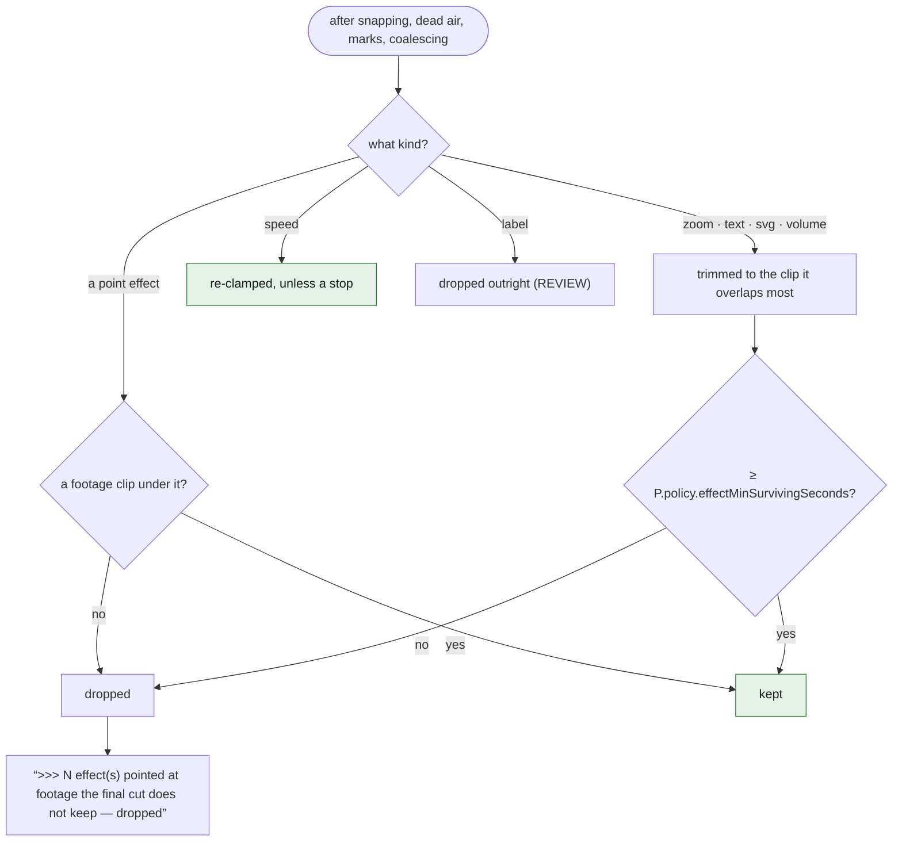
```mermaid
flowchart TD
  A(["after snapping, dead air, marks, coalescing"]) --> K{"what kind?"}
  K -- "a point effect" --> P{"a footage clip under it?"}
  P -- no --> DR["dropped"]
  P -- yes --> KP["kept"]:::done
  K -- "zoom · text · svg · volume" --> TR["trimmed to the clip it overlaps most"]
  TR --> S{"≥ P.policy.effectMinSurvivingSeconds?"}
  S -- no --> DR
  S -- yes --> KP
  K -- speed --> SP["re-clamped, unless a stop"]:::done
  K -- label --> DL["dropped outright (REVIEW)"]
  DR --> LOG["“>>> N effect(s) pointed at footage the final cut does not keep — dropped”"]
  classDef refuse fill:#fde2e1,stroke:#c01c28,color:#1a1a1a
  classDef done fill:#e3f1e6,stroke:#2e7d32,color:#1a1a1a
  classDef ask fill:#e8eefc,stroke:#3a63c8,color:#1a1a1a
```

After snapping, dead-air and mark removal, coalescing: a point effect needs a footage clip under it; a zoom/text/svg/volume band is trimmed to the clip it overlaps most, dropped under P.policy.effectMinSurvivingSeconds (1.0); a speed is re-clamped unless a stop; a **label is dropped outright**, never trimmed (REVIEW: it marks a moment for the narration brief; the rewrite SHOULD trim it like the rest); fades shrink proportionally; ">>> N effect(s) pointed at footage the final cut does not keep — dropped". Suggested effects replace the list, same Undo step as the segments.

## 4. Render (how each effect becomes ffmpeg)

- **Speed**: the only effect changing the clip list: clips split at rate boundaries, the middle carries the rate (`setpts=PTS/rate`; sound by atempo chain, asetrate when pitched, a mute expression when silent, or a planned 1× read head with 0.15 s dips at run ends for own/scene). Inserts and spliced cards keep their own clock.
- **Stop**: a still of the frame at t (scene's own camera) overlaid with alpha fades for the frozen spans; footage runs on at 1×.
- **Zoom**: sampled at clip ends and every zoom's breakpoints, straight lines between; static → crop + scale; moving → pad black as needed, crop to the union box, `zoompan` with piecewise-linear expressions at fixed fps (default 30); > 10× capped and logged.
- **Text/SVG**: composited after the camera and burned subtitles, each from a looped input (title: generated transparent frame-sized SVG, black round-joined stroke then white fill; svg effect: the user's file scaled into its box), with alpha fades and an enable window.
- **Volume**: one `volume=<expr>:eval=frame` per cue, in turn, after the lane mix, before the narration.
- **Label**: nothing.
Frame box for every clip: no aspect → the footage's own; with an aspect the resolution tier names the short side (1080p on 9:16 = 1080×1920), even sides.

## 5. Cards (SVG inserts)

An insert path may carry `?key=value&…` (order matters; escapes `% & = ?` only). Documents declare inputs as `<!-- Input: key[flags] | Label | hint -->` (flags `keep`, `logo`) and holes as `{{name}}` / `{{name|fallback}}` (outside comments). Two shipped cards: **tier** (a board of rows S A B C D F with items "Name|logo.png" and a `new` list of arrivals with per-item timing) and **badge** (one big letter with a caption); seeds `s a b c d f .svg`, `tier.svg` and `CARDS.md` written into `assets/` on first use, never overwriting. Canvas 1920×1080, dark background, 2.2 s stillness at the end. Every animation starts at 0 and waits inside `keyTimes`, so the static file is the finished card. Render bakes SMIL (animate/set/animateTransform on numbers, lengths, colours; values/keyTimes; repeat; freeze; additive) and a CSS subset (opacity, transform, fill; simple selectors; animation longhands; standard easings) to frames at the render fps (default 25). Card length = last moving moment, offered as the insert's length.

## 6. Parameters used

P.policy: minRate, maxRate, minClipSeconds, rampStepSeconds, maxGain (10), speedGapSeconds, captionBatch, captionMinSeconds, effectMinSurvivingSeconds, default lengths (zoom/text/svg 3 s; label/speed/volume 2 s), default fades (text/svg 0.3; volume 0.25; stop 0.5; zoom 1), default gain 2, default rate 0.5, suggested zoom hf 0.6, forms' typed floors (zoom 0.4, text/svg 0.3, speed 0.5 for a stop else clampSpeed, volume 0.1, label 0.4), the 0.2 s floor under which a band is not a marked stretch, decorations density (prompt). Engineering: lane height 26, grip/kill widths, snap 8/10 px, text metrics (0.58, 1.25, 0.95, 7 pt, 12 lines), edge dilation, svg preview 512 px, card constants, bake fps.

## 7. Rules

One list, one owner; nothing reaches backwards; dur is the bar for every kind; one fade rule (both fades ≥ 0, together ≤ dur, trimmed proportionally); rates average, gains multiply, sound answers do not merge; a stop is not a rate; staircases are built whole or not at all; slivers are healed, not dropped; only speed touches the clip list; camera windows have no width, overlay boxes do; the box belongs to the picture not the form; forms find effects by value; one Undo per visit, drag or hold; empty effects are never placed; a click is not a drag; framing is done paused; hit order on the picture: held box → held camera → texts top-down → the framing zoom; snapping is pixel-constant and nudging unsnapped; effects cannot leave the timeline; the lane draws what the render does; static card files are finished pictures; a path with `?` is not a file; suggested effects are clamped against the cut as applied.

## 8. Details confirmed against the code (verification pass)

- ▨ SVG with no line: "click a track first — the drawing needs a moment to appear at"; no file chosen: "choose a drawing and it goes on the picture"; failed preview raster logs ">>> the drawing <file> cannot be shown: <err>" once; unrenderable still ">>> the stop frame at m:ss cannot be shown in the preview: <err>"; neither stops the effect.
- A cut-model rate for a whole segment is a speed effect spanning it, not counted against any decorations ceiling.
- **Cards**: a shipped card carries `data-naivepost=<kind>` and `data-naivepost-args=<defaults>` on its root; as an insert it is redrawn from the generator with the path's parameters merged over those defaults; an unstamped file only gets its holes filled. Logged per render, how a card was arrived at: "drawn by the built-in <name> card[, except that <note>]", "filled in", or "has no {{placeholders}} and was not drawn by a card, so its parameters were ignored". The `CARDS.md` contract is normative: 1920×1080, opaque background; self-contained (images as `data:` URLs — the render folder resolves no relative href, refuses an absolute one); machine fonts as a family list, no `@font-face`; ~0.58 em per character for sizing by eye; placeholders in content and attributes, values XML-escaped, never left in the picture; `<!-- Input: key[flags] | Label | hint -->` declares the insert form. Seeds written badges first, then the board (embeds badge files as logos; default `new` "A[1.2s]: a.svg, B[1.8s]: b.svg") as its template; nothing overwritten; what was written logged. An indefinitely repeating document has no own length: takes the default insert length, loops for its slot; the bake writes one static SVG per frame (`f%05d.svg`). A CSS animation with no `@keyframes` is drawn as a still ("<file>: a CSS animation with no @keyframes in the file — drawn as a still").
- The 1× sound read head opens only where debt ≥ 0.05 s; a card, held frame or clip on no recording closes it, the dip half on each side of the join.

<!-- nav -->
---
[← 05 Cut](05-cut.md) · [↑ top](#06--effects) · [↑ Contents](README.md) · [07 Narrate →](07-narrate.md)
<!-- /nav -->
