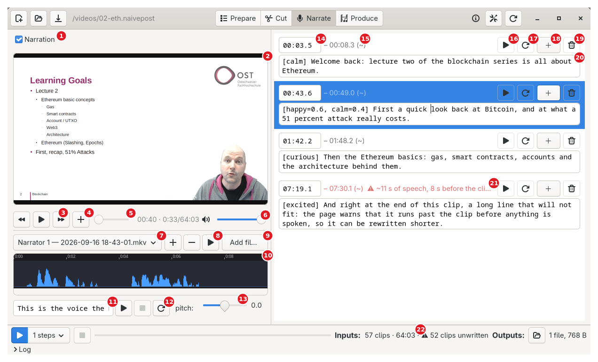
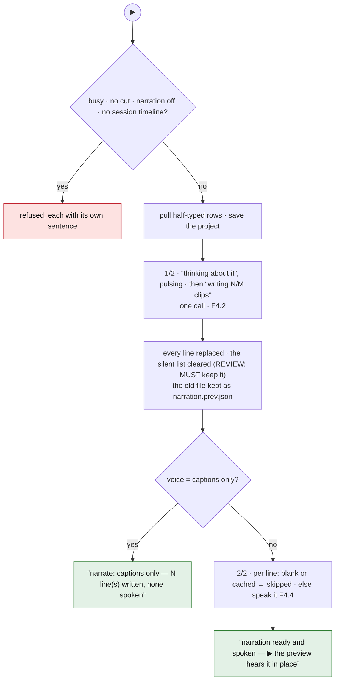
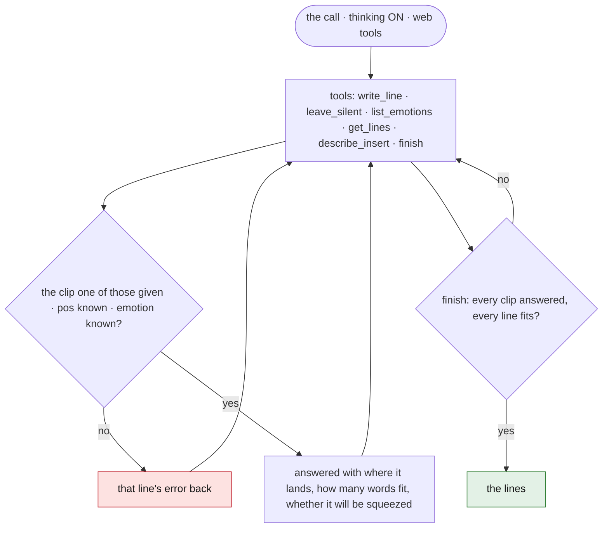
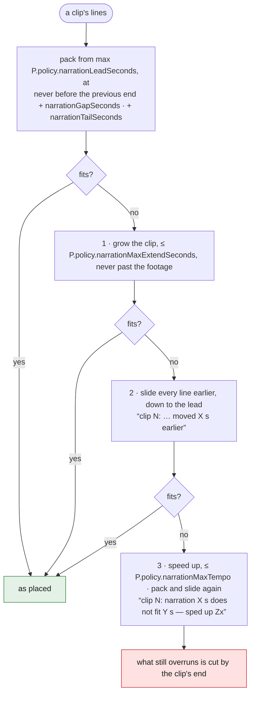
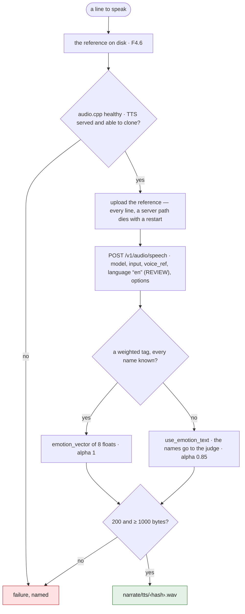
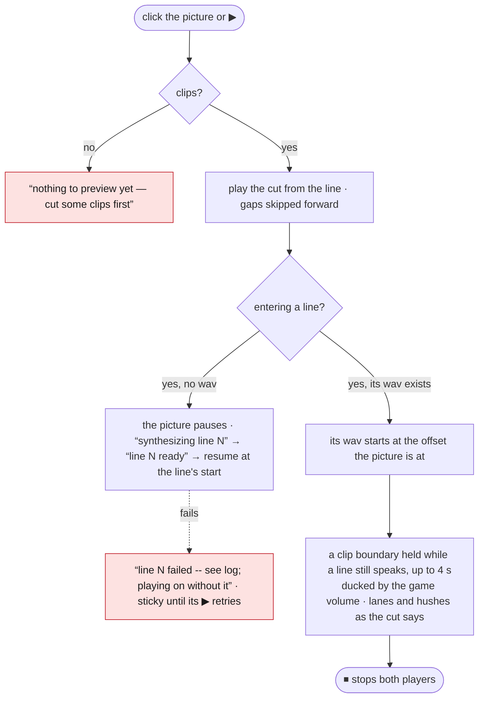
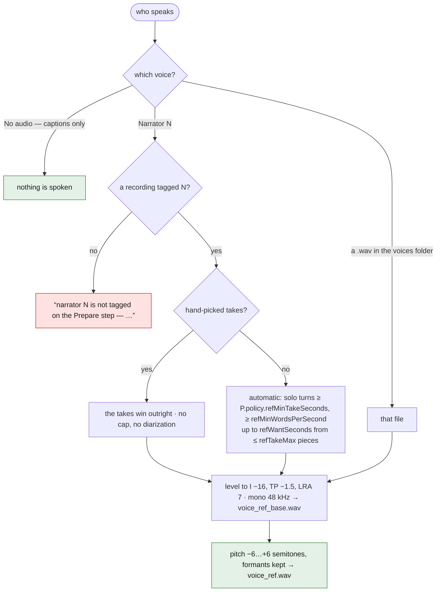
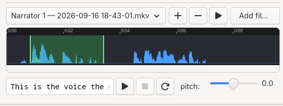
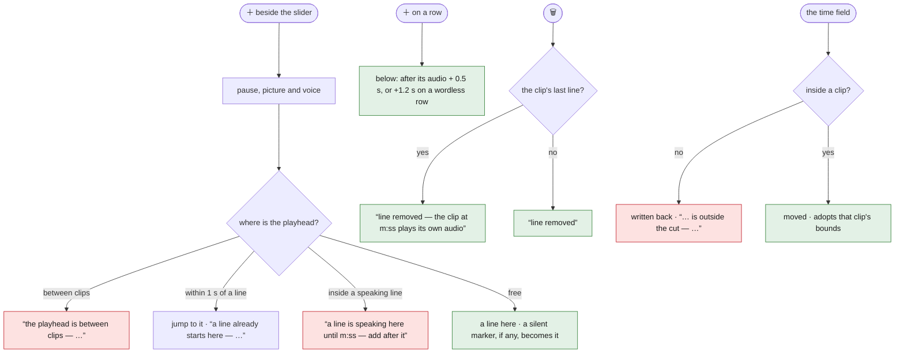
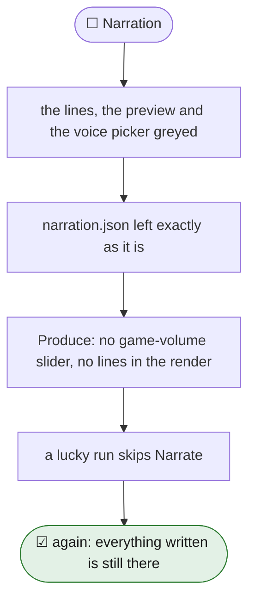

# 07 — Narrate

<!-- nav -->
[← 06 Effects](06-effects.md) · [↑ Contents](README.md) · [08 Produce →](08-produce.md)

**Flows:** [F4.1](#f41--write-and-speak) · [F4.2](#f42-the-narration-call) · [F4.3](#f43-fit-a-line-to-its-clip-the-renders-rule-mirrored-by-the-row-warnings) · [F4.4](#f44-speak-a-line-tts) · [F4.5](#f45-preview-the-cut-with-narration) · [F4.6](#f46-choose-the-voice-and-build-the-reference) · [F4.7](#f47-edit-lines) · [F4.8](#f48-narration-off)
<!-- /nav -->

One editable line per clip: what is said, in which voice, with what emotion. ▶ writes and speaks the lines. Narration off → everything that carries one is greyed.

## 1. Screen



<sub>Screenshot of the prototype on a copy of the ETH lecture project. The project has narration off, so these four lines were written into the copy for the shot; their times, the “(~)” estimates and the warning are the app's own.</sub>

**1** Narration tick · **2** preview · **3** back 3 s · ▶ · forward 3 s · **4** ＋ a line at the playhead · **5** slider over the cut, clock “session · cut/length” · **6** volume · **7** who speaks · **8** take ＋ − ▶ · **9** Add file… · **10** take band · **11** sample sentence · **12** sample ▶ ⏹ ⟳ · **13** pitch · **14** time field · **15** end time, “(~)” while estimated · **16** ▶ speak this line · **17** ↻ re-roll · **18** ＋ a line below · **19** 🗑 remove · **20** “[emotion] words” · **21** the fit warning · **22** Inputs readout

REVIEW: the row's ＋ is the full-width sign U+FF0B, which only CJK fonts carry; on a machine without one it draws as a missing-glyph box. The rewrite SHOULD use an icon or an ASCII “+”.

- **Narration tick**: "Whether this video has a narration. Unticked, ▶ writes none, the lines already written are left alone, and Produce drops the game-volume slider…" (the shipped tooltip also promises the subtitle choices go — stale: only the slider is hidden, since captions also come from the transcript. REVIEW: fix the wording.) Off greys lines, preview and voice picker; Produce renders as if there were no lines.
- **Preview**: finished frame (crop, zoom, stops, titles), narration mixed over the cut's sound; click = play/pause. Transport: back 3 s, ▶/⏸, forward 3 s, ＋ new line at this second, slider on the cut's own clock ("what the edit removed is not on this bar…"; paused, wheel steps a frame), clock "session · cut/length", shared volume.
- **Lines column**: one row per entry, sorted by clip then offset. Row: time entry (mm:ss.s, session clock; typing moves within the clip; Enter/leave may move it to another clip; a time in a gap is refused and written back), status ("– end time", "(~)" while estimated, "(no line — this clip plays on its own audio)", "(caption — the viewer reads it; never spoken)", warnings "⚠ ~N s of speech, M s before the clip ends|the next line" and "⚠ this clip's lines run N s past it — the render will have them moved earlier[ and sped up]"), ▶ speak this line — audition from 3 s ahead where those seconds are its own, then continue down the cut; five other cases, each in its own words: a press while speaking pauses; a wordless row "clip N has no line — playing it on its own audio" / "…and no recording covers it"; a caption "line N is a caption — read, never spoken; playing its moment" / "…and no recording covers its clip"; a synthesis in flight "still speaking line N for the first time — ⏹ gives up on it". A clip no recording covers speaks alone off the tick ("synthesizing… (first line after a cold start also loads the model)", then "entry N — no recording covers this clip, so the line plays on its own", failure "synthesis failed — see log"), ↻ re-roll (new take, same words), ＋ add a line below, 🗑 remove (clip plays its own audio). Text box: `[emotion] words`, `[top|center|bottom] words` for captions; may carry the line's second in the tag as `@N` (`[excited @65] Weee` moves the line, clamped out of the clip's last second) — write-only: the time field owns the number, the box never prints it back. Tooltip explains the tag, judge vs weighted mixes, the eight base emotions.
- **Voice picker**: unlabelled dropdown, tooltip "Who speaks the narration…" (No audio — captions only; Narrator 1..4 — the recording tagged on Prepare; every .wav in the voices folder); the take band's ＋ − ▶; "Add file…" (copies a recording into the voices folder). **Take band** (narrator slot with a recording only): the recording's waveform ("reading the recording…" while the envelope decodes); red ▶-start bar, drawn through the ruler too; faint red bar under the pointer; blue live selection; playhead while ▶ walks; each take shaded, labelled with its duration alone ("4.2s") when wider than 34 px; own scrollbar once the wheel zooms past fit. Drag selects; ＋ makes a take (≥ 0.4 s); − takes seconds back out (splitting takes); click sets the red bar; ▶ plays the takes from the bar (raw recording when none); wheel zooms; Shift+wheel pans; "With no takes the seconds are chosen for you." Sample: an entry (default "This is the voice the narration will be spoken in. It should stay clear and easy to follow for a couple of minutes."), ▶ speaks it, ⏹, ⟳ new take; pitch −6..+6 semitones ("Shift the reference recording before it is cloned — a different speaker, not the same one transposed"), applied 400 ms after the last move.
- Inputs: "N clip(s) · mm:ss\[ · ⚠ N clip(s) unwritten, N line(s) off the cut]\[ · no timeline]"; "no cut yet — build one on the Cut step". Outputs: "narrate/ — narration.json, the voice reference and the synthesis cache".

## 2. Flows

### F4.1 ▶ Write and speak

<sub><!-- back -->[← F3.12](06-effects.md#f312-clamp-to-the-cut-as-applied) · [↑ 07 Narrate](#07--narrate) · [all flows](11-flow-index.md#3-all-flows) · [F4.2 →](#f42-the-narration-call)</sub>



S1 Refuse: busy; no cut ("no cut yet — build one on the Cut step first"); narration off ("this video has no narration — tick Narration at the top of this page to write one"); no session timeline ("run Transcript first — no session timeline"). S2 Pull half-typed rows; keep the previous file as `narration.prev.json`. S3 Save the project; job "narration" 1/2 — bar opens at "thinking about it", pulses every 150 ms until the first clip closes, then "writing N/M clips" as they stream; log ">>> narrate: <why> — writing N clip(s), one LLM call, then speaking them" where <why> is the staleness reason ("there is no narration yet" / "clip N has no narration — it is new, or the cut moved under it" / "the narration has lines for clips the cut no longer has") or "rewriting every line"; one model call ([F4.2](#f42-the-narration-call)). S4 Replace every line (REVIEW: the prototype always rewrites; the Readme promised only missing lines — the rewrite SHOULD rewrite only clips with no entry unless the user asks for all, via a choice on the ▶ or the policy); clear the silent list — **REVIEW: it holds the user's own "this clip plays its own audio" decisions; wiping it every run destroys hand work; the rewrite MUST keep it** ([`12-decisions.md` §3](12-decisions.md#3-where-the-prototype-overrules-the-model--and-where-that-decision-moves)); save; rebuild; ">>> narration written for N clips"; "narration written — speaking it". S5 Captions-only voice → done ("narrate: captions only — N line(s) written, none spoken"). S6 Job "speaking" 2/2, one task per line: checkpoint; skip blank text or a cached wav; else synthesize ([F4.4](#f44-speak-a-line-tts)). "    narrate: N line(s) spoken, M already in the cache" — four-space indent, not `>>> `. S7 Done: status "narration ready and spoken — ▶ the preview hears it in place" / "narration ready — captions only, nothing spoken" / "<stage> stopped" / "<stage> failed — see log". (Prototype bug: written to the progress bar's hidden text, never shown; they belong on the status line.)

### F4.2 The narration call

<sub><!-- back -->[← F4.1](#f41--write-and-speak) · [↑ 07 Narrate](#07--narrate) · [all flows](11-flow-index.md#3-all-flows) · [F4.3 →](#f43-fit-a-line-to-its-clip-the-renders-rule-mirrored-by-the-row-warnings)</sub>

```text
SYSTEM  house rules + the "narrate" prompt
        + the speech addendum, when the clips play what people said out loud
        + the captions addendum, for a captions-only voice
USER    User Context (+ the speech rule)
        THE CLIPS AND WHAT IS KNOWN ABOUT EACH:
        CLIP 7: 3:20–3:38 (18 s of footage at 2x, 9 s on screen, at most 13 words -- fewer is better, none is fine)
          [+0.4s] NARRATOR: …        lines within ±P.policy.narrationContextSeconds
          [+6.1s] EVENT: …
          [+2.0s] MARKED: boss fight   [+4.0s] CAPTION: …
        CLIP 8: an insert — "not footage: a graphic or clip inserted here … Narrate what is ON it, or say nothing"
```



System = house rules + the "narrate" prompt (+ speech addendum when the clips play what people said out loud: "THIS VIDEO PLAYS WHAT PEOPLE SAID OUT LOUD… never say one back: set it up before it lands, or react after it"; + captions addendum for a captions-only voice: write for the eye, emotion "", every entry has a placement). User = User Context (+ the speech rule) + "THE CLIPS AND WHAT IS KNOWN ABOUT EACH:" + per clip "CLIP n: a–b (X s[ of footage at Rx, Y s on screen], at most W words -- fewer is better, none is fine)" with its lines within ±4 s as "[+Ns] LABEL: text" (narrator's mic as NARRATOR; "(no lines over this clip: nothing said, nothing described)"), inserts described ("not footage: a graphic or clip inserted here … Narrate what is ON it, or say nothing"), effects as "[+Ns] MARKED: name" / "[+Ns] CAPTION: text". Word ceiling per clip = clamp(0.75 · seconds, P.policy.narrationMinWords 8, P.policy.narrationMaxWords 30). Thinking on; web tools offered. **Tools**: `write_line(clip, at, text, emotion, pos?)`, `leave_silent(clip)`, `finish` ([`02-services.md` §3.8](02-services.md#38-narration)). Tool validation: clip must be one given; `at` clamped inside the clip, never its last second; `pos` normalised. Prototype: `{"entries":[{start,end,at,text,emotion}]}` matched to clips by echoed bounds within 0.5 s scanning forward, three attempts, thinking off after a call that wrote nothing. Streaming progress = written clips / clips. Never served from the reply cache (the TTS cache is the cache).

### F4.3 Fit a line to its clip (the render's rule, mirrored by the row warnings)

<sub><!-- back -->[← F4.2](#f42-the-narration-call) · [↑ 07 Narrate](#07--narrate) · [all flows](11-flow-index.md#3-all-flows) · [F4.4 →](#f44-speak-a-line-tts)</sub>



Lines pack in order from max(P.policy.narrationLeadSeconds 0.3, at), never before the previous line's end + P.policy.narrationGapSeconds (0.3); need = packed end + P.policy.narrationTailSeconds (0.2). Over the clip: grow it by up to P.policy.narrationMaxExtendSeconds (4 s), never past the footage; still over: slide every line earlier, down to the lead; still over: speed up to P.policy.narrationMaxTempo (1.25×), then pack and slide earlier once more at the new tempo; only then log. Each step logged ("clip N: the narration does not fit where it was placed — moved X s earlier" / "clip N: narration X s does not fit Y s — sped up Zx"). Speech length = the wav's duration if it exists, else — **on the Narrate page only** — characters / the narration's own measured rate (default 15 chars/s, clamped 8..28). In the render a line with no synthesis has length 0, takes no room; its cue is held to the next line or the clip's end.

### F4.4 Speak a line (TTS)

<sub><!-- back -->[← F4.3](#f43-fit-a-line-to-its-clip-the-renders-rule-mirrored-by-the-row-warnings) · [↑ 07 Narrate](#07--narrate) · [all flows](11-flow-index.md#3-all-flows) · [F4.5 →](#f45-preview-the-cut-with-narration)</sub>



S1 Reference on disk ([F4.6](#f46-choose-the-voice-and-build-the-reference)). S2 Audio server health; TTS model served and able to clone. S3 Upload the reference every line (a server path dies with a restart). S4 POST /v1/audio/speech `{model, input: text, voice_ref: <server path>, language: "en", options: {emotion_alpha "0.85", seed, and either emotion_vector "<8 floats>" with emotion_alpha "1" (a weighted tag whose names are all known) or use_emotion_text "true" + emotion_text "<names>" (the judge)}}`. REVIEW: prototype hard-codes "en"; it SHOULD follow the project language or a policy field. S5 Reply under 1000 bytes or non-200 = failure; else write `narrate/tts/<hash>.wav`. S6 Emotion vocabulary: eight bases (happy, angry, sad, afraid, disgusted, melancholic, surprised, calm) with kin words, 21 named blends as recipes over the bases; weights 0..1; unknown names go to the judge as words; never an error.

### F4.5 Preview the cut with narration

<sub><!-- back -->[← F4.4](#f44-speak-a-line-tts) · [↑ 07 Narrate](#07--narrate) · [all flows](11-flow-index.md#3-all-flows) · [F4.6 →](#f46-choose-the-voice-and-build-the-reference)</sub>



S1 Click the picture or ▶: play from the line, else the cut's start ("nothing to preview yet — cut some clips first"; "no recording covers the start of the cut" when the cue lands on nothing). S2 The tick follows the picture; gaps skipped forward (past the last clip → pause); a clip boundary held while a line still speaks, up to 4 s; entering a line starts its wav at the picture's offset; a line with no wav pauses the picture, synthesizes ("synthesizing line N" / "line N ready"), resumes at the line's start; a line failing while the picture waits sets "line N failed -- see log; playing on without it" and resumes where the picture froze, not at the line's start; a failed line is sticky per wav until its own ▶ retries it ("line N failed to synthesize — see log; its ▶ retries"), which first clears the failure. S3 Sound equals the render's: whole clip ducked by the game volume while a line speaks; lanes and hushes follow the cut; speed effects apply at seeks. S4 Seeks snap to the cut (gap target → previous clip's end going back, next clip's start going forward). S5 While playing, row selection follows the playhead; selecting a row seeks to its line's lead-in (3 s ahead unless the previous line still speaks there). S6 ⏹ stops both players, hands ▶ back to the step.

### F4.6 Choose the voice and build the reference

<sub><!-- back -->[← F4.5](#f45-preview-the-cut-with-narration) · [↑ 07 Narrate](#07--narrate) · [all flows](11-flow-index.md#3-all-flows) · [F4.7 →](#f47-edit-lines)</sub>





<sub>Screenshot of the prototype on the ETH lecture project.</sub> Drag across the wave, press ＋: a 2.6 s take, the status says “take added: 0:00–0:03 — 1 take(s), 2.6 s of reference (14 s is plenty)”.

S1 Pick a voice: captions only (nothing spoken); Narrator N (recording tagged on Prepare; "narrator N is not tagged on the Prepare step — tag a recording, or pick another voice"); a voices-folder file ("voice X is no longer in DIR — pick another"). Switching keeps what was synthesized (cache key carries the voice) and reports the switch: "no audio — the narration is written and timed, never spoken" / "voice: narrator N's — it is re-cut from the recording on the next line spoken" / "voice: <name> — ▶ beside the sample plays it" / "could not install that voice — see log". S2 Reference: hand-picked takes win outright (no cap, no diarization needed); else automatic from diarization turns and transcript: takes ≥ P.policy.refMinTakeSeconds (5), ≥ 2 s from other speakers, ≥ 1.5 words/s, up to P.policy.refWantSeconds (14) from ≤ 3 pieces; errors "nothing is tagged as narrator N on the Prepare step", "no diarization for X -- run Prepare, or pick the seconds by hand under the video", "no clean solo stretch found for the voice reference". S3 Level to −16 LUFS / −1.5 dBTP / LRA 7, mono 48 kHz pcm → `voice_ref_base.wav`; pitch-shift (rubberband, formants preserved) → `voice_ref.wav`. A wav header the server cannot read (extensible format, > 48 kHz) is logged ("voice reference <file> is not a wav the server reads -- cutting it again") and re-cut; a project with `voice_ref.wav` but no `voice_ref_base.wav` renames the former to the base. S4 Takes: ＋ on a selection ≥ 0.4 s ("take added: a–b"; "that is X s — a take has to be at least 0.4 s"), − subtracts seconds (splitting takes), ▶ walks takes from the red bar; takes sorted, merged when touching; changing takes, pitch or voice removes the shifted reference (and the base where needed). S5 Sample: speak the entry text in the voice (cached per voice and text; "sample in <voice>"; ⟳ = new take).

### F4.7 Edit lines

<sub><!-- back -->[← F4.6](#f46-choose-the-voice-and-build-the-reference) · [↑ 07 Narrate](#07--narrate) · [all flows](11-flow-index.md#3-all-flows) · [F4.8 →](#f48-narration-off)</sub>



- **Add at the playhead** (＋ beside the slider): preview paused first, picture and voice. Between clips → "the playhead is between clips — the cut has nothing to narrate here"; within 1 s of a line → jump to it, "a line already starts here — edit it, or move the playhead"; inside a speaking line → "a line is speaking here until m:ss — add after it". If the clip's only entry is the empty "deliberately silent" marker, that entry moves to the playhead and becomes the line (no second row).
- **Add below** (＋ on a row): previous audio's end + 0.5 s for a row with words, else flat +1.2 s ("no room after this line — the clip ends first").
- **Move** (time field): into another clip adopts its bounds ("moved this line to the clip at m:ss.s — it now starts at m:ss.s"); a gap is refused and written back ("m:ss.s is outside the cut — this line stays in its clip (a–b), at m:ss.s"); never in the clip's last second. A move emptying the old clip marks it deliberately silent, like a delete.
- **Delete**: row goes. Clip remembered as deliberately silent only if that was its last line ("line removed — the clip at m:ss plays its own audio"); otherwise bare "line removed".
- **Re-roll**: roll + 1, a new take spoken; the old wav stays.
- **Text**: `[tag] words`; placement tag clears the emotion; emptying a box keeps the old emotion; autosaved 400 ms after typing; flushed on tab leave, window close, and before Produce reads the file.
- **Refit** on entering the tab: when the cut moved, lines keep their place against the video ("the cut moved — N line(s) followed their clips[, N sit on video the cut no longer has]").

### F4.8 Narration off

<sub><!-- back -->[← F4.7](#f47-edit-lines) · [↑ 07 Narrate](#07--narrate) · [all flows](11-flow-index.md#3-all-flows) · [F5.1 →](08-produce.md#f51--produce)</sub>



Greys the page; leaves `narration.json` alone; Produce hides the game-volume slider and renders without lines; a lucky run skips Narrate ([F0.4](03-shell.md#f04-run-every-step-im-feeling-lucky)).

## 3. Data

`narrate/narration.json` ([`01-project-and-files.md` §4](01-project-and-files.md#4-narratenarrationjson)); `narration.prev.json`; `voice.txt`, `pitch.txt`, `takes.json`, `voice_ref_base.wav`, `voice_ref.wav`, `tts/*.wav`, `samples/*.wav`.

## 4. Parameters used

P.policy: narrationMinWords, narrationMaxWords, narrationWordsPerSecond (0.75), narrationLead, narrationGap, narrationTail, narrationMaxExtend, narrationMaxTempo, narrationContextWindow (±4 s), ttsLanguage, refMinTakeSeconds, refPadSeconds (2), refWantSeconds, refTakeMax (3), refMinWordsPerSecond (1.5), takeMinSeconds (0.4), emotionAlpha (0.85), runInSeconds (3), speech rate defaults (15, 8..28). Engineering: tick 100 ms, seek debounce 120 ms, autosave 400 ms, band geometry, cache key format (frozen).

## 5. Rules

Entries always sorted; a line's clip bounds = the cut's numbers; `at` never in the last second; empty text is a deliberate answer; preview plays the cut, sound equals the render's; boundary held while a line speaks; a hold resumes at the line's start; failed synthesis sticky until retried; captions-only short-circuits everything that speaks; the run bar is the preview's transport only once the preview started; cache keys stable, nothing deletes old wavs; hand-picked takes never re-ranked; a voice not on offer leaves the picker empty rather than pointing at the wrong speaker.

## 6. Details confirmed against the code (verification pass)

- **[F4.1](#f41--write-and-speak)**: previous file copied aside only once a valid narration came back ("    the narration it replaced is kept at <path>"); silent list cleared with the replacement; a captions-only voice still opens and closes the "speaking 2/2" job so the bar finishes.
- **[F4.2](#f42-the-narration-call) validation**: every clip must be answered — a skipped clip ("clip N (a-b) got no entry") or no clip with a line ("every clip came back with no line at all") is refused; entries matched forward only ("an entry says X-Y, which matches no clip (or is out of order)"); several entries on one clip sorted by offset. With tools, these are `finish`'s answers.
- **Inputs tooltip**: names `cut/cut.json` (clips, minutes), the staleness sentence + "— ▶ writes the narration again", `prepare/transcript/session.tsv` with line count and the ±4 s rule, the session context verbatim, and "Spoken by <voice> at ±X.X semitones (narrate/voice_ref.wav)". A clip is "unwritten" when no entry sits on it and it is not deliberately silent; a line is "off the cut" when on video the cut no longer has.
- **Re-roll / sample refusals**: "clip N has no line to re-roll"; "no audio is chosen — a caption has no take to re-roll"; "line N: new take, speaking it"; "pick a voice first"; "no audio is chosen — there is no voice to sample"; "type a sample sentence to hear the voice"; "still synthesizing the last sample…"; "sample playing" / "sample paused — ▶ resumes, ⏹ starts over" / "sample stopped". Each sample logs ">>> sample[ take N]: <voice> at ±X semitones — \"text\"" then "    sample: <file> (N kB, spoken in T | spoken earlier)"; an under-sized answer "!!! sample: <file> is N bytes — no audio came back".
- **Reference build**: logged ">>> voice reference built: X s, N words | N hand-picked take(s) from <base>". Automatic ranking: speaker with the most turn time; solo turns (nobody else within refPadSeconds), narrowed to their words, ranked by words said, length as tie-break; takes under refMinWordsPerSecond dropped unless that leaves none.
- **"Add file…"** converts the recording to mono PCM wav in the voices folder under a sanitised base name, never overwriting (`name-2`, `name-3` …); the file name is the voice id in every project's cache keys.
- **Take band messages**: "drag across the wave first — ＋ makes the selection a take"; "drag across the takes you want gone — － removes those seconds"; "nothing is picked in those seconds"; "no takes left — the seconds are chosen for you again on the next line spoken"; "no takes yet — drag across the wave and press ＋"; "playing the recording from m:ss — nothing is picked after it"; "playing N take(s), X s from m:ss"; "takes played" / "stopped playing the takes"; commit status "<what> — N take(s), X s of reference (14 s is plenty). Re-cut on the next line spoken." `takes.json` keyed by recording base name, not slot, so re-tagging never moves anyone's takes; changing takes removes the built reference.
- **Preview**: a gap is held only while the speaking line is within its clip's end + narrationMaxExtend; past the last clip both players pause; when the picture stops, narration stops too — except a line auditioned from its own ▶ over a clip with no footage, which speaks against a still frame.

<!-- nav -->
---
[← 06 Effects](06-effects.md) · [↑ top](#07--narrate) · [↑ Contents](README.md) · [08 Produce →](08-produce.md)
<!-- /nav -->
