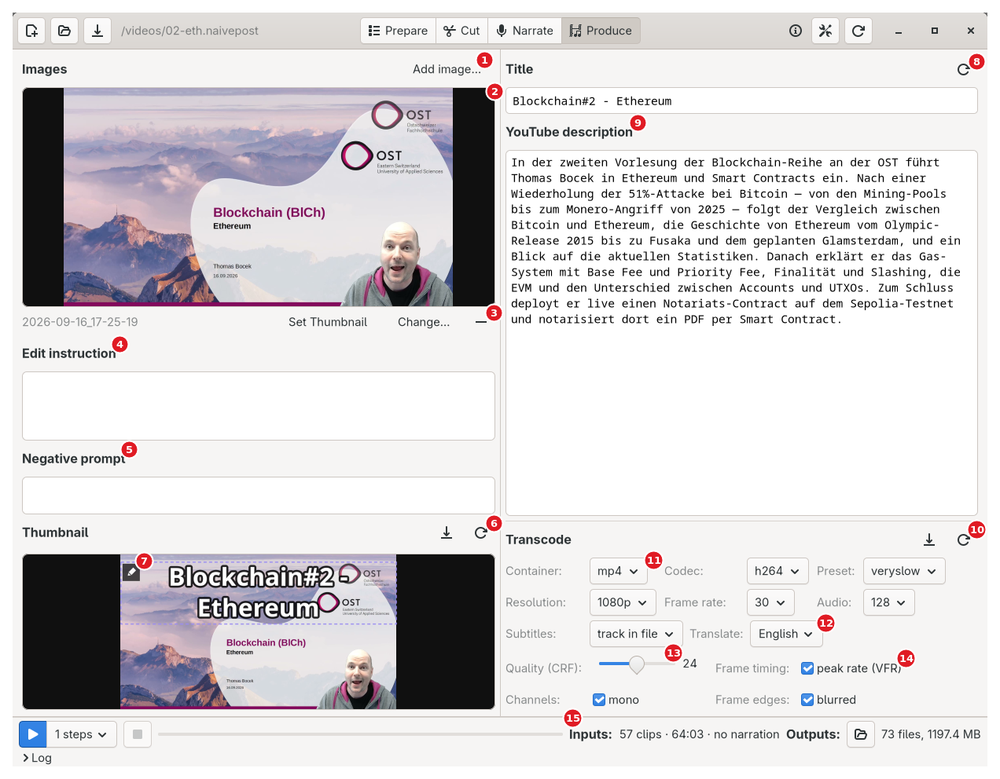
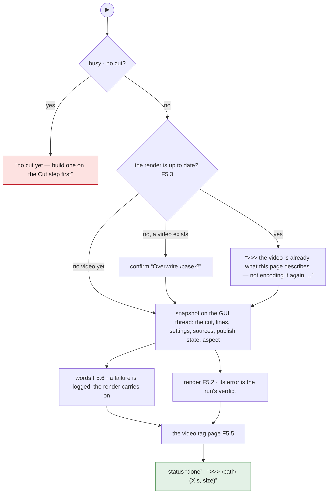
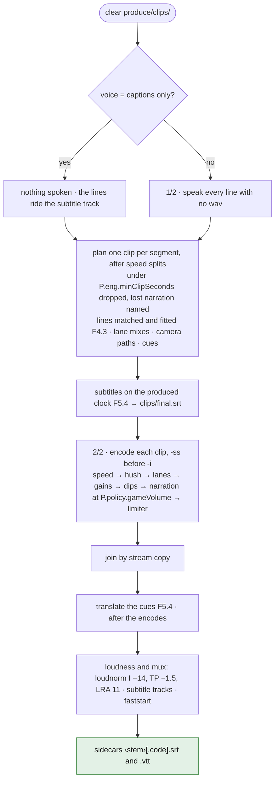
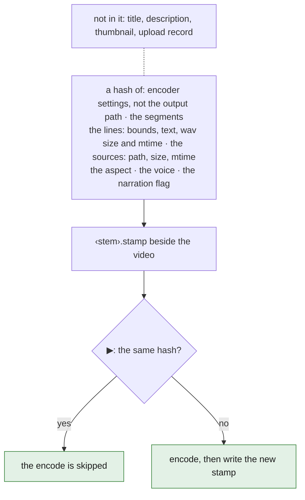
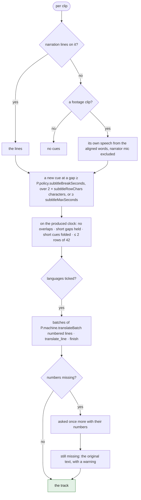
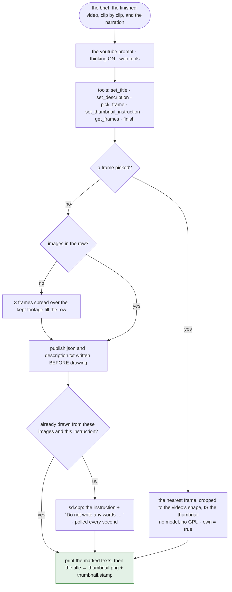
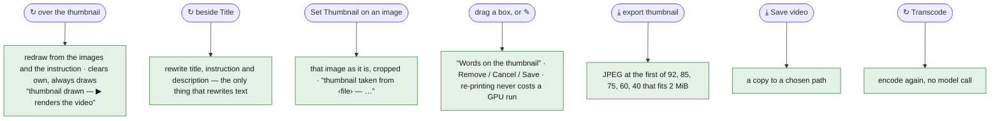
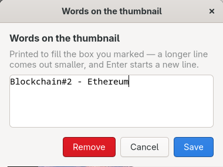

# 08 — Produce

<!-- nav -->
[← 07 Narrate](07-narrate.md) · [↑ Contents](README.md) · [09 The LLM client, tools, gate, cache, log →](09-llm-and-tools.md)

**Flows:** [F5.1](#f51--produce) · [F5.2](#f52-the-render) · [F5.3](#f53-what-up-to-date-means) · [F5.4](#f54-subtitles) · [F5.5](#f55-the-video-tag) · [F5.6](#f56-upload-text-and-thumbnail) · [F5.7](#f57-page-runs)
<!-- /nav -->

Renders the video; writes subtitles per language, title, description, thumbnail. Words half and render half run in parallel; neither reads the other's files.

## 1. Screen



<sub>Screenshot of the prototype on the ETH lecture project.</sub> Narration is off in this project, so the Game audio slider is hidden.

**1** Add image… · **2** the base image the image model edits · **3** Set Thumbnail · Change… · remove (a reference slot also has Make base) · **4** Edit instruction · **5** Negative prompt · **6** Thumbnail: ⤓ export · ↻ redraw · **7** the thumbnail: drag a box to add words, ✎ to reword · **8** Title, ↻ suggest · **9** YouTube description · **10** Transcode: ⤓ save the video · ↻ encode again · **11** container · codec · preset · resolution · frame rate · audio · **12** Subtitles · Translate (· Game audio with narration on) · **13** Quality (CRF) · **14** Frame timing · Channels · Frame edges · **15** Inputs readout

- **Encoder settings** (labels, options, defaults and tooltips in [`inventory/produce.md`](inventory/produce.md) §A, normative): Container mp4/mkv/webm; Codec h264/h265/vp9; Preset ultrafast…veryslow (default `slow`; prototype: veryslow); Resolution 720p/1080p/original (short side; the cut's aspect sets the shape); Frame rate source/60/30/24; Audio 128/192/256/320 kbit/s; Subtitles burned in / track in file / none in the video (.srt and .vtt written beside the video regardless); Translate (per-language ticks in the settings list; session's own language never offered); Game audio 0..1 (hidden when narration off); Quality CRF 14..34 (mark at 24); Frame timing "peak rate (VFR)"; Channels "mono"; Frame edges "blurred" (on). webm forces vp9; "track in file" → "none". Output = `produce/final.<container>`, not asked. ↻ Transcode ("Encode the video again from the cut and these settings — no model call…"); ⤓ Save video (copy elsewhere).
- **Images row**: up to 8; first = base the image model edits, others = references it can name ("the ship from the second image"); base shows a crop box when its shape differs from the video's; per slot: Set Thumbnail (use as is, no model), Change…, remove; Make base on every non-base slot; empty state "No image — the thumbnail will be drawn from the instruction alone." **Edit instruction** and **Negative prompt** boxes; **Thumbnail** with ⤓ export (JPEG under 2 MB) and ↻ redraw; picture is a text-overlay editor: drag a box → words printed to fill it; drag borders/middle to resize/move; ✎ to reword or remove; title band is its own box.
- **Title** entry (printed across the thumbnail the first time only; then separate) with ↻ suggest (fresh title, instruction, description; the only text rewriter); **YouTube description** box.
- Inputs: "N clip(s) · mm:ss\[ · no narration | · N to speak]\[ · no upload text]"; tooltip: what will be spoken first, which recordings are mixed, the voice, whether `publish.json` exists. Outputs: count only ("61 files, 220 MB"); folder button tooltip: "produce/ — the finished video, the per-clip encodes, the thumbnail and the upload text".

## 2. Flows

### F5.1 ▶ Produce

<sub><!-- back -->[← F4.8](07-narrate.md#f48-narration-off) · [↑ 08 Produce](#08--produce) · [all flows](11-flow-index.md#3-all-flows) · [F5.2 →](#f52-the-render)</sub>



S1 Refuse when busy; no cut → "no cut yet — build one on the Cut step first". S2 Render up to date ([F5.3](#f53-what-up-to-date-means) stamp) → encode skipped (">>> the video is already what this page describes — not encoding it again (↻ beside Transcode encodes anyway)"); else if the video exists, confirm "Overwrite <base>?" ("<path> — size, age\n\nThe encode takes minutes and there is no undo for it."). S3 Snapshot on the GUI thread (cut, lines, settings, sources, publish state, aspect); cut = the Cut page's own if it holds one (unsaved tweak still renders), else `cut/cut.json` — one function answers "what is the cut" for render, subtitles, brief and stamp. S4 startRun; one opening line: ">>> transcoding <file>: N clips at <container>/<codec> crf N — the thumbnail and the upload text are left as they are", or ">>> producing <file>: … and the thumbnail redrawn beside them" when `publish.json` exists, else "… and the upload text and thumbnail written beside them". Two halves in parallel: **words** ([F5.6](#f56-upload-text-and-thumbnail), own progress line; failure logged "!!! the upload text and thumbnail failed: … -- the render carries on") and **render** ([F5.2](#f52-the-render)). S5 After both: write the `<video>` tag page ([F5.5](#f55-the-video-tag)). S6 Render's error = run's verdict. Progress text "produced <file> — X s, size"; status "done" / "production stopped" / "production failed — see log"; log ">>> <path>  (X s, size)".

### F5.2 The render

<sub><!-- back -->[← F5.1](#f51--produce) · [↑ 08 Produce](#08--produce) · [all flows](11-flow-index.md#3-all-flows) · [F5.3 →](#f53-what-up-to-date-means)</sub>



S1 Clear `produce/clips/`. S2 Speak every line without a wav (job "speaking" 1/2) — unless voice is "captions only": nothing spoken, lines carried by the subtitle track alone (with Subtitles "none in the video" warn ">>> captions only and nothing in the video — the lines are in the .srt beside it"). S3 Plan one clip per cut segment (after speed-effect splits): footage (rate, clamped to the recording), copies (`copy:<s>`), inserts (missing file → "clip N: <file> is not there any more — skipped"), sounds over footage; clips under P.eng.minClipSeconds (0.5) dropped, log line naming any narration lost. Narration lines matched to clips (overlap ≥ half the shorter span) and fitted ([F4.3](07-narrate.md#f43-fit-a-line-to-its-clip-the-renders-rule-mirrored-by-the-row-warnings)). Sound plan for own-clock runs; lane mixes per clip (overlaps ≥ 0.1 s; per-lane report "<lane> is mixed into N of the M clips"); frame box per clip; camera paths; text, gain, hush, still cues. S4 Subtitles on the produced clock ([F5.4](#f54-subtitles)) → `clips/final.srt`; stale sidecars beside the video deleted by exact name. S5 Encode each clip (job "clip": stems `c000_<stamp>`; -ss before -i; filter graph of [`06-effects.md` §4](06-effects.md#4-render-how-each-effect-becomes-ffmpeg) + burned subtitles; audio: speed → hush → lane bed → gains → seam dips → narration mix at P.policy.gameVolume → limiter −1 dBFS → 48 kHz format; codec args by codec/preset/CRF; every command logged). Size mismatch vs clip 0 logged (join is a stream copy). S6 Join by stream copy ("joining"). S7 Translate cues into ticked languages ([F5.4](#f54-subtitles); after the encodes so the encoder never idles behind the LLM gate). S8 Loudness + mux: `aresample=async=1:first_pts=0,loudnorm=I=-14:TP=-1.5:LRA=11`, 48 kHz, the audio codec, subtitle tracks when "track in file" (mov_text in mp4, srt in mkv; never webm), mp4 faststart flags. S9 Sidecars `<stem>[.code].srt` and `.vtt` per language; each logged. S10 Checkpoints between every subprocess. The run writes the stamp ([F5.3](#f53-what-up-to-date-means)) once the render returns without error; a press that skipped the encode writes none.

### F5.3 What "up to date" means

<sub><!-- back -->[← F5.2](#f52-the-render) · [↑ 08 Produce](#08--produce) · [all flows](11-flow-index.md#3-all-flows) · [F5.4 →](#f54-subtitles)</sub>



Stamp = hash of encoder settings (minus output path), segments, lines (bounds, text, wav size and mtime), sources (path, size, mtime), aspect, voice, narration flag; kept as `<stem>.stamp` beside the video. Not in it: title, description, thumbnail, upload record. Upload text is "written" when `produce/publish/publish.json` exists; deleting `publish/` starts it over.

### F5.4 Subtitles

<sub><!-- back -->[← F5.3](#f53-what-up-to-date-means) · [↑ 08 Produce](#08--produce) · [all flows](11-flow-index.md#3-all-flows) · [F5.5 →](#f55-the-video-tag)</sub>



S1 Cues per clip: its narration lines if any, else — footage clips only, never an insert, a freeze or a clip with no video — its own speech from the aligned words (narrator mic excluded), respelled from the fixed transcript; per word, new cue at a gap ≥ P.policy.subtitleBreakSeconds (0.6), over 2 × P.policy.subtitleRowChars (42) characters, or ≥ P.policy.subtitleMaxSeconds (6); an empty cue extends the previous. S2 Produced clock: no overlaps; gaps under 1.2 s held; cues under 0.8 s folded into the next; wrapped at 42 chars, ≤ 2 rows; `{\an8}`/`{\an5}` for top/centre. S3 Translation per ticked language: numbered batches of P.machine.translateBatch lines (new; prototype sent all lines at once and repaired gaps); message "TRANSLATE THESE N LINES INTO X. Answer with N lines, numbered as they are here:"; thinking off; **Tools**: `translate_line(n, text)`, `finish` ([`02-services.md` §3.10](02-services.md#310-translate-per-batch-of-numbered-lines)); missing numbers re-asked once with original numbers; still missing → original text + warning; cached only when complete. Session's own language = track 0, never translated.

### F5.5 The `<video>` tag

<sub><!-- back -->[← F5.4](#f54-subtitles) · [↑ 08 Produce](#08--produce) · [all flows](11-flow-index.md#3-all-flows) · [F5.6 →](#f56-upload-text-and-thumbnail)</sub>

```html
<video poster="final.jpg" controls src="final.mp4" preload="none">
  <track src="final.vtt"    srclang="en" default>
  <track src="final.de.vtt" srclang="de">
</video>
```

<sub>`final.html`: the poster is the thumbnail as JPEG 90; one track per `.vtt` on disk, the video's own language first and default. Rewritten even when the encode was skipped.</sub>

Poster `<stem>.jpg` (JPEG 90) from the thumbnail; tracks = `.vtt` files on disk, video's own language first and default; `<stem>.html` = bare `<video poster controls src preload="none">`, one `<track>` per language. Notes logged: container/codec not web-playable; subtitles need http, not file://.

### F5.6 Upload text and thumbnail

<sub><!-- back -->[← F5.5](#f55-the-video-tag) · [↑ 08 Produce](#08--produce) · [all flows](11-flow-index.md#3-all-flows) · [F5.7 →](#f57-page-runs)</sub>



S1 Brief: "THE FINISHED VIDEO: N clips, m:ss long." + "WHAT IS IN EACH CLIP:" + per clip "CLIP n (at m:ss in the video, X s): session a–b" with what was seen and said, + "THE NARRATION SPOKEN OVER IT, at its time in the finished video:" and the lines (or "(no narration has been written for this video)"). Unlike the narration brief ([F4.2](07-narrate.md#f42-the-narration-call)): no MARKED or CAPTION lines; effects not passed. For long sessions the brief is bounded (P.machine.briefMaxChars, 120 kB): each clip folded to its first lines and events; the model reads more with `get_lines`. S2 System = "youtube" prompt; thinking on; web tools offered. **Tools**: `set_title`, `set_description`, `pick_frame(clip, offset)`, `set_thumbnail_instruction(text, negative?)`, `finish` ([`02-services.md` §3.9](02-services.md#39-upload-text-and-thumbnail)). Prototype: "TITLE: …", "THUMBNAIL: <instruction | frame: clip n +s>", then the description, peeled from prose. S3 Picked frame: nearest extracted frame, cropped to the video's shape, is the thumbnail as is (no model, no GPU); row holds that frame only; `own` = true. S4 First run, no images, no chosen frame: 3 frames evenly spread over the kept footage fill the row ("    publish: no images chosen — taking 3 from the cut"). S5 Write `publish.json` and `description.txt` before drawing (failed draw keeps the thinking); title printed onto the picture whenever the title text changes, until the user has edited the picture by hand — an own frame, or an edit instruction of their own — after which the picture is theirs (prototype: printed only the first time a title existed, so a re-suggested title and the thumbnail disagreed until the user retyped it) ([`12-decisions.md` §3](12-decisions.md#3-where-the-prototype-overrules-the-model--and-where-that-decision-moves)). S6 Draw (unless `own`, or its own stamp says already drawn from these images and this instruction): instruction + "Do not write any words, letters, titles, logos or captions into the picture. Keep the <upper|middle|lower> part of the picture calm and uncluttered: a title will be printed across it afterwards."; frame = video's aspect at long side 1280; base cropped, references raw; sd.cpp request {prompt, negative_prompt, width, height, seed −1, ref_images, auto_resize_ref_image, png} (steps/cfg left to the server); empty instruction refused: "nothing to tell the image model — write an edit instruction first (▶ suggests one)"; poll every second: "drawing (<status>)" or "drawing (<status>, N ahead in the queue)"; result → `thumbnail-plain.png`. S7 Print marked texts, then title, onto `thumbnail.png`; write `thumbnail.stamp`. S8 Missing title/instruction keeps the previous value; description always replaced.

### F5.7 Page runs

<sub><!-- back -->[← F5.6](#f56-upload-text-and-thumbnail) · [↑ 08 Produce](#08--produce) · [all flows](11-flow-index.md#3-all-flows) · [F6.1 →](09-llm-and-tools.md#2-tool-protocol-f61)</sub>





<sub>Screenshot of the prototype on the ETH lecture project.</sub>

- ↻ over the thumbnail: redraw from current images and instruction (clears "own"; always draws). No cut → "no cut yet — the thumbnail is drawn from the cut's own frames"; opens ">>> publish: drawing the thumbnail again — one sd.cpp call, nothing rewritten"; ends "thumbnail drawn — ▶ renders the video".
- ↻ beside Title: rewrite title, instruction, description only. No cut → "no cut yet — build one on the Cut step first"; opens ">>> publish: rewriting the title, instruction and description — one LLM call"; ends "title, instruction and description rewritten — ▶ renders the video".
- Both end through one path: success re-prints the words onto the thumbnail; else "<what> failed — see log" or "<what> stopped".
- Set Thumbnail on an image: use as is, cropped; "thumbnail taken from <file> — the words are printed on it; ↻ draws over it".
- Words on the thumbnail: drag a box → dialog "Words on the thumbnail" (Remove / Cancel / Save); boxes snap to the picture's and each other's edges and middles; re-printing costs a decode, never a GPU run.
- ⤓ export: JPEG at the first of qualities 92, 85, 75, 60, 40 fitting 2 MiB (last attempt written even if it still doesn't; never rescaled); default name `<project>-thumbnail.jpg`, extension forced to `.jpg`; "nothing to export yet — draw a thumbnail, or use one of the images"; ">>> exported <path> (<size>)". ⤓ Save video: default name `<project>.<container>`, "saving <file>…" then "saved <file> — <size>"; "nothing to save yet — ▶ renders the video first".
- ⤓ Save video: copy to a chosen path; ↻ Transcode: encode again, no model call.

## 3. Data

`produce/clips/` (encodes, final.srt, final.<code>.srt, concat.txt), `produce/final.<ext>` + `.stamp` + sidecars + `.jpg` + `.html`, `produce/publish/` ([`01-project-and-files.md` §5](01-project-and-files.md#5-producepublishpublishjson)).

## 4. Parameters used

Parameters ([10](10-parameters.md)): minClipSeconds, gameVolume (0.22), subtitle break/row chars/max/hold/min, translateBatch, narration fitting ([F4.3](07-narrate.md#f43-fit-a-line-to-its-clip-the-renders-rule-mirrored-by-the-row-warnings)), loudness target (−14 LUFS, −1.5 dBTP, LRA 11), limiter (−1 dBFS), thumbnail long side (1280), title band, publish frames (3, max 8), briefMaxChars. Project: encoder settings. Engineering: input ordering, faststart flags, sd.cpp timeouts, poster quality, export ladder.

## 5. Rules

- Join is a stream copy: all clips share one frame size and audio layout; -ss before -i; -t on the output for inserts, sounds, freezes, rated clips; adelay in whole milliseconds; input indices append-only; 0.5 s is the single clip floor; a dropped clip is always logged.
- Cues built for every subtitle mode; sidecars written whenever there is anything to say (no narration and no speech → none: "!!! nothing to put in a subtitle: no narration, and no speech in the clips"), stale ones deleted first; never an empty cue; translations read back by number; gaps re-asked once, then left in the original; own language never translated; webm carries no subtitle track.
- ▶ leaves an up-to-date video alone; upload text written once per project; `publish.json` laid down before drawing; thumbnail has its own stamp; ↻ over it always redraws; a chosen frame survives ▶; title seeded onto the picture once; re-printing words never costs a GPU run.
- The two halves touch no common file; all widget reads happen before the goroutine; `<video>` tag rewritten even when the encode was skipped.

## 6. Details confirmed against the code (verification pass)

- **Clip planning refusals**: "clip N copies footage at T s that falls in no recording — skipped"; "clip N copies past the end of <base> — shortened to X s"; "clip N at T s falls in no recording — its sound has no picture, skipped"; "clip N runs past the end of <base> — shortened to X s"; an insert keeping the sound under it but finding no recording, or with no sound, "… — it plays silent". A clip uses its recording's first audio stream as its own sound only if that stream is among the source's selected `tracks`; else it is heard via the lane mix. Narration on a card or held frame (no session span) matched by exact bounds within 0.05 s. A line with no synthesis holds its cue to the next line or clip end. The planned 1× read head opens only where sound would drift ≥ 0.05 s; a card, held frame or clip on no recording closes the run. A moving camera forces a fixed frame grid even under VFR ("<clip>: the moving camera needs a fixed frame rate — this clip is N fps"). Each spoken line: time-stretched, resampled, panned across the output layout (else a mono voice lands in one speaker), delayed by whole milliseconds.
- **Planning log lines** beyond the refusals: "clip N: the zoom goes deeper than ffmpeg's 10× — it is rendered at 10×"; "a stop at T s falls in no recording — its still is skipped"; "clip N at T s has no narration entry — it keeps its own audio"; "clip N: no synthesis for a line — it is captioned only".
- **produce/clips/ also holds**: per-clip burn cue files `c%03d_<stamp>.srt`, one generated title document per text cue `…_t%02d.svg`, a written copy of any parameterised static card, a `.frames/` folder per baked animation, the stream-copy `joined.<container>`; cleared at the start of every render.
- **Mux**: each subtitle track is its own input tagged with ISO-639-2 code and name so players name them; spoken language not in the list → tagged `und`, named by its upper-cased code; after a webm mux: "webm cannot carry an srt track — the subtitles are the files beside the video". Unknown stored subtitle mode reads as "none in the video" (an unknown answer must not letter somebody's picture); stored resolution no longer offered → default. Legacy `produce` keys: `subs: "sidecar"` → "none"; `subs_from` dropped; absent `game_vol` = default, stored 0 = silence; `bare` = negation of the blurred-edges tick.
- **Translation**: a cue's line breaks go out as " / ", come back as breaks, then re-wrapped; a cue with no words is never counted missing or re-asked; missing lines named by number (">>> subtitles: <lang> came back missing line 7, 64, 92 -- asking again for N line(s)"; "!!! subtitles: <lang>: N line(s) left in the original (line 7, 92) -- the rest of the track is good"); answers read back by number (tab, space, dot or colon after it); unreadable line skipped, never shifted; first answer per number wins; cache holds the finished numbered track, only when complete (">>> subtitles: <lang> came from the cache -- the same lines were translated before"). Wrapping rebalances at the middle, never drops words; the track's last cue is extended to the readable minimum.
- **Frame boxes**: no aspect → thumbnail 16:9 at long side 1280; frame box derivable from nothing = chosen height (or 1080) at 16:9; both sides always even.
- **Publish**: legacy `base` index applied by moving that frame to the front; `title_off` read once; a one-line `frame: …` instruction cleared on load (sent to the image model it drew nothing); an older `<project>/publish/` folder wins over `produce/publish/`. Deadlock breaker: text gate closed but no picture, no images, no instruction → text asked again ("    publish: no picture, no images and no instruction — asking for the upload text again"). A picked frame clears the instruction; row holds that frame only ("    publish: the thumbnail is the frame at m:ss, as it is — no model, no GPU"; failure "    publish: <why> -- the thumbnail is drawn instead"). Prototype frame line: `frame: clip <n> +<seconds>` → that clip's start + offset, or a bare second / mm:ss; unknown clip or negative sum = no frame named — never "take the first one"; a `THUMBNAIL: frame: …` line is a frame, instruction discarded; labelled lines peel in either order, up to three, quotes stripped, a whole-reply fence removed first; a first description line under 40 chars ending in ":" is dropped. Candidate frames: middles of three equal bands over the kept footage (never first or last frame, never under an insert; whole extracted set when the kept pool is too small; "    publish: no frames extracted either — drawing from the instruction alone"). Drawing: missing base = error ("the base image is gone: <path>"); missing reference skipped and logged; request logged with size, base, image count, crop ("    publish: WxH editing <base>, N image(s) sent, base cropped to P% of its width around cx,cy" / "…drawn from the instruction alone, no images"); "already drawn" needs both thumbnail files and a stamp match (frames by path and size@mtime, instruction, negative, crop centre, aspect, own); the chosen-picture branch prints the words before the text-only gate, so ↻ Suggest picking a frame still gets its title; printing failure keeps the plain picture. Title band is a box only while the picture carries words; its ✎ edits the picture's line; Remove keeps it off for good; the YouTube title never re-prints the picture. Text boxes: only the ✎ chip opens the dialog ("Printed to fill the box you marked — a longer line comes out smaller, and Enter starts a new line."); drag under 8 px marks nothing; box saved empty is not created / is removed; nothing to print → plain bytes copied through untouched.
- **<video> tag**: tracks read off disk (tag rewritten even when the encode was skipped), own language first, rest by name, `default` on the first only; notes "no browser plays Matroska — render to mp4 or webm for a page" / "Firefox plays no h265 at all, and the others only where the machine decodes it in hardware — h264 is the one that plays everywhere"; unwritable poster logged, tag written without one.
- **Stamp**: uncomputable or unwritable stamp never matches ("    produce: could not write the render stamp (…) — the next ▶ will encode again"); never fails the run.

<!-- nav -->
---
[← 07 Narrate](07-narrate.md) · [↑ top](#08--produce) · [↑ Contents](README.md) · [09 The LLM client, tools, gate, cache, log →](09-llm-and-tools.md)
<!-- /nav -->
