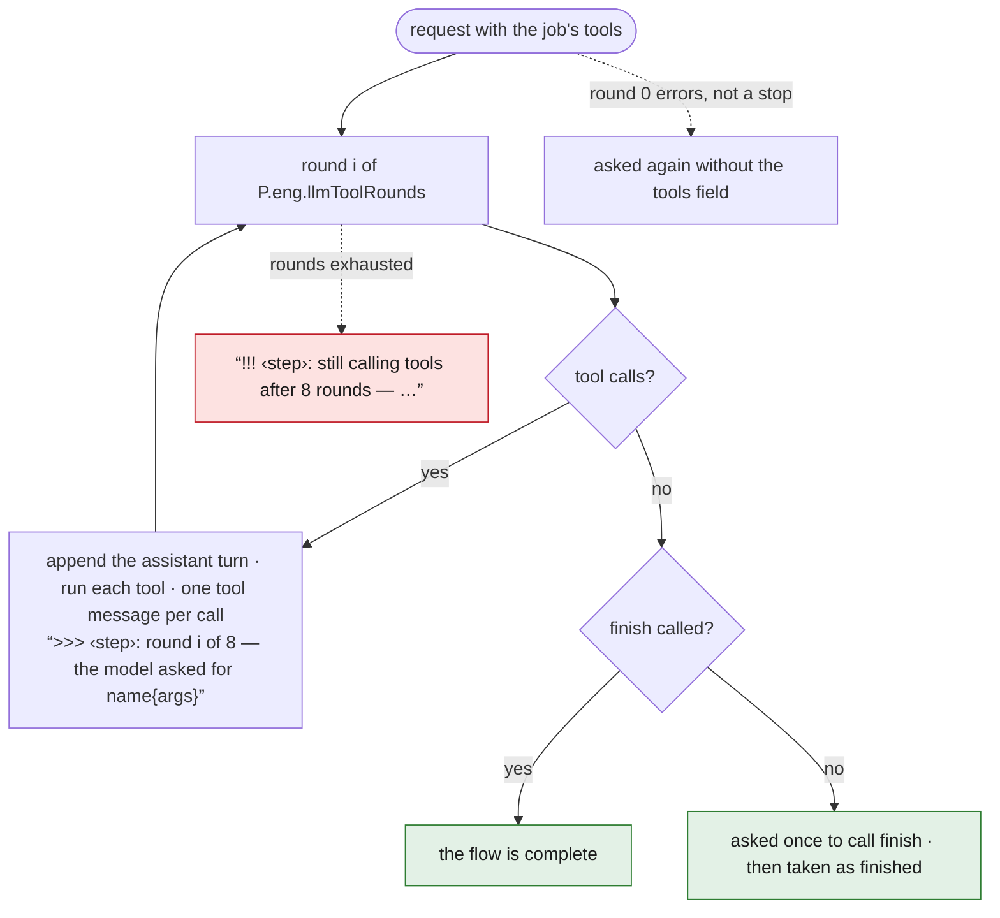
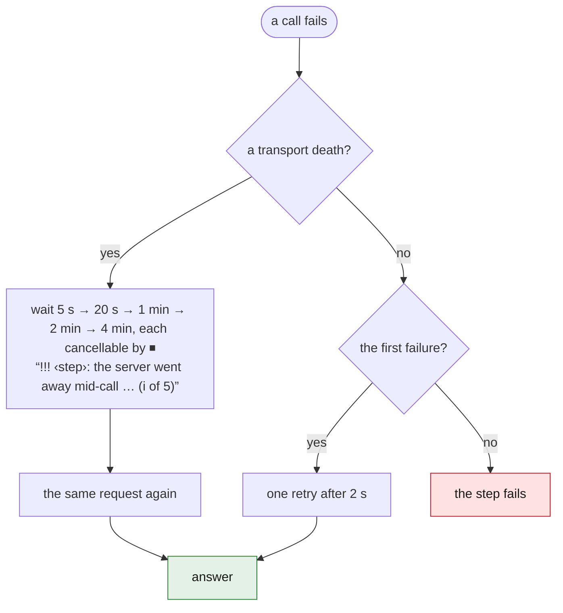
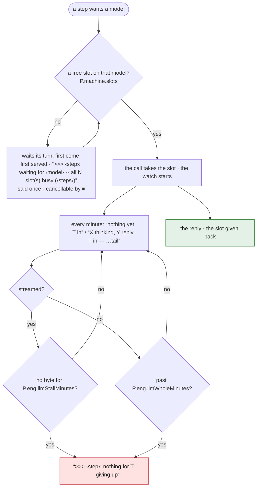

# 09 — The LLM client, tools, gate, cache, log

<!-- nav -->
[← 08 Produce](08-produce.md) · [↑ Contents](README.md) · [10 Parameters →](10-parameters.md)

**Flows:** [F6.1](#2-tool-protocol-f61) · [F6.2](#3-retries-f62) · [F6.3](#4-liveness-and-the-gate-f63)
<!-- /nav -->

## 1. Request contract

- `POST <server>/v1/chat/completions`, bearer key when set; model id required ("no LLM model configured -- use the gear button").
- Body: `model`, `messages` (text parts and `image_url` data URLs), sampling `top_p 0.95, top_k 20, min_p 0, presence_penalty 0`; thinking mode `temperature 1.0, max_tokens 65536, enable_thinking true`; execute mode `temperature 0.6, max_tokens 8192, enable_thinking false`; thinking switch sent top-level and in `chat_template_kwargs` (llama.cpp reads one, other servers the other), `preserve_thinking true`; `tools` when offered; `stream true` when the caller streams.
- Response: `choices[0].message.{content, reasoning_content, tool_calls}` and `finish_reason`. Streaming only when the response is `text/event-stream`: `data:` chunks, `[DONE]`, tool calls reassembled by index; reasoning kept apart and never returned as the answer; EOF without `[DONE]` keeps what arrived.
- Every request rides the run's cancel context.

## 2. Tool protocol (F6.1)

<!-- back -->[← F5.7](08-produce.md#f57-page-runs) · [↑ 09 The LLM client, tools, gate, cache, log](#09--the-llm-client-tools-gate-cache-log) · [all flows](11-flow-index.md#3-all-flows) · [F6.2 →](#3-retries-f62)

**Prototype:** only tools offered: `web_search` and `web_read`, to three jobs — client step names `suggest` (prompt key `cut`), `narrate`, `publish` (key `youtube`); no `finish`, no job-specific tool; a round without calls just returns its content. Log lines and exchange-page names use the step names, not the prompt keys (`suggest`/cut, `publish`/youtube, `transcript`/fix). S1–S3: the rewrite; S4–S7: the prototype's loop, kept.
S1 Offer the job's tools ([`02-services.md` §3](02-services.md#3-tool-catalogue-rewrite-directive-b)) with JSON schemas; descriptions are the instructions. S2 Loop up to P.eng.llmToolRounds (8): a round with calls appends the assistant turn and one `tool` message per call with its result; log ">>> <step>: round i of 8 — the model asked for name{args}" — name directly followed by the raw arguments JSON cut at 60 bytes plus "…"; several calls per round joined by ", " ("…asks for the same thing again — …" when identical: the tell for a loop). S3 Round without calls: job's `finish` called → flow complete; else ask once "Call finish when you are done, or continue with the tools.", then treat as finished with what was produced. S4 Rounds exhausted → "!!! <step>: still calling tools after 8 rounds — the step gets no answer from this call". Prototype defect the rewrite MUST NOT keep: the last round's calls still run (a web search up to 45 s each), their results never sent, logged or recorded; the loop MUST stop before running tools it cannot deliver. S5 A non-stop error on round 0 is read as a server refusing a `tools` field: identical request resent without the field, logged (">>> <step>: the server refused the request with tools (…) -- asked again without them"). Prototype: the only test is "an error on round 0 that is not a stop", so a transport death or 500 on the first round is misread as a refusal, logged so, tools dropped for that call; the refusal is not remembered, so a step retrying with tools (narrate's three attempts) re-offers the field and re-logs the line each time; no mode switch — the "Your answer failed validation: … Return corrected strict JSON only." turns and three-attempt validation loops are caller-side code, same with or without tools. The rewrite SHOULD remember a refusal per server and tell a refused field from a dead server ([§3](#3-retries-f62)). A transport retry re-runs the whole tool loop from the original messages. S6 Tool errors go back to the model as text, never failing the job. S7 Every call and result goes to the exchange page (prototype: a call only as "[tool call name(args)]" text appended to the reply, a result only as the `tool` message of the next round's request — see [§7](#7-exchange-log)).
Web tools (where offered; descriptions verbatim in [`prompts/tools.md`](prompts/tools.md)): `web_search(broad, medium, narrow)` drives headless Firefox over WebDriver BiDi against DuckDuckGo's result page, deduping by URL; the ladder climbs while the web answers (an erroring query is skipped; a narrower query finding nothing after a wider one that did ends the climb with the wider hits; only a ladder finding nothing anywhere reports the error); results: header `Results for "<query>":`, then up to 8 hits (P.eng.searchHits) numbered `N. title / url / snippet`, or "No results for any of the three queries."; `web_read(url)` returns up to 6000 bytes cut back to a UTF-8 character boundary, " …" appended when clipped; refuses "the page had no text", "the page is behind a bot wall (<phrase>)" and "the page had almost no text (blocked, or not loaded)" under 200 characters, all as "web_read failed: <reason>". Whether tools are offered: logged once per step with the reason (">>> <step>: no web search inside Flatpak" / "…(web search is off)" / "…(no firefox found -- name one in the settings, or set it to off)" / "…(firefox: <stat error>)" for a missing named binary); firefox setting → the named binary, else firefox/firefox-esr/firefox-bin on PATH, else the usual install paths; each search and read logs one line (">>> <step>: searched a / b / c -- N result(s) for <used>", ">>> <step>: read <url> (N characters)"). 45 s per call: one budget over the whole search ladder (three queries share it) and over a read, including browser boot (15 s) and render wait (15 s); one headless browser launched and killed per tool call, on ports from 9223 upward.

## 3. Retries (F6.2)

<!-- back -->[← F6.1](#2-tool-protocol-f61) · [↑ 09 The LLM client, tools, gate, cache, log](#09--the-llm-client-tools-gate-cache-log) · [all flows](11-flow-index.md#3-all-flows) · [F6.3 →](#4-liveness-and-the-gate-f63)

- Transport death (EOF, reset, refused, broken pipe, unreachable, or the words eof/connection reset/connection refused/broken pipe/server closed/no such host/transport is closing): wait 5 s, 20 s, 1 min, 2 min, 4 min (past a container restart and weight load), each cancellable by ⏹; log "!!! <step>: the server went away mid-call (…) -- waiting T and asking again (i of 5)".
- Anything else (a 4xx/5xx, an unusable answer): one retry after 2 s, first failure only. A status code is never "the server went away". REVIEW: a 5xx whose body names a device or memory failure SHOULD back off like a transport death, not resend at once.
- Content repair in degraded (JSON) mode: `noAnswer` (whole reply was reasoning), `cutOff` (unexpected end of JSON → "answer again with far fewer items"), `thinkAgain` (empty answer → thinking off for the retry), `retryTurn`. With tools these become tool results.

## 4. Liveness and the gate (F6.3)

<!-- back -->[← F6.2](#3-retries-f62) · [↑ 09 The LLM client, tools, gate, cache, log](#09--the-llm-client-tools-gate-cache-log) · [all flows](11-flow-index.md#3-all-flows) · last flow →

- A streamed call is given up after P.eng.llmStallMinutes (5) without a byte — any byte off the wire counts, including keep-alives the event parser never sees; the guard looks four times per heartbeat; an unstreamed call is held to P.eng.llmWholeMinutes (10). Heartbeat every minute, three shapes: ">>> <step>: nothing yet, T in"; ">>> <step>: X thinking, Y reply, T in"; the same plus " — \"…tail\"" (last 90 bytes of the answer, else of the reasoning, trimmed forward to a character boundary, whitespace-collapsed, Go-quoted). The guard also ticks for an unstreamed call, where X and Y stay 0: it logs "nothing yet" every minute and is never given up for silence — only the 10-minute ceiling ends it. Giving up: ">>> <step>: nothing for T — giving up", cancellation reported as "nothing arrived in 5m0s" or "stopped answering after T -- nothing more for 5m0s". REVIEW: two thinking jobs are unstreamed in the prototype, so sit under the 10-minute ceiling with no stall rule: the upload text, and textedit (every seam repair, about two minutes each); the rewrite SHOULD stream both.
- **Slots** (REVIEW, new): every model the app talks to — the LLM, each audio.cpp model (ASR, diarization, aligner, TTS, separation) and the image model — has a slot count set in Settings ([03 §5](03-shell.md#5-settings-dialog)), P.machine.slots, default 1. It is how many of this app's requests that model is given at once; the server may have more and serve other clients with them. A request takes a slot before it goes on the wire and gives it back when the reply is in (or the call is given up); when every slot is taken it waits, first come first served, and says so once: ">>> ‹step›: waiting for ‹model› -- all N slot(s) busy (‹steps›)". The wait is cancellable by ⏹ and is not the stall watch's business: the watch starts once the request is on the wire. Held across the HTTP call only, so a step thinking between tool rounds holds nothing. Steps whose requests do not depend on each other MAY send up to N at once: describe chunks of different videos, fix blocks, the retake pool's runs, subtitle translations, one TTS line per slot. A step whose requests depend on the answers before them sends them in order whatever N is: the join pass ([F1.10](04-prepare.md#f110-repair-the-joins)), whose every window leaves out what the joins before it took, and a tool conversation's rounds. Two models on one server are two slot counts; the Settings text says so, since a GPU shared between them is not two GPUs.
- Prototype: one chat request on the wire per application, taken before the watch starts, released after the reply; a queued step logs once ">>> <step>: waited for the LLM -- it was busy with <other>; one request at a time" — only when the holder was a different step; queued behind its own earlier call, a step waits silently. Wait cancellable by ⏹. Produce runs its translation after the encodes so the encoder never idles behind the gate.

## 5. Context budgets (REVIEW — new)

The prototype sent whole sessions (a 64-minute lecture made a 451 kB upload brief and a 778-line translation call, and the server lost its GPU). The rewrite MUST bound every prompt: P.machine.promptMaxChars (default 120 000) per request; jobs over it read the rest via `get_lines`/`get_events` tools or run in batches (captions 5 clips; translation P.policy.translateBatch lines; cut brief folded per clip). The app log records the size sent (">>> <step>: N kB of text and M image(s) went to the LLM"; not on the exchange page).

## 6. Cache

`<project>/cache/llm/<step>/<sha256 of the JSON-encoded parts, each followed by a NUL byte>`; the key holds the texts deciding the answer (system prompt, user text, rolling state, speech, context, image data URLs, run index for pooled calls) — NOT the model id or thinking flag: changing the model in Settings replays the old model's cached answers. REVIEW: the rewrite MUST put the model id and thinking flag in the key. Only usable answers stored (not a fix block that failed validation, a join not at the seam, an incomplete translation); an uncomputable key is no key (nothing read or stored); an empty reply is never stored; an unwritable cache makes a slower step, never a failed one. Used by describe, transcript, textedit, retake, translate; not by the cut, narration or upload text. Two irregularities: translate stores the reconstructed numbered text, not the reply, and never caches its gap-filling second call; the transcript fixer caches only its first attempt. A cache hit is answered before the gate and the exchange log, so a resumed run's page holds only uncached calls. With tools, the cached unit is the finished item list of a job with identical inputs.

## 7. Exchange log

`<project>/llm/<MMDD-HHMMSS>-<first step>.html`, one page per run (a run = the calls between two queue resets; a call outside a run gets its own page). Sections: an `h1` "N. step"; a meta line (time, model, thinking/execute, "reply pending" until the answer is in, then the outcome); each message as an `h2` role, text in `pre` (images inline); the reply, reasoning in a `details` block; notes for cut-off and empty answers. Tool calls: "[tool call name(args)]" text appended to the reply; tool results: the `tool` messages of the next round's request. Page written when the request goes out, streamed reply appended into an open `pre`, whole file rewritten when the call is done. App log: sizes sent, the verdict ("X came back in T, after Y of thinking"; "— cut off at the model's token limit"; "— the model answered nothing at all"; "the call failed after T: …"), ">>>   the reply begins: " with the first 110 characters after the last `</think>`, and once per run the clickable page link. Recording never fails the call.

## 8. Prompt assembly

System message = the "system" prompt cut to the job's sections by a per-job table (describe/fix/retake: THE ANSWER, THE MATERIAL, THE CLOCKS, the jobs list, NEVER INVENT; textedit/translate: THE ANSWER, the jobs list, NEVER INVENT; cut/narrate/youtube additionally THE FOUR STEPS and TOOLS; cut/captions/effects/speed THE CUT; speed only THE ANSWER, THE CUT and the jobs list; jobs list cut to this job's own line, its example indented under it; an unknown heading and anything before the first heading go to every job; a job with no table row gets the whole system prompt) + "\n\n" + the job's prompt (+ for narrate its no-microphone note and captions addendum, [`07-narrate.md`](07-narrate.md)) + (User Context non-empty) the precedence rule, whose second half says a context instruction naming another step is that step's, not this job's, to act on. User message = the User Context block (+ the speech rule for cut and narrate) + the job's material. The twelve prompts: [`prompts/`](prompts); the policy-derivation prompt ([F0.7](03-shell.md#f07-derive-the-editing-policy-review--new)) is new.

## 9. Model list and tests

`GET /v1/models` (15 s) fills the Settings dropdown. The Settings tests send one completion and one red-square vision probe ([`03-shell.md`](03-shell.md) [F0.13](03-shell.md#f013-tests)).

## 10. Every request timed (REVIEW — new)

Every request the app sends outside — to the LLM, to audio.cpp (ASR, alignment, diarization, TTS, separation, uploads), to the image server, and the web tools' searches and page reads — is measured and written down in the open project's folder, `requests.tsv` ([01 §6](01-project-and-files.md#6-text-formats)): one line per request, appended the moment it ends, whether it succeeded, failed, was given up by the stall watch or cancelled by ⏹. A retry is a line of its own. A reply served from the cache is a line too, marked as such with no time on the wire, so the file shows what a re-run saved. Nothing in the file is ever rewritten; a line is written before the reply is used, so a step that then fails still leaves its requests behind.

What a line holds: when it started; the run it belongs to (the name of that run's `llm/` page, empty outside a run); the step and the job; the service and the model; the kind of request; what went out (bytes, images) and what came back (bytes; tokens in and out when the server says); how long it **waited for a slot** ([§4](#4-liveness-and-the-gate-f63)); how long until the first byte came back; how long it was **on the wire** in all; for a thinking model, how much of that was thinking; the outcome; the attempt number.

At the end of every run the log says it in one line per service: ">>> requests: llm 57 in 2h 13m on the wire, 4m waiting for a slot; audio 38 in 6m 10s; web 3 in 12s". Local work — ffmpeg and the other subprocesses — is not in the file; it is logged as the commands it ran.

It is what the slot counts are chosen by (time spent waiting for a slot against time on the wire), what a prompt or a model is compared by, and where numbers like "a thinking join takes three to fifteen minutes" come from rather than from someone's memory of a run.

Prototype: only model calls are timed, and only for reading — the log line ">>> ‹step›: X kB came back in T" and the run's `llm/` page ("took T"). Audio, image and web requests are not timed at all, and nothing is kept in a form a program can read.

<!-- nav -->
---
[← 08 Produce](08-produce.md) · [↑ top](#09--the-llm-client-tools-gate-cache-log) · [↑ Contents](README.md) · [10 Parameters →](10-parameters.md)
<!-- /nav -->
