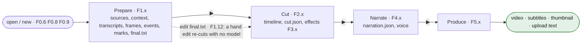

# 11 — Flow index and UI flow map

<!-- nav -->
[← 10 Parameters](10-parameters.md) · [↑ Contents](README.md) · [12 What the model decides, and what the app decides →](12-decisions.md)
<!-- /nav -->

## 1. The top-level flow

- **Settings** (⚙): servers, models, ffmpeg, firefox; tested by [F0.13](03-shell.md#f013-tests).
- **Run bar**: ▶ runs the ticked steps in order ([F0.4](03-shell.md#f04-the-chain)); ⏸ parks between subprocesses.
- **Every model call**: one gate, one exchange page, tools first ([F6.1](09-llm-and-tools.md#2-tool-protocol-f61)).

## 2. Tab states

| tab | when it opens | what the run bar's ▶ does there |
|---|---|---|
| Prepare | always | runs Prepare |
| Cut | once a source is footage ("Add footage on the Prepare step first…") | Suggest, until the preview started; then the preview's transport until ⏹. Preview modes: recording ▶, cut ▶✂, review ▶✂✂ — one lit, one ⏸ |
| Narrate | always; ▶ refuses without a cut; greyed when narration is off | write and speak, until the preview started |
| Produce | always; ▶ refuses without a cut | render |

## 3. All flows

| id | flow | chapter |
|---|---|---|
| [F0.1](03-shell.md#f01-switch-tab) | Switch tab | [03](03-shell.md) |
| [F0.2](03-shell.md#f02-press-) | Press ▶ (run / pause / transport) | [03](03-shell.md) |
| [F0.3](03-shell.md#f03-press-) | Press ⏹ | [03](03-shell.md) |
| [F0.4](03-shell.md#f04-the-chain) | The chain | [03](03-shell.md) |
| [F0.5](03-shell.md#f05-a-runs-bookkeeping-every-step-uses-it) | A run's bookkeeping (progress, checkpoints) | [03](03-shell.md) |
| [F0.6](03-shell.md#f06-open-at-start) | Open at start | [03](03-shell.md) |
| [F0.7](03-shell.md#f07-derive-the-editing-policy-review--new) | Derive the editing policy from the context (new) | [03](03-shell.md) |
| [F0.8](03-shell.md#f08-new-project) | New project | [03](03-shell.md) |
| [F0.9](03-shell.md#f09-open-a-project) | Open a project | [03](03-shell.md) |
| [F0.10](03-shell.md#f010-save-as) | Save as | [03](03-shell.md) |
| [F0.11](03-shell.md#f011-rescan) | Rescan | [03](03-shell.md) |
| [F0.12](03-shell.md#f012-add-sources-from-prepare) | Add sources | [03](03-shell.md) |
| [F0.13](03-shell.md#f013-tests) | Settings tests | [03](03-shell.md) |
| [F1.1](04-prepare.md#f11--prepare) | ▶ Prepare | [04](04-prepare.md) |
| [F1.2](04-prepare.md#f12-voice-separation-rows-with-) | Voice separation | [04](04-prepare.md) |
| [F1.3](04-prepare.md#f13-per-source-audio--text--word-times--speakers--segments) | Per source: audio, ASR, alignment, diarization, segments | [04](04-prepare.md) |
| [F1.4](04-prepare.md#f14-asr-in-chunks) | ASR in chunks | [04](04-prepare.md) |
| [F1.5](04-prepare.md#f15-forced-alignment) | Forced alignment | [04](04-prepare.md) |
| [F1.6](04-prepare.md#f16-frames-per-video) | Frames | [04](04-prepare.md) |
| [F1.7](04-prepare.md#f17-describe-per-footage-source-chunks-of-ppolicydescribeframesperreq--4) | Describe | [04](04-prepare.md) |
| [F1.8](04-prepare.md#f18-fix-the-transcripts-blocks-of-ppolicyfixblocklines--25-lines) | Fix the transcripts | [04](04-prepare.md) |
| [F1.9](04-prepare.md#f19-mark-retakes-gaming-style) | Mark retakes (Gaming) | [04](04-prepare.md) |
| [F1.10](04-prepare.md#f110-repair-the-joins-lecture-style) | Repair the joins (Lecture) | [04](04-prepare.md) |
| [F1.11](04-prepare.md#f111-place-the-edges-of-a-mark) | Place the edges of a mark | [04](04-prepare.md) |
| [F1.12](04-prepare.md#f112-hand-edit-the-text-lecture) | Hand-edit final.txt | [04](04-prepare.md) |
| [F1.13](04-prepare.md#f113-the-sessions-word-list-shared-by-retakes-joins-finaltxt-and-subtitles) | The session's word list (glue, dress, respell) | [04](04-prepare.md) |
| [F2.1](05-cut.md#f21-play-the-recording-) | Play the recording | [05](05-cut.md) |
| [F2.2](05-cut.md#f22-play-the-cut-) | Play the cut | [05](05-cut.md) |
| [F2.3](05-cut.md#f23-review-every-cut-) | Review every cut | [05](05-cut.md) |
| [F2.4](05-cut.md#f24-place-and-step-the-line) | Place and step the line | [05](05-cut.md) |
| [F2.5](05-cut.md#f25-hush-and-mix-what-the-preview-hears) | Hush and mix | [05](05-cut.md) |
| [F2.6](05-cut.md#f26-select) | Select | [05](05-cut.md) |
| [F2.7](05-cut.md#f27-add-split-remove-) | Add, Split, Remove, ⌦ | [05](05-cut.md) |
| [F2.8](05-cut.md#f28-trim-and-move) | Trim and move | [05](05-cut.md) |
| [F2.9](05-cut.md#f29-copy-paste-lane) | Copy, Paste, Lane | [05](05-cut.md) |
| [F2.10](05-cut.md#f210-cameras-and-hearing) | Cameras and hearing | [05](05-cut.md) |
| [F2.11](05-cut.md#f211-folds-and-rows) | Folds and rows | [05](05-cut.md) |
| [F2.12](05-cut.md#f212-insert-a-card-still-video-or-sound) | Insert a card, still, video or sound | [05](05-cut.md) |
| [F2.13](05-cut.md#f213-undo-redo-revert-clear) | Undo, Redo, Revert, Clear | [05](05-cut.md) |
| [F2.14](05-cut.md#f214-suggest-a-cut) | Suggest a cut | [05](05-cut.md) |
| [F3.1](06-effects.md#f31-zoom-by-hand) | Zoom by hand | [06](06-effects.md) |
| [F3.2](06-effects.md#f32-aspect-ratio) | Aspect ratio | [06](06-effects.md) |
| [F3.3](06-effects.md#f33-speed-and-stop-by-hand) | Speed and stop by hand | [06](06-effects.md) |
| [F3.4](06-effects.md#f34-text-caption-by-hand) | Text by hand | [06](06-effects.md) |
| [F3.5](06-effects.md#f35-svg-drawing-by-hand) | SVG by hand | [06](06-effects.md) |
| [F3.6](06-effects.md#f36-volume-by-hand) | Volume by hand | [06](06-effects.md) |
| [F3.7](06-effects.md#f37-label-by-hand) | Label by hand | [06](06-effects.md) |
| [F3.8](06-effects.md#f38-hold-move-resize-edit-remove) | Hold, move, resize, edit, remove an effect | [06](06-effects.md) |
| [F3.9](06-effects.md#f39-captions-proposed-by-the-model-after-the-cut) | Captions proposed | [06](06-effects.md) |
| [F3.10](06-effects.md#f310-speeds-proposed-by-the-model) | Speeds proposed | [06](06-effects.md) |
| [F3.11](06-effects.md#f311-decorations-proposed-by-the-model) | Decorations proposed | [06](06-effects.md) |
| [F3.12](06-effects.md#f312-clamp-to-the-cut-as-applied) | Clamp effects to the cut | [06](06-effects.md) |
| [F4.1](07-narrate.md#f41--write-and-speak) | ▶ Write and speak | [07](07-narrate.md) |
| [F4.2](07-narrate.md#f42-the-narration-call) | The narration call | [07](07-narrate.md) |
| [F4.3](07-narrate.md#f43-fit-a-line-to-its-clip-the-renders-rule-mirrored-by-the-row-warnings) | Fit a line to its clip | [07](07-narrate.md) |
| [F4.4](07-narrate.md#f44-speak-a-line-tts) | Speak a line (TTS) | [07](07-narrate.md) |
| [F4.5](07-narrate.md#f45-preview-the-cut-with-narration) | Preview the cut with narration | [07](07-narrate.md) |
| [F4.6](07-narrate.md#f46-choose-the-voice-and-build-the-reference) | Choose the voice and build the reference | [07](07-narrate.md) |
| [F4.7](07-narrate.md#f47-edit-lines) | Edit lines | [07](07-narrate.md) |
| [F4.8](07-narrate.md#f48-narration-off) | Narration off | [07](07-narrate.md) |
| [F5.1](08-produce.md#f51--produce) | ▶ Produce | [08](08-produce.md) |
| [F5.2](08-produce.md#f52-the-render) | The render | [08](08-produce.md) |
| [F5.3](08-produce.md#f53-what-up-to-date-means) | What "up to date" means | [08](08-produce.md) |
| [F5.4](08-produce.md#f54-subtitles) | Subtitles and translation | [08](08-produce.md) |
| [F5.5](08-produce.md#f55-the-video-tag) | The `<video>` tag | [08](08-produce.md) |
| [F5.6](08-produce.md#f56-upload-text-and-thumbnail) | Upload text and thumbnail | [08](08-produce.md) |
| [F5.7](08-produce.md#f57-page-runs) | Page runs (redraw, suggest, set thumbnail, words, export, save, transcode) | [08](08-produce.md) |
| [F6.1](09-llm-and-tools.md#2-tool-protocol-f61) | Tool protocol | [09](09-llm-and-tools.md) |
| [F6.2](09-llm-and-tools.md#3-retries-f62) | Retries | [09](09-llm-and-tools.md) |
| [F6.3](09-llm-and-tools.md#4-liveness-and-the-gate-f63) | Liveness and the gate | [09](09-llm-and-tools.md) |

## 4. Model calls at a glance

| step | model calls | note |
|---|---|---|
| Prepare | describe ×(frames/4) · fix ×(lines/25) · retake ×3 or textedit ×(joins) | cached |
| Cut | cut ×1 (+web) · captions ×(clips/5) · speed ×1 · effects ×1 | Gaming only |
| Narrate | narrate ×1 (+web) · TTS ×(lines) | |
| Produce | youtube ×1 (+web) · sd.cpp ×1 when drawn · translate ×(languages × batches) | |
| Setup | policy ×1 | new; when the context changes |

## 5. Where each kind of decision lives (directive A)

- **What the video becomes** (lengths, thresholds, budgets): editing policy ([`10-parameters.md` §2](10-parameters.md#2-editing-policy-project-derived-from-the-user-context-by-f07-else-defaults)), derived from the User Context, editable.
- **How a job is worded**: the prompts ([`prompts/`](prompts)).
- **Which servers and binaries**: machine settings.
- **How the app looks, waits and caches**: engineering constants.

<!-- nav -->
---
[← 10 Parameters](10-parameters.md) · [↑ top](#11--flow-index-and-ui-flow-map) · [↑ Contents](README.md) · [12 What the model decides, and what the app decides →](12-decisions.md)
<!-- /nav -->
